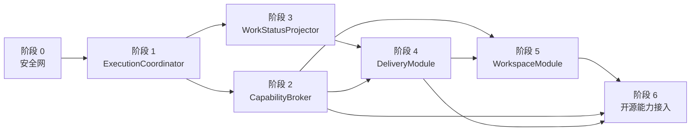

# PiWork 核心 Agent 架构整改完整实施计划

> 日期：2026-08-22  
> 前置盘点：[`PiWork 当前 Agent 架构全景`](./piwork-current-agent-architecture.zh-CN.md)  
> 文档类型：实施计划（Plan A，共两份计划中的第一份）  
> 目标：在不替换 Pi、Scheduler、EngineHarness 和 SQLite 的前提下，收紧执行、权限、状态和交付 seam，为第二份“能力平台与市场实施计划”建立稳定控制面。

## 1. 核心建议

采用：

> **整体规划一次，分阶段逐个完成；每阶段形成可运行、可验证、可回滚的纵向闭环。**

不建议一次性完成全部整改。当前问题横跨 Tauri 命令、Work、Assignment、Scheduler、Pi Adapter、扩展、SQLite 和前端投影；一次性修改会同时失去旧行为基线、迁移回滚点和故障定位能力。

也不建议毫无整体设计地逐个修补。`ExecutionCoordinator`、`CapabilityBroker`、`WorkStatusProjector`、`DeliveryModule` 和 `WorkspaceModule` 之间存在明确依赖，如果只按眼前 bug 修复，容易继续产生第二套状态和第二条执行路径。

正确节奏是：

```text
一次性确定领域不变量、目标 seam 和依赖顺序
                    ↓
阶段 0 建立测试与迁移安全网
                    ↓
阶段 1～5 每次只替换一个核心 seam
                    ↓
每阶段验收、删除旧路径、形成稳定版本
                    ↓
再逐个接入 LSP / MCP / Browser / Documents / Sandbox
```

## 2. 整改期间不可破坏的五条不变量

1. **SQLite 始终是产品事实源。** 内存 Queue、React Store、Work Ledger 和远程记忆只能是运行态或投影。
2. **一个用户动作只有一条权威执行路径。** 不再同时保留 Supervisor 路径和 Assignment 路径供生产调用。
3. **Work Completed 只能来自有效 Work Delivery。** Run 或 Member Assignment 的结束不能直接代表 Work 完成。
4. **能力授权默认拒绝。** 未知工具、未知作用域、失效快照和授权服务异常都不能放行。
5. **Adapter 不绕过领域模块写产品状态。** Pi、MCP、Browser、Connector 等 Adapter 只能通过受控 interface 提交事件或请求动作。

这五条应先写成架构决策和契约测试，后续每个阶段都以它们为验收依据。

## 3. 总体依赖图



`CapabilityBroker` 与 `WorkStatusProjector` 在阶段 1 后可以由不同开发者并行，但对当前项目更建议先后完成，减少同时变化的核心状态面。

### 3.1 目标代码结构

目录不是架构本身，但核心 seam 应在代码中有一个容易定位的归属。建议最终形成以下结构；内部文件可以继续细分，外部 interface 不随实现细节膨胀。

```text
src-tauri/src/
├── execution/                 # ExecutionCoordinator
│   ├── mod.rs                 # submit/control interface
│   ├── coordinator.rs         # production implementation
│   └── receipt.rs             # command/result DTO
├── capability/                # CapabilityBroker
│   ├── mod.rs                 # snapshot/authorize interface
│   ├── policy.rs              # pure decision rules
│   ├── snapshot.rs            # immutable Run snapshot
│   ├── repository.rs          # snapshot/audit persistence
│   └── operation.rs           # normalized operation vocabulary
├── work/
│   └── projector.rs           # pure WorkStatusProjector
├── delivery/                  # Result/Artifact/Validation/Delivery
│   ├── mod.rs
│   ├── result.rs
│   ├── artifact.rs
│   └── validation.rs
├── workspace/                 # first-class Workspace
│   ├── mod.rs
│   ├── repository.rs
│   └── path_identity.rs
├── assignment/                # existing queue/repository/scheduler retained
├── engine/                    # existing Adapter/Harness/Pi retained
├── resource/                  # existing managed resource pipeline retained
└── collaboration/             # Lead/Member tools become callers of Delivery
```

前端不复制这些领域规则，只增加与 Rust read model 对应的类型化状态：

```text
src/
├── bindings/                  # ts-rs generated DTO
├── features/works/            # Work/Execution read models
├── features/approvals/        # Capability Ask 决策
├── features/delivery/         # Result/Artifact/Validation inspector
└── features/workspace/        # Workspace settings and health
```

### 3.2 影响文件与替换关系

| 现有位置 | 调整方式 | 最终归属 |
|---|---|---|
| `work/service.rs` 的 `Execution` 双轨 | 调用者迁移后删除 | `execution/ExecutionCoordinator` |
| `assignment/service.rs` 的执行控制 | 保留 Assignment 创建，控制动作交给 Coordinator | `assignment` + `execution` |
| `assignment/scheduler.rs::reflect_work_terminal` | 删除直接 Work 状态写入 | `work/projector.rs` |
| `engine/mod.rs::RunCapabilityManifest` | 升级为持久、带版本的 Snapshot | `capability/snapshot.rs` |
| `extensions/mod.rs::runtime_snapshot` | 只消费 Broker 结果，不再独立裁决 | `capability` + `extensions` Adapter |
| `collaboration/result.rs` | 作为 Delivery 内部校验实现迁移 | `delivery/result.rs` |
| `complete_work_delivery` Host Tool | 只调用 DeliveryModule | `delivery` |
| `works.root_path` 的 Workspace 语义 | expand-and-contract 迁移 | `workspace` |
| React `statusForEvent` | 保留短暂 optimistic 显示，不作权威状态机 | Rust Projector + UI read model |

### 3.3 计划产物

本计划完成时，除代码和迁移外必须交付：

- 3 份架构决策：唯一执行所有者、Rust 权威能力快照、Delivery 唯一完成语义。
- 每个深 module 的 interface 契约测试。
- 当前数据库到目标 schema 的迁移 fixture 与恢复说明。
- Windows 进程树、权限、崩溃恢复的端到端测试。
- 用户可理解的权限、恢复、交付状态文案。
- 第二份能力平台计划可以依赖的稳定 interface 文档。

## 4. 阶段 0：建立安全网

### 目标

先确保后续重构可以分辨“行为被有意改变”和“行为意外损坏”。

### 工作内容

1. 解决当前 Rust 测试进程的 `STATUS_ENTRYPOINT_NOT_FOUND (0xc0000139)`，恢复 `cargo test --lib` 可运行状态。
2. 为生产装配增加 characterization tests，覆盖：
   - `start_work` 走 Assignment 路径；
   - queued/running/waiting Work 可以停止；
   - 重启恢复不会自动重放未知副作用；
   - Host Tool 租约在 Run 结束后撤销；
   - Event 先持久化再发布。
3. 准备带真实旧数据的 SQLite 迁移 fixture，至少覆盖迁移 `0001 → 当前版本`。
4. 固化以下运行门槛：
   - `pnpm typecheck`
   - 前端关键 store/projector tests
   - Rust domain/repository/harness tests
   - storage contract 与 collaboration loop tests

### 非目标

- 不修改产品行为。
- 不先重排目录或拆大文件。
- 不引入新能力。

### 退出条件

- Rust 与 TypeScript 测试门槛能稳定重复运行。
- 生产执行路径有可失败的测试，而不是通过源码字符串断言装配关系。
- 迁移失败可从数据库备份恢复。

### 相对工作量

小到中，但不可跳过。

## 5. 阶段 1：统一 ExecutionCoordinator

### 要解决的问题

生产通过 `AssignmentService` 启动 Work，但 `stop_work` 仍依赖旧 `EngineSupervisor` 路径。调用者必须理解两套执行模型，当前 module 是浅的且容易误用。

### 目标 interface

先采用具体 module，不急于定义 trait。当前只有一种生产协调实现；测试可以给它注入 Repository、Scheduler Handle 和 EngineAdapter。

```rust
pub struct ExecutionCoordinator { /* hidden */ }

impl ExecutionCoordinator {
    pub async fn submit(
        &self,
        work_id: &str,
        input: WorkInput,
    ) -> Result<SubmissionReceipt, AppError>;

    pub async fn control(
        &self,
        work_id: &str,
        command: ExecutionCommand,
    ) -> Result<ExecutionReceipt, AppError>;
}

pub enum ExecutionCommand {
    Stop,
    Steer(WorkInput),
    InterruptAndReplace(WorkInput),
}
```

这里使用一个 `control` interface 隐藏 active Assignment、Run、Scheduler 和 Engine 之间的协调细节。查询仍由 Work 读取模型承担，避免 Coordinator 同时变成万能 module。

### 实施切片

1. 先把 `start_work`、`queue_work_input`、`interrupt_and_replace` 路由到 Coordinator。
2. 实现 `Stop`：
   - queued Assignment 取消；
   - active Run 调用 EngineAdapter abort；
   - Repository 在同一领域事务中更新 Assignment/Run；
   - Scheduler 释放 claim；
   - Host Tool lease 必须撤销。
3. 将前端命令保持兼容，只替换 Rust 内部调用路径。
4. 删除或内部化 `WorkService::Execution` 双轨；旧 `EngineSupervisor` 若仍被兼容测试使用，不得再成为生产 Work command 的依赖。

### 验收矩阵

| 场景 | 预期结果 |
|---|---|
| 停止 queued Work | Assignment cancelled/stopped，不启动 Pi |
| 停止 running Work | Pi 进程树结束，Run/Assignment/Work 一致 |
| 停止 waiting Lead | 等待关系被显式取消，不自动恢复 |
| 重复停止 | 幂等或返回稳定的已终态结果 |
| abort 超时 | 状态进入 Interrupted/cleanup-unconfirmed，不伪装成功 |
| 应用重启 | 不遗留可继续调用的 Host Tool token |

### 删除条件

新 interface 的契约测试通过后，删除生产调用中的旧 Supervisor 分支和对应重复测试。不要长期保留两条路径作为“保险”。

### 相对工作量

中等，建议作为第一个正式整改里程碑。

## 6. 阶段 2：建立 CapabilityBroker

### 要解决的问题

当前权限信息分散在 Work permission mode、Agent policy、Assignment permission scope、角色 Host Tool allowlist、Extension grant 和 Connector grant 中；Pi 内置工具仍由 `--tools` 与 `--approve` 粗粒度控制。

### 目标 interface

```rust
pub struct CapabilityBroker { /* hidden */ }

impl CapabilityBroker {
    pub async fn snapshot(
        &self,
        request: RunCapabilityRequest,
    ) -> Result<RunCapabilitySnapshot, AppError>;

    pub fn authorize(
        &self,
        snapshot: &RunCapabilitySnapshot,
        operation: &CapabilityOperation,
    ) -> CapabilityDecision;
}

pub enum CapabilityDecision {
    Allow { audit: AuditContext },
    Deny { reason: DenialReason },
    Ask { request: ApprovalRequest },
}
```

`RunCapabilitySnapshot` 在 Run 启动前生成，包含版本、来源、作用域和完整 allowlist；Run 开始后不可被静默扩权。设置变化只影响新 Run，除非用户显式重启当前 Run。

### 内部输入

```text
Workspace defaults
→ Work permission mode
→ Agent role/instance override
→ Assignment permission scope
→ Capability Pack requirements
→ Extension/Connector grants
→ runtime health/version
→ immutable RunCapabilitySnapshot
```

### 实施切片

#### 2A：纯策略核心

- 规范化操作类型：filesystem read/write、process、network、connector read/write、browser、secret、publish。
- 建立三档 permission mode 的决策矩阵。
- 未知 capability、scope、operation 一律 Deny。
- 用纯函数测试完整矩阵，不连接 Pi。

#### 2B：Host Tools 与 Connectors

- Host Tool Registry 发租约前从 Snapshot 取得工具集合。
- Tool Bridge 每次调用同时校验 lease、工具、Work、Assignment、Agent 与操作参数。
- Email 等外部副作用进入统一审计。

#### 2C：Extensions

- `ExtensionService::runtime_snapshot` 必须真正消费 `agent_instance_id`、`work_id` 和 Snapshot。
- 只有 installed、未 revoked、版本兼容、Agent grant 与 Work policy 都允许的扩展才能加载。
- 工具 allowlist 由 Snapshot 决定，而不是扩展自己决定。

#### 2D：Pi 内置工具

- 先做一个短验证：确认当前 Pi extension hook 能否在 `read/edit/write/bash` 真正执行前阻止调用。
- 若能可靠阻止，内置 permission extension 只作为 enforcement Adapter，Rust Snapshot 仍是权威决定。
- 若不能可靠阻止，则将高风险 `edit/write/bash` 替换为 Host-mediated tools 或在 Execution Environment 层强制隔离。
- 在证明执行前可阻止之前，不宣称 `AskEveryStep` 或 `Balanced` 已实现生产安全。

### 验收矩阵

至少覆盖：

```text
3 种 permission mode
× 7 类 operation
× Lead / Member
× Workspace 内 / 外
× 已授权 / 未授权 Extension
× 正常 / 过期 / 被撤销 Snapshot
```

必须验证：

- Balanced 与 AutoExecute 有明确差异。
- AskEveryStep 的写入不会因 `--approve` 自动通过。
- Extension grant 和 Work policy 改变真实运行结果。
- 未知工具与 Broker 故障默认拒绝。
- 决策和实际执行结果都有审计关联 ID。

### 相对工作量

大。必须按 2A～2D 纵向切片交付，不建议一次写完后再统一测试。

## 7. 阶段 3：建立 WorkStatusProjector

### 要解决的问题

Scheduler 当前会把一个 Assignment 的 outcome 直接反射为 Work 状态。Work 是聚合，Member 完成不等于 Work 完成，等待中的 Lead 与死信 Member 也不能靠最后一次 Run 判断。

### 目标 interface

这是纯 in-process module，不需要 Adapter：

```rust
pub fn project_work_status(facts: WorkExecutionFacts) -> WorkStatus;
```

`WorkExecutionFacts` 应包含：

- Lead Assignment 状态
- 必需 Member Assignment 状态
- active/queued Run
- recovery confirmation
- dead letter
- Work Delivery 是否有效
- archive 状态

### 实施切片

1. 先写完整状态表和纯函数测试。
2. Repository 的状态事务统一调用 Projector。
3. Scheduler 不再直接设置 Work terminal status。
4. 前端 `statusForEvent` 只做短暂 optimistic projection；持久详情仍覆盖 UI。
5. 增加全库 rebuild 命令或迁移逻辑，修复旧的错误 Work status 缓存。

### 核心规则

| 事实 | Work 状态 |
|---|---|
| 存在 active Run | Running |
| Lead 等用户输入或子 Assignment | Waiting |
| 仅有排队 Assignment | Queued |
| Member 完成、Lead 尚未交付 | Running/Waiting，而非 Completed |
| 有效 Lead Delivery | Completed |
| 未决 recovery confirmation | Interrupted 或专门的恢复投影 |
| 必需 Assignment dead letter | Failed |

### 退出条件

- 只有 Projector 能决定 Work 的非归档执行状态。
- 任意 Assignment 事件序列重放后得到相同 Work 状态。
- 子 Assignment 完成不再产生 Completed 闪烁。

### 相对工作量

中等。

## 8. 阶段 4：建立 DeliveryModule

### 要解决的问题

Result Envelope、Work Delivery、Artifact path、Resource 和 Validation 当前分散。普通 `agent_end` 可能绕过 Member Result；Agent 声明的验证字符串也不等于真实验证证据。

### 目标 interface

```rust
pub struct DeliveryModule { /* hidden */ }

impl DeliveryModule {
    pub async fn submit_member_result(
        &self,
        context: MemberSubmission,
    ) -> Result<MemberResultReceipt, AppError>;

    pub async fn complete_work(
        &self,
        context: WorkDeliverySubmission,
    ) -> Result<WorkDeliveryReceipt, AppError>;

    pub async fn inspect(
        &self,
        work_id: &str,
    ) -> Result<DeliveryReadModel, AppError>;
}
```

### 内部职责

- 校验 Result schema、作者、Assignment、来源事件和大小限制。
- 将 Artifact 路径规范化到 Workspace/允许范围。
- 检查文件存在性、类型、大小和生成者。
- 把正式 Artifact 导入 Resource/Artifact 管理。
- 将 Validation 关联到真实 Tool/Command Event 或验证 Adapter 结果。
- 判断必需 Assignment、验收标准和开放问题是否允许 Lead 完成交付。
- 在同一事务中写 Result/Delivery Event，并触发 WorkStatusProjector。

### 完成语义

| Agent 行为 | 新语义 |
|---|---|
| Member 普通 `agent_end`，未提交 Result | 不得 Completed；请求修复或 Failed |
| Member 提交无效 Result | `repair_requested`，受次数限制 |
| Lead 普通 `agent_end`，未提交 Delivery | Idle/Waiting，不得 Completed |
| Lead 提交 Delivery，但必需子任务未完成 | 拒绝并返回缺失条件 |
| Artifact 路径不存在或越界 | 拒绝该 Artifact，不将字符串当产物 |
| Validation 无对应执行证据 | 标为 unverified，不能满足强制验收项 |

### 退出条件

- Work Completed 只能由 DeliveryModule 触发。
- Member Completed 必须存在 valid Result Envelope。
- Inspector 可以展示每个结论、证据、产物和验证的来源。

### 相对工作量

中到大。

## 9. 阶段 5：将 Workspace 提升为一等实体

### 为什么放在后面

Workspace 会影响大量外键和策略。如果在执行、权限和交付语义尚未稳定时同时迁移，改动面过大。前四阶段完成后，Workspace 才有清晰职责。

### 目标模型

```text
Workspace
├── stable workspace_id
├── canonical root path
├── default permission/sandbox policy
├── memory Task binding
├── extension/MCP/connector defaults
├── index/LSP lifecycle
├── Git/worktree strategy
└── concurrency policy
```

### 采用 expand-and-contract 迁移

#### 5A：Expand

- 新增 `workspaces` 表与 `works.workspace_id` 可空字段。
- 按 canonical root path 回填；同一路径 Work 归入同一 Workspace。
- 保留 `works.root_path`，不立即删除旧列。

#### 5B：Switch

- 新建 Work 必须解析/创建 Workspace。
- Memory binding、Extension policy、Connector grant 和未来索引都逐步改用 `workspace_id`。
- 读取模型从 Workspace 获得 root path，同时对旧数据保持兼容。

#### 5C：Contract

- 所有读取均切换且迁移验证通过后，再决定是否删除重复路径字段。
- Contract 可延后一个发布周期，避免不可逆的大迁移。

### 退出条件

- 同一路径 Work 稳定共享一个 Workspace ID。
- 路径大小写、符号链接和 Windows 短路径不会产生重复 Workspace。
- 旧数据库升级后 Work、Resource、Memory 和权限关系无丢失。

### 相对工作量

大，但可以用三次兼容迁移降低风险。

### 9.1 建议迁移序列

迁移编号以当前 `0015` 为基线，实施时每个 migration 只承担一种不可分割的数据职责：

| 建议 migration | 阶段 | 主要内容 | 回滚/兼容策略 |
|---|---|---|---|
| `0016_run_capability_snapshots.sql` | 阶段 2 | Run Snapshot、决策审计、Approval request/decision | 旧 Run 标为 legacy snapshot；不自动扩权 |
| `0017_work_deliveries.sql` | 阶段 4 | Work Delivery、Artifact admission、Validation evidence | 从现有 delivery/result event 回填可确认部分，其余标 unverified |
| `0018_workspaces_expand.sql` | 阶段 5A | `workspaces`、nullable `works.workspace_id`、路径 identity | 保留 `works.root_path` |
| `0019_workspace_policy_links.sql` | 阶段 5B | Memory/Extension/Connector policy 关联 Workspace | 双读校验，禁止长期双写 |
| `0020_workspace_contract.sql` | 阶段 5C | 唯一性与非空约束；是否删除重复列另行决定 | 至少延后一个发布周期 |

若某阶段发现需要额外 migration，应继续追加，不得回改已经进入测试或发布基线的 SQL 文件。

### 9.2 数据一致性检查

每次迁移后自动验证：

- 外键悬挂数为 0；
- 每个 Run 至多一个有效 Capability Snapshot；
- 每个 Completed Work 恰有一个当前有效 Delivery；
- 每个 Work 恰有一个 Workspace；
- 同 canonical root path 不产生多个 active Workspace；
- Event sequence、Assignment attempt 与 Result provenance 保持连续；
- 迁移前后 Work/Run/Message/Resource 总数符合预期。

## 10. 阶段 6：移交能力平台并逐个接入开源能力

完成阶段 0～5 后，按第二份 [`PiWork 能力平台与市场实施计划`](./piwork-capability-platform-market-implementation-plan.zh-CN.md) 把能力作为 Adapter 接入。每个能力单独立项、单独 feature flag、单独回滚：

| 顺序 | 能力 | 依赖 seam | 首个最小闭环 |
|---|---|---|---|
| 6A | LSP / AST | Workspace + Broker | 当前 Workspace 的只读诊断与符号查询 |
| 6B | MCP Runtime | Broker | 一个只读 MCP Server、审批和审计闭环 |
| 6C | Execution Environment / Sandbox | Broker + Engine + Workspace | 统一 launcher、Windows 强隔离模式与降级说明 |
| 6D | Browser | MCP + Sandbox + Delivery | Playwright 隔离会话、截图 Artifact、网络策略 |
| 6E | 文档生成 | Sandbox + Delivery + Resource | Markdown/Typst → PDF → Managed Artifact |
| 6F | Worktree | Workspace + Coordinator + Sandbox | 一个 Assignment 一个可回收 checkout |

不要把这些能力合成一个“超级插件阶段”。它们的故障模式、许可证、进程生命周期和权限风险完全不同。

## 11. 版本与提交策略

### 每阶段固定流程

```text
1. 写 interface 契约测试
2. 在旧实现旁完成新 module 的内部实现
3. 一次只迁移一类调用者
4. 运行全量门槛与故障注入
5. 删除被替代的生产路径
6. 提交数据库迁移和恢复说明
7. 打一个可回滚检查点
```

“在旧实现旁完成”只允许出现在阶段内部。阶段结束必须通过删除测试：删掉旧 module 后，复杂度不应重新散落到调用者中；若仍有生产调用者依赖旧路径，该阶段不算完成。

### 数据库变更规则

- 只向前迁移，不修改已发布 migration。
- 先新增、回填、双读校验，再切换；避免长期双写。
- 每次迁移必须有旧数据库 fixture、行数/关系校验和备份恢复演练。
- Capability Snapshot、Delivery 和 Workspace ID 都要有稳定 schema version。

### Feature flag 使用范围

Feature flag 适合：

- 新的外部 Adapter
- 新 Extension/MCP/Browser 能力
- 高风险 enforcement 后端切换

Feature flag 不适合：

- 永久保留两套 Work 状态机
- 永久保留两套执行协调器
- 在同一 Run 内同时使用两套权限权威来源

## 12. 里程碑与决策检查点

| 里程碑 | 包含阶段 | 可向用户证明什么 | 是否可开始接新能力 |
|---|---|---|---|
| R0 可重构 | 阶段 0 | 测试与迁移安全网可靠 | 否 |
| R1 执行一致 | 阶段 1 | start/stop/interrupt 只有一条路径 | 仅低风险只读实验 |
| R2 权限可信 | 阶段 2 | 所有工具有统一 Snapshot、裁决和审计 | 可接只读 MCP/LSP 试点 |
| R3 状态可信 | 阶段 3 | Work 状态可由事实重放 | 仍不建议广泛发布 |
| R4 交付可信 | 阶段 4 | Result、Artifact、Validation 不可绕过 | 可接浏览器与文档生成试点 |
| R5 Workspace 稳定 | 阶段 5 | 能力有稳定项目归属和生命周期 | 可以规模化接入开源模块 |

每个里程碑都应做一次真实桌面演示，而不仅是单测：创建 Work、运行、委派、停止、恢复、提交 Result、验证 Artifact、重启后继续。

## 13. 第一批可直接执行的 Backlog

建议接下来只启动阶段 0 和阶段 1：

1. 调查并修复 Rust test executable 的 Windows entrypoint 问题。
2. 增加 production composition 测试，复现当前 `stop_work` seam 错位。
3. 写三份精简架构决策：
   - Assignment pipeline 是唯一生产执行所有者；
   - 权限由 Rust Capability Snapshot 权威裁决；
   - Work Completed 只能由 Lead Work Delivery 产生。
4. 定义 `ExecutionCommand`、Receipt 和错误语义。
5. 实现 queued/running/waiting 三种 Stop。
6. 将 Work 与 Assignment Tauri commands 迁移到 Coordinator。
7. 删除生产 `WorkService::Execution` 双轨。
8. 运行 stop/interrupt/recovery/process-tree/lease 全链路测试。

阶段 1 验收后再开始 CapabilityBroker 2A；此时不要同时接入 MCP 或 Browser。

## 14. 明确不做的事情

- 不重写 Pi 或自研 LLM Agent loop。
- 不替换当前 Scheduler、EngineHarness 或 SQLite。
- 不先做全仓库目录重排。
- 不把 Repository 按文件大小机械拆分。
- 不在 CapabilityBroker 完成前接入高权限 MCP、Browser 或 Shell 扩展。
- 不在 DeliveryModule 完成前宣称 Agent 产物与验证可信。
- 不用一次大迁移把所有 `root_path` 直接替换成 `workspace_id`。

### 14.1 全计划 Definition of Done

以下条件全部满足，核心架构整改才算完成：

#### 行为

- 所有 Work 执行控制只经过 ExecutionCoordinator。
- queued/running/waiting 的停止、打断、替换和恢复都有确定语义。
- 所有可执行能力都能追溯到一个不可变 Run Capability Snapshot。
- 未知或失效能力默认拒绝，Ask 决策能在重启后恢复。
- Work 状态可以从持久事实重建，重放结果确定。
- Member 无有效 Result 不能完成，Lead 无有效 Delivery 不能完成 Work。
- Artifact 与 Validation 有真实来源，不以模型自述字符串代替证据。
- 所有 Work 拥有稳定 Workspace ID。

#### 质量门槛

- Rust 单元、Repository、Harness、Storage Contract、Collaboration Loop 测试通过。
- TypeScript typecheck、store/projector/component 测试通过。
- 当前 schema 与至少两个历史 schema fixture 的迁移测试通过。
- Windows 11 干净环境完成安装、运行、停止、崩溃恢复、卸载保留数据测试。
- Pi sidecar 异常、Broker 不可用、SQLite 写失败和外部 Provider 超时均完成故障注入。
- 日志、Event、Audit 和支持包不泄露 API Key、Host Tool token、文件内容或敏感路径。

#### 架构清理

- 旧 WorkService Execution 双轨已删除。
- Scheduler 不直接决定 Work terminal status。
- Extension/Connector 不拥有独立的最终权限权威。
- 普通 `agent_end` 不再绕过 Result/Delivery 契约。
- `root_path` 不再被新模块当作跨领域稳定主键。

### 14.2 交付节奏建议

相对工作量按一个“实现周期”表示一次可评审、可测试、可回滚的纵向改动，不等同固定自然日：

| 阶段 | 建议实现周期 | 主要风险 |
|---|---:|---|
| 0 安全网 | 1～2 | Windows/Xberg 测试运行环境 |
| 1 Coordinator | 2 | stop/abort 与 Scheduler claim 一致性 |
| 2 Broker | 4～6 | Pi 内置工具是否能可靠执行前拦截 |
| 3 Projector | 2 | 历史状态回填与 UI optimistic 状态 |
| 4 Delivery | 3～4 | 旧 Result/Artifact 兼容和证据真实性 |
| 5 Workspace | 3～4 | 路径 identity 与数据迁移 |

计划总量约 15～20 个实现周期。不要把周期压成一个长期分支；每个阶段应持续合入可运行主线。

## 15. 最终判断

PiWork 当前需要的是 **控制面收敛**，不是整体重写。

最佳实施方式是：

```text
完整路线图现在一次确定
→ 阶段 0～5 逐个完成
→ 每阶段只改变一个核心 seam
→ 新路径验收后删除旧路径
→ 阶段 2/4/5 到位后逐个接入开源能力
```

如果人力只有一条开发线，严格按 `0 → 1 → 2 → 3 → 4 → 5` 执行。若有两条独立开发线，只允许在阶段 1 完成后并行 `CapabilityBroker` 与 `WorkStatusProjector`；其他阶段保持依赖顺序。
