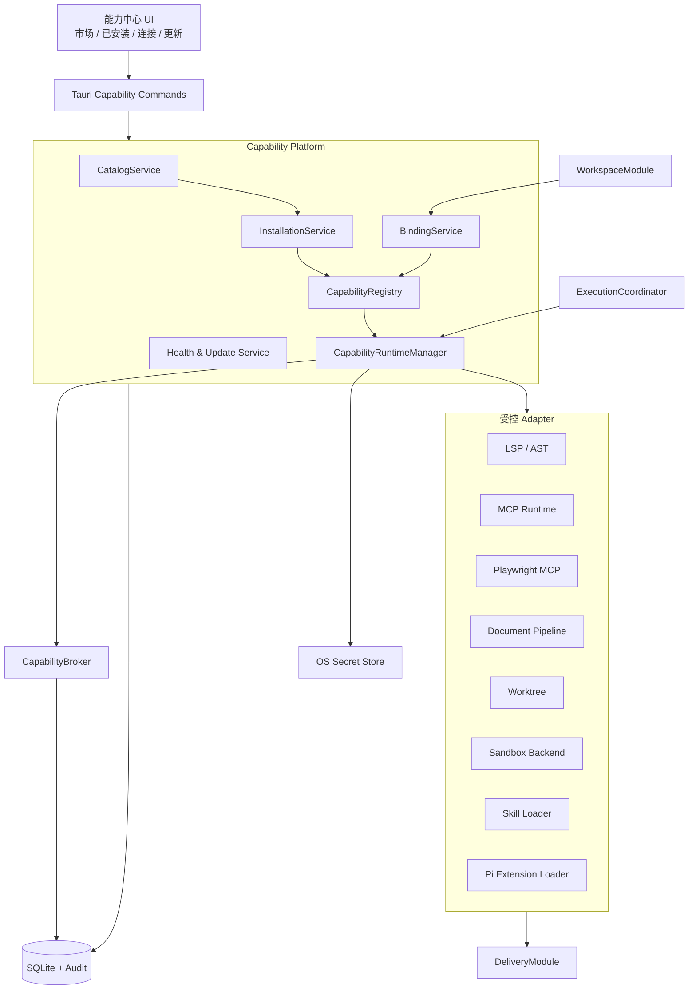

# PiWork 能力平台与市场实施计划

> 日期：2026-08-22  
> 前置文档：[`PiWork 当前 Agent 架构全景`](./piwork-current-agent-architecture.zh-CN.md)、[`PiWork 核心 Agent 架构整改完整实施计划`](./piwork-agent-remediation-roadmap.zh-CN.md)  
> 范围：在 `ExecutionCoordinator`、`CapabilityBroker`、`WorkStatusProjector`、`DeliveryModule`、`WorkspaceModule` 之上，接入 LSP/AST、MCP、Browser、文档解析与生成、Worktree、Sandbox、Skill，并建设统一的 Plugin/MCP/Skill 能力市场。  
> 计划原则：开源引擎优先；PiWork 自己掌握安装、授权、生命周期、审计、状态与产品体验。

## 1. 执行结论

这份计划不把所有能力做成一个“超级插件”，也不把市场理解成一个 npm 搜索页面。目标是建立一个稳定的 **Capability Platform（能力控制面）**：任何 Plugin、MCP Server、Skill 或内置 Adapter 都必须经过同一套目录、安装、兼容性、授权、运行和审计模型，再被某个 Workspace、Agent 或 Work 使用。

建议采用：

> **核心整改整体先完成到对应门槛，能力平台一次设计，能力模块逐个接入，市场先做受控目录再开放社区发布。**

发布顺序为：

```text
核心整改 R0～R5
    ↓
能力平台基础：Manifest / Registry / Installer / Binding / Audit
    ↓
Skill + 只读 AST/LSP
    ↓
只读 MCP
    ↓
Execution Environment + Windows 强 Sandbox
    ↓
Browser + 文档生成
    ↓
Worktree
    ↓
Verified Marketplace → Community Marketplace
```

禁止在 `CapabilityBroker` 完成前开放高权限 MCP、Browser 或可执行 Skill；禁止在 `DeliveryModule` 完成前把截图、PDF、DOCX 或测试报告声明为可信 Artifact；禁止在 `WorkspaceModule` 完成前规模化管理 LSP 索引、浏览器 Profile、Worktree 和项目级 Skill。

## 2. 当前基线与必须保留的资产

PiWork 已经具备能力平台的部分基础，不应从零重写：

| 当前资产 | 现状 | 处理方式 |
|---|---|---|
| Pi 运行时 | sidecar 固定为 `@earendil-works/pi-coding-agent 0.80.2` | 保留；增加兼容矩阵和受控升级流程 |
| 显式扩展装配 | Pi 使用 `--no-extensions`、`--no-skills`，只加载 PiWork 选择的路径 | 保留；这是默认拒绝和可复现运行的正确基础 |
| `extension_packages` | 已记录版本、integrity、manifest、permissions、trust tier、旧版本 | expand-and-contract 迁移为统一 Package/Release/Installation 模型 |
| Extension Marketplace 页面 | 已有已安装/社区搜索、信任等级、工具与权限展示 | 演进成“能力中心”，不另建第二个市场页面 |
| Agent/Work grant | 已有 `extension_agent_grants`、`extension_work_policies` | 迁移到统一 `capability_bindings`，旧表短期只读兼容 |
| Web Access | 已有第一个内置 Extension 和凭证管理 | 作为能力平台第一个迁移样本 |
| Resource/Document Runtime | 已有 Xberg 解析和 derivative/resource 模型 | 作为文档解析主路径；Docling 只做高级 fallback/增强 |
| Secret Store | 已通过操作系统凭证存储保存 Web/Connector secret | 继续作为唯一 secret 事实源；数据库只保存引用 |

当前最关键的缺口是 `ExtensionService::runtime_snapshot` 仍忽略 `agent_instance_id` 与 `work_id`；市场页面展示了授权概念，但生产装配没有完整执行这些 grant。能力平台不得在这个问题修复前开放任意社区代码。

## 3. 开源选型核验基线

下表是 2026-08-22 的核验快照。版本号只用于启动兼容性验证；生产安装必须锁定经过验证的版本、完整依赖树和内容摘要，不能使用 `latest`。

| 模块 | 一手来源与当前版本 | 许可证 | Windows / Pi 0.80.2 判断 | 决策 |
|---|---|---|---|---|
| LSP/AST 聚合 | [`pi-lens 4.1.1`](https://registry.npmjs.org/pi-lens/4.1.1)、[源码](https://github.com/apmantza/pi-lens)、[install smoke](https://github.com/apmantza/pi-lens/blob/master/.github/workflows/install-smoke.yml) | MIT | 当前 peer 包含 `pi-tui ^0.84.1`，官方 smoke 覆盖到 Pi 0.80.10 而非 0.80.2；Windows 代码有专项处理，但正式 smoke 矩阵未覆盖 Windows。兼容性尚未建立，不能直接装入生产 | 先验证 Pi 升级；升级前直接使用 `ast-grep` 和语言服务器子进程，或评估最后一个兼容版本，不长期维护 fork |
| MCP Runtime | [`pi-mcp-adapter 2.27.0`](https://registry.npmjs.org/pi-mcp-adapter/2.27.0)、[源码](https://github.com/nicobailon/pi-mcp-adapter)、[package.json](https://github.com/nicobailon/pi-mcp-adapter/blob/main/package.json) | MIT | 包声明 `@earendil-works/pi-ai ^0.84.1`，当前 0.80.2 不满足；官方 CI 只覆盖 Ubuntu，Windows 兼容仍待产品验收。它支持注入隔离 config snapshot，但跨 Pi session 共享 server process 尚未实现 | Pi 升级并完成 Windows contract 后采用；协议、OAuth、transport、tool cache 不自研，PiWork 只做配置投影、审批 Broker 和运行状态 |
| Browser | [`@playwright/mcp 0.0.79`](https://registry.npmjs.org/%40playwright%2Fmcp/0.0.79)、[源码与配置](https://github.com/microsoft/playwright-mcp) | Apache-2.0 | Node >=18，PiWork sidecar Node 要求 >=22.19，运行时条件满足；Windows 有 profile 路径说明。其 origin allowlist 明确不是安全边界 | 通过 MCP Runtime 接入；默认 isolated profile，网络和文件限制由 Broker/Sandbox 强制 |
| 文档高级解析 | [`Docling 2.121.0`](https://github.com/docling-project/docling/releases/tag/v2.121.0)、[项目说明](https://github.com/docling-project/docling)、[安装文档](https://docling-project.github.io/docling/getting_started/installation/) | MIT | 官方支持 Windows/macOS/Linux x86_64/arm64，要求 Python >=3.10；模型/OCR 依赖可能有下载、冷启动和内存成本，不依赖 Pi | Xberg 主路径，Docling sidecar 按需安装为高级 PDF/版面/OCR fallback |
| PDF 排版生成 | [`Typst 0.15.1`](https://github.com/typst/typst/releases/tag/v0.15.1)、[官方 PDF 文档](https://typst.app/docs/reference/pdf/) | Apache-2.0 | 官方提供 Windows CLI；本地单进程，不依赖 Pi | 首选确定性 PDF 生成引擎，固定 binary hash、字体包和模板版本 |
| Office/HTML 转 PDF | [`Gotenberg 8.36.0`](https://github.com/gotenberg/gotenberg/releases/tag/v8.36.0)、[项目说明](https://github.com/gotenberg/gotenberg) | MIT | 官方形态是 Docker API；Windows 需要 Docker/容器环境，不适合作为桌面基础依赖 | 可选增强 Adapter，不作为首发必需项；无 Docker 时明确降级 |
| Worktree | [`@narumitw/pi-worktree 0.51.4`](https://registry.npmjs.org/%40narumitw%2Fpi-worktree/0.51.4)、[包说明](https://pi.dev/packages/%40narumitw/pi-worktree)、[源码](https://github.com/narumiruna/pi-extensions/tree/main/packages/pi-worktree) | MIT | peer 对 Pi 使用 `*`，但当前开发基线是 Pi 0.84.x，`*` 不是兼容承诺；Windows 路径已明确支持。它只提供交互 `/worktree` 命令，不提供 LLM tool、后台 watcher 或 Assignment 生命周期 | 复用其安全检查与测试思路；PiWork 以 Git argv subprocess 实现 `WorktreeAdapter`，由 Workspace/Assignment 管理 |
| Sandbox | [`pi-sandbox 0.6.5`](https://registry.npmjs.org/pi-sandbox/0.6.5)、[包说明](https://pi.dev/packages/pi-sandbox) | MIT | peer 为 Pi `^0.80.0`，与 0.80.2 相符；但 OS 后端仅 macOS `sandbox-exec` 与 Linux `bubblewrap`，没有 Windows 生产后端 | 不作为 Windows 安全边界；借鉴策略模型，Windows 强隔离使用 WSL2/Docker/Windows Sandbox，原生限制另做 Adapter |
| 结构化 AST | [`ast-grep`](https://github.com/ast-grep/ast-grep) | MIT | Rust CLI，支持 Windows，可独立于 Pi 运行 | 可最早接入；首期只开放 search/scan，rewrite 必须预览和审批 |
| Skill 标准 | [Agent Skills 规范](https://github.com/agentskills/agentskills/blob/main/docs/specification.mdx)、[客户端实现指南](https://github.com/agentskills/agentskills/blob/main/docs/client-implementation/adding-skills-support.mdx) | 规范文档 CC-BY-4.0，参考代码 Apache-2.0 | 开放目录格式，与 Pi 的 Skill 机制兼容；`allowed-tools` 仍是实验字段 | 原样支持标准 `SKILL.md`，权限由 PiWork overlay 管理，不扩写私有 frontmatter 破坏可移植性 |

Pi 官方把 Package 定义为可同时包含 extension、skill、prompt 和 theme 的分发单元，并明确第三方 Package 能执行代码、需要先审查来源。[Pi Packages 文档](https://github.com/earendil-works/pi/blob/main/packages/coding-agent/docs/packages.md) 同时，Pi 本身没有内建的文件、进程、网络和凭证权限系统，官方建议使用容器或自行实现 permission flow。[Pi 仓库权限说明](https://github.com/earendil-works/pi#permissions--containerization) 因此，市场“能安装”不等于“可直接执行”。

## 4. 目标架构



### 4.1 模块职责边界

| 模块 | 唯一职责 | 明确不做 |
|---|---|---|
| `CatalogService` | 搜索、详情、分类、发行版元数据、兼容/许可/信任投影 | 不下载安装，不决定运行权限 |
| `InstallationService` | staged download、校验、解包、原子切换、升级、回滚、卸载 | 不加载工具，不保存明文 secret |
| `CapabilityRegistry` | 将已安装 Package 的 contributions 规范化为 Plugin/MCP/Skill/LSP 等能力 | 不拥有 Workspace grant |
| `BindingService` | 将 contribution 绑定到 Workspace/Agent/Work，保存配置和权限收窄 | 不允许扩大 Manifest 声明权限 |
| `CapabilityRuntimeManager` | 建立/复用/停止运行实例，生成 Run capability snapshot | 不绕过 Broker，不直接设置 Work 状态 |
| Adapter | 把开源引擎转成 PiWork 内部请求、事件和 Artifact | 不直接写市场/Work/Delivery 表 |
| `CapabilityBroker` | 对每次危险操作 Allow/Deny/Ask，签发短期 lease，记录审计 | 不负责下载安装 |

## 5. 统一领域模型

市场必须把“分发单元”和“运行能力”分开。一个 npm/Pi Package 可能同时贡献 Extension 和 Skill；一个 MCP Server 可能是远程 URL，也可能由某个 Package 安装本地 launcher；项目目录中的 Skill 可能根本没有市场 Package。

```text
CatalogPackage                  市场身份：作者、介绍、分类、信任等级
└── PackageRelease             不可变发行版：版本、digest、许可、兼容性、manifest
    ├── PackageArtifact        可下载文件：npm tarball / git archive / binary / container
    └── CapabilityContribution 该版本声明的 plugin / mcp / skill / lsp / document / browser

PackageInstallation            Package + scope 的稳定本机安装槽，不随升级更换 ID
├── InstallationRelease        已 staged / active / retained 的精确 PackageRelease
├── ActiveReleasePointer       原子指向一个已验证版本
└── CapabilityBinding          按稳定 contribution_key 对 Workspace / Agent / Work 启用和收窄
    └── RuntimeInstance        从精确 release + contribution 启动的进程、连接、索引或 sandbox

CapabilityOperation            安装/启停/升级/回滚/卸载操作记录
CapabilityAuditEvent           授权决策、执行结果、健康状态和来源追踪
```

### 5.1 核心不变量

1. `PackageRelease` 一经收录不可原地改变；同一版本 digest 改变必须隔离并撤销。
2. Package 不是单一 `kind`；能力类型来自每个 `PackageRelease` 的 `CapabilityContribution[]`。
3. 安装默认不启用，启用默认不授权危险能力。
4. Binding 只能收窄 Release Manifest 权限，不能扩大。
5. Secret 只保存 `secret_ref`，永不进入 manifest、SQLite JSON、日志或 Agent prompt。
6. RuntimeInstance 必须关联 immutable `RunCapabilitySnapshot` 和确切 release digest。
7. Work 完成只能由 DeliveryModule 决定；能力运行成功不等于 Work 完成。
8. 禁用/撤销影响新 Run；正在运行的高危实例收到 revoke 时必须被 RuntimeManager 中止并清理 lease。
9. Binding 引用 `installation_id + contribution_key`，不引用某一版本的行 ID；若升级版本删除或改变该 key，升级必须阻塞并要求用户处理 Binding。

### 5.2 生命周期

目录状态与本机安装状态分开：

```text
Catalog: draft → submitted → scanning → verified/community → deprecated/revoked

Install: absent
  → downloading → staged → verifying → installed_disabled
  → enabling → enabled → disabling → installed_disabled
  → updating → enabled
  → rolling_back → enabled
  → pending_removal → absent

任何中间状态 → failed（保留诊断和上一个可用 release）
任何运行状态 → quarantined（安全撤销、digest 冲突或策略违规）
```

所有修改操作使用 `operation_id` 和 idempotency key；应用崩溃后由 InstallationService 从 staged directory、active pointer 和操作日志恢复，不凭目录是否存在猜测状态。

## 6. PiWork Manifest v1

PiWork 不修改 Agent Skills 的 `SKILL.md` 规范，也不要求上游作者更改 Pi `package.json`。InstallationService 将上游元数据、Pi manifest、MCP 配置和 PiWork 审核 overlay 规范化为内部 `piwork.manifest.v1`。市场发布者可以原生提供该文件；没有时由审核流水线生成。

```json
{
  "schemaVersion": "piwork.manifest.v1",
  "package": {
    "id": "org.example.code-intelligence",
    "version": "1.2.3",
    "publisher": "org.example",
    "license": "MIT",
    "source": "https://github.com/example/code-intelligence",
    "digest": "sha512-..."
  },
  "compatibility": {
    "piwork": ">=1.0.0 <2.0.0",
    "pi": ">=0.84.1 <0.85.0",
    "os": ["windows-x64"],
    "runtime": { "node": ">=22.19.0" }
  },
  "contributions": [
    {
      "id": "plugin",
      "kind": "pi-extension",
      "entry": "dist/index.js",
      "tools": ["code_diagnostics", "symbol_search"]
    },
    {
      "id": "skill",
      "kind": "agent-skill",
      "entry": "skills/code-intelligence/SKILL.md"
    }
  ],
  "permissions": {
    "filesystem": [{ "access": "read", "scope": "workspace" }],
    "process": [{ "executable": "language-server", "scope": "managed" }],
    "network": [],
    "secrets": [],
    "git": [],
    "browser": null
  },
  "dependencies": [],
  "conflicts": [],
  "artifacts": {
    "source": "npm",
    "integrity": "sha512-...",
    "provenanceRequired": true
  }
}
```

### 6.1 Manifest 校验顺序

1. JSON Schema 与路径规范化；拒绝绝对 entry、`..` 越界、NUL 和符号链接逃逸。
2. ID、SemVer、贡献项唯一性和 dependency graph 循环检查。
3. PiWork/Pi/Node/OS/arch 兼容性检查。
4. SPDX license 识别和企业策略检查；未知或多重许可进入人工审核。
5. tarball/git commit/binary/container digest 校验。
6. npm registry signature 与 provenance 校验；npm 官方说明 `npm audit signatures` 同时验证 registry signature 和 provenance，但 provenance 只证明构建来源，不能证明代码无恶意。[npm provenance 文档](https://docs.npmjs.com/generating-provenance-statements/)
7. 静态检查 install/preinstall/postinstall scripts、native binary、网络域名、secret 声明、可执行脚本和 prompt injection 信号。
8. 在隔离 staging 环境运行 smoke/contract tests，禁止访问真实用户 secret。
9. 审核结果作为 PiWork overlay 保存，不能写回或伪造上游 manifest。

## 7. 权限与信任模型

### 7.1 权限词汇

所有 Adapter 映射到同一套 `CapabilityOperation`：

| 类别 | 典型 operation | 默认策略 |
|---|---|---|
| filesystem | `read`, `write`, `delete`, `watch` + workspace/artifact/user-selected scope | Workspace read 可按模式允许；write/delete Ask 或 Deny |
| process | managed executable + argv + cwd + timeout | 未声明 executable 拒绝；shell 字符串不作为 manifest 权限 |
| network | scheme + host + port + purpose | 域名 allowlist；重定向后重新裁决 |
| secret | secret key + injection channel + consumer | 必须显式授权；只给目标进程短期注入 |
| MCP | server + tool + args sensitivity | 每个 tool 单独裁决，不以“连接 server”代表全授权 |
| browser | navigate/read/form-input/download/upload/persist-profile | 读取与副作用分开；下载只进 Artifact staging |
| document | parse/render/convert + input/output scope | 输出只进入 managed Artifact directory |
| git | status/diff/worktree-add/worktree-remove/commit/merge | status/diff 与变更操作分级 |
| publish | send/upload/share/external-write | 始终 Ask，除非 Work 有显式一次性批准 |

### 7.2 Trust Tier

| 等级 | 来源 | 允许的发布体验 |
|---|---|---|
| `builtin` | PiWork 随应用签名分发 | 默认安装；仍受 Run snapshot 限制 |
| `verified` | 固定源码、许可、provenance、自动扫描、人工审核和兼容测试 | 可一键安装，但必须展示权限差异并由用户确认 |
| `community` | 可追踪来源并通过基础 schema/digest/恶意软件检查 | 默认不可自动执行；先安装为 disabled，并显示未验证警告 |
| `local` | 用户目录/git/path 导入 | 视为开发模式；只允许显式 Workspace trust，不进入全局自动更新 |
| `quarantined` | digest 冲突、撤销或检测到违规 | 禁止启用；允许导出诊断和卸载 |

Pi 官方 Package 可以执行任意代码，因此信任等级只是审核事实，不是运行时安全边界；真正边界始终是 Broker、受控进程和 Sandbox。

## 8. 数据库实施方案

采用新增表、回填、切换读取、删除旧写入的 expand-and-contract 策略。不要直接修改已发布的 `0010_extensions_and_connectors.sql`。

### 8.1 新表

| 表 | 关键字段 | 用途 |
|---|---|---|
| `catalog_sources` | `source_id`, kind, base_url, trust_policy_json, enabled, last_sync_cursor, last_sync_at | bundled、Pi/npm、MCP Registry、Git、本地目录等来源 |
| `catalog_packages` | `package_id`, publisher, display_name, summary, trust_tier, source_kind, repository_url, catalog_status | 稳定市场身份 |
| `package_releases` | `release_id`, package_id, version, manifest_json, manifest_schema, integrity, source_commit, provenance_json, license_spdx, compatibility_json, review_status, published_at | 不可变发行版 |
| `package_artifacts` | `artifact_id`, release_id, kind, source_url, integrity, size_bytes, signature_json | npm/git/binary/container 下载物 |
| `capability_installations` | `installation_id`, package_id, scope_kind, workspace_id, install_root, lifecycle_status, active_release_id, previous_release_id, health_status, operation_id | Package + scope 的稳定安装槽与原子版本指针 |
| `installation_releases` | `installation_id`, release_id, state, staged_path, verified_at, retained_until | staged、active、previous 与回滚窗口中的本地版本 |
| `capability_contributions` | `contribution_id`, release_id, contribution_key, kind, entry_path, metadata_json | 某个不可变 Release 声明的 Plugin/MCP/Skill/LSP 等贡献项 |
| `capability_bindings` | `binding_id`, installation_id, contribution_key, scope_kind, scope_id, enabled, config_json, permission_overrides_json, updated_at | 跨版本稳定的 Workspace/Agent/Work 启用与收窄授权 |
| `capability_operations` | `operation_id`, installation_id, operation_kind, from_release_id, to_release_id, status, progress_json, error_code, idempotency_key, created_at, completed_at | 安装、升级、回滚、卸载恢复日志 |
| `capability_runtime_instances` | `runtime_id`, installation_id, release_id, contribution_key, workspace_id, work_id, run_id, process_id, snapshot_version, status, health_json, started_at, stopped_at | 精确版本的进程/连接/索引/Profile 生命周期 |
| `capability_audit_log` | `audit_id`, runtime_id, work_id, run_id, operation_kind, resource, decision, approval_id, outcome, redacted_details_json, created_at | 统一审计 |
| `mcp_connections` | `connection_id`, contribution_id nullable, workspace_id, transport, endpoint_redacted, command_json, enabled, protocol_version, health_status, credential_ref | Package 安装与 MCP 配置解耦 |
| `skill_entries` | `skill_id`, contribution_id nullable, workspace_id, canonical_path, name, description, content_hash, license, compatibility, validation_status, executable_files_json | 市场、项目和本地 Skill 的统一索引 |

`active_release_id` 应放在 Installation 或独立 active pointer 上，Installation 本身不绑定某个固定 Release。更新流程先把新 Release 加入 `installation_releases` 并完整验证，再用单事务切换 active pointer；失败时旧版本仍可运行，Binding 也不会因为版本行 ID 改变而丢失。

### 8.2 现有表迁移

1. 从 `extension_packages` 回填 `catalog_packages` 和一个 `package_releases`；现有 `integrity`、manifest、permissions、previous versions 保留为迁移证据。
2. 为 `pi-web-access` 建立一个 global `capability_installations` 和一个 `pi-extension` contribution。
3. 把 `extension_agent_grants` 与 `extension_work_policies` 回填为 bindings；回填后双读校验，不双写超过一个发布周期。
4. `ExtensionService` 改为 Capability Platform 的兼容 facade，只读新表；Tauri 旧命令暂时不变。
5. 新页面和 Runtime Snapshot 全部切换后，停止旧表写入；下一发布周期才删除旧表和旧 TypeScript 类型。

### 8.3 Secret 与敏感字段

- `mcp_connections.command_json` 禁止保存 env secret 值，只允许 `${secret:ref}` 占位符。
- endpoint 只保存可展示的 redacted 值；OAuth token、cookie、browser storage state 放 OS credential store 或受保护 runtime directory。
- audit 参数使用 schema-aware redaction；未知字段默认 redacted，不默认记录完整 MCP args。

### 8.4 建议迁移序列

以下编号承接 Plan A 的 `0020_workspace_contract.sql`；实施时只追加 migration，不回改已进入测试或发布基线的文件：

| 建议 migration | 内容 | 切换策略 |
|---|---|---|
| `0021_capability_catalog.sql` | Catalog Source、Package、Release、Artifact | 先只读同步，不影响现有 Extension 页面 |
| `0022_capability_installations.sql` | Installation、Installation Release、Operation、content-addressed store 元数据 | 仅迁移 builtin `pi-web-access` 验证恢复算法 |
| `0023_capability_contributions_bindings.sql` | Contribution、Binding、旧 grant/policy 回填 | 一个发布周期双读校验，禁止长期双写 |
| `0024_capability_runtime_audit.sql` | Runtime Instance、统一 Audit、Run Snapshot 外键 | 新 Runtime 先 shadow 记录，Broker 验证后切权威读取 |
| `0025_mcp_skill_indexes.sql` | MCP Connection 与 Skill Entry read model | 不保存 secret 值，只保存引用 |
| `0026_extensions_contract.sql` | 停止旧 Extension 表写入，收紧约束；是否删除旧表另行决定 | 至少延后一个稳定发布周期 |

每次迁移验证 Package/Release 数量、active pointer 唯一性、Binding contribution key 可解析、Runtime release digest 可追溯、旧 Extension grant 无扩权，以及数据库中不存在 secret 明文。

## 9. Rust 与 TypeScript Module Seam

### 9.1 Rust 后端

建议新增深模块，而不是继续扩张 `extensions/mod.rs`：

```text
src-tauri/src/capability/
├── mod.rs                    # CapabilityPlatform facade
├── domain.rs                 # Package/Release/Installation/Contribution/Binding
├── manifest.rs               # parse/validate/normalize piwork.manifest.v1
├── catalog.rs                # catalog read model and source adapters
├── repository.rs             # SQLite persistence
├── installation.rs           # staged install/update/rollback/remove
├── registry.rs               # installed contribution resolution
├── binding.rs                # Workspace/Agent/Work bindings
├── runtime.rs                # RuntimeManager and health
├── audit.rs                  # redaction + audit writer
├── commands.rs               # thin Tauri commands
└── adapters/
    ├── pi_extension.rs
    ├── skill.rs
    ├── lsp.rs
    ├── ast_grep.rs
    ├── mcp.rs
    ├── browser.rs
    ├── document.rs
    ├── worktree.rs
    └── sandbox.rs
```

目标 facade：

```rust
pub struct CapabilityPlatform { /* hidden */ }

impl CapabilityPlatform {
    pub async fn search(&self, query: CatalogQuery) -> Result<CatalogPage, AppError>;
    pub async fn plan_install(&self, release_id: &str) -> Result<InstallPlan, AppError>;
    pub async fn apply(&self, command: CapabilityCommand) -> Result<OperationReceipt, AppError>;
    pub async fn bind(&self, command: BindingCommand) -> Result<BindingReceipt, AppError>;
    pub async fn snapshot(&self, request: RunCapabilityRequest) -> Result<RunCapabilitySnapshot, AppError>;
}
```

`PiEngineAdapter` 只消费已经解析完成的 Snapshot，不能自己查询市场或拼装 grant。Extension、Skill、MCP 配置必须由 RuntimeManager 写入 Run 的私有 staging 目录，再显式追加 `--extension`/`--skill`；继续保留 `--no-extensions`/`--no-skills`。

### 9.2 TypeScript 前端

```text
src/features/capabilities/
├── CapabilityCenterPage.tsx
├── MarketplaceView.tsx
├── InstalledView.tsx
├── ConnectionsView.tsx
├── UpdatesView.tsx
├── PackageDetailPage.tsx
├── InstallReviewDialog.tsx
├── PermissionDiff.tsx
├── BindingEditor.tsx
├── RuntimeHealthPanel.tsx
├── capabilityStore.ts
└── capabilityTypes.ts
```

前端只消费 Rust read model，不解析任意第三方 manifest、不计算兼容性、不决定信任等级。所有 `install/enable/update/rollback/remove` 返回 `operation_id`，页面订阅进度事件并可在重启后重新查询。

## 10. 页面信息架构与 UI 流程

### 10.1 一级入口：能力中心

把当前 Extension Marketplace 演进为单一一级入口“能力中心”：

```text
能力中心
├── 市场 Marketplace
│   ├── 全部
│   ├── Plugins
│   ├── MCP Servers
│   ├── Skills
│   └── 开发工具 / 浏览器 / 文档 / Git / 数据连接分类
├── 已安装 Installed
│   ├── 全局
│   └── 当前 Workspace
├── 连接 Connections
│   ├── MCP
│   ├── Browser Profiles
│   └── Connectors
└── 更新与安全 Updates
    ├── 可用更新
    ├── 权限变化
    ├── 撤销/隔离
    └── 安装历史与回滚
```

Plugin/MCP/Skill 是贡献类型过滤器，不是三个割裂的商店。包卡片应显示它贡献的全部类型，例如 `pi-lens` 同时显示 Plugin 与 Skill 标签。

### 10.2 包详情页

必须展示：

- 发布者、源码仓库、精确版本、发布日期、许可证、trust tier。
- 内容 digest、provenance 是否可验证、最后一次安全扫描和兼容测试版本。
- 支持的 PiWork/Pi/OS/arch/runtime。
- contributions、tools、Skill 摘要、MCP resources/prompts/tools。
- 权限按低/中/高风险分组，并显示“为什么需要”。
- 当前 Workspace/Agent 的 binding、健康状态、最近审计和历史版本。
- 安装、启用、禁用、升级、回滚、卸载按钮；Community 包突出“未经 PiWork 验证”。

### 10.3 安装流程

```text
选择 Release
→ 解析兼容性与依赖
→ 展示许可与权限
→ 下载到 staging
→ digest/signature/provenance 校验
→ 静态扫描 + 隔离 smoke test
→ installed_disabled
→ 用户选择 Workspace/Agent
→ 生成最小权限 binding
→ 启用并运行 health check
```

升级时必须显示 permission diff、license diff、publisher/source/digest 变化。新增高风险权限时不得自动升级。回滚按钮应明确回到哪个 digest，而不是只显示版本号。

### 10.4 Workspace 与 Agent 页面体现

- Workspace 设置新增“能力”页：当前启用的 Plugin/MCP/Skill、LSP 状态、Sandbox mode、Worktree 策略。
- Agent 编辑页新增“可用能力”区：继承 Workspace binding，再做收窄；不得提升权限。
- Work 运行 Inspector 显示本次 immutable capability snapshot、MCP/Browser/Document runtime、审批和 Artifact 来源。
- Dashboard 的 `AgentSkillsPanel` 改为真实 Skill read model，不再使用静态展示数据。

## 11. 各能力模块实施计划

### 11.1 LSP / AST

#### 目标边界

LSP Server 生命周期属于 Workspace，不属于单次 Agent turn；诊断、符号、定义、引用等查询属于只读能力，rename/code action/rewrite 属于写能力。LSP 规范本身规定 server 生命周期由 client 管理，并要求成套处理 `didOpen/didChange/didClose`。[LSP 3.17 规范](https://microsoft.github.io/language-server-protocol/specifications/lsp/3.17/specification/)

#### 实施切片

1. `AST-0`：直接集成固定版本 `ast-grep` CLI，只提供 `search/scan/outline`，输出规范化为 `CodeFinding[]`。
2. `LSP-0`：实现 `WorkspaceLanguageService` 进程池、健康、超时、文件版本和 shutdown；先支持 TypeScript/Rust 两种项目。
3. `LSP-1`：暴露 `diagnostics/symbol/definition/references` Host Tools；每个调用经过 Snapshot。
4. `LSP-2`：把 edit/write 后的 diagnostic delta 送入 Validation，不直接改 Work 状态。
5. `LSP-3`：完成 Pi >=0.84.x 升级验证后试点 `pi-lens 4.1.1`；若契约通过，用它替代内部聚合层而不是并行保留两套诊断权威。
6. `LSP-4`：rename/rewrite/code actions 必须先生成 patch preview，再由 Broker Ask，应用后重新诊断。

#### 验收

- 同一 Workspace 复用 server，Workspace 切换和关闭会终止进程树。
- stale document version 不产生可执行 edit。
- 1000 文件项目冷启动、增量诊断和内存有基线预算。
- Pi 版本、语言服务器版本和配置 hash 写入 Validation evidence。

### 11.2 MCP Runtime

MCP 是工具/资源/Prompt 的协议，不是信任边界。规范包含版本协商、JSON-RPC、transport、authorization 和 capability negotiation；PiWork 必须保存实际协商版本并拒绝未支持版本。[MCP 规范](https://github.com/modelcontextprotocol/modelcontextprotocol/blob/main/docs/specification/draft/basic/index.mdx)

#### 实施切片

1. `MCP-0`：完成 Pi 0.80.2 → >=0.84.1 兼容性升级 spike；未通过前不加载当前 `pi-mcp-adapter`。
2. `MCP-1`：以 `createMcpAdapter({ config })` 的隔离快照模式接入，不读取用户环境中的任意 `.mcp.json` 作为权威来源。
3. `MCP-2`：只允许一个 builtin/verified 的只读 stdio server；建立 connect/list/describe/call/stop/health 契约。
4. `MCP-3`：tool discovery 结果写入 contribution read model；每次 call 转成 `CapabilityOperation::McpToolCall`，按 server/tool/args 裁决。
5. `MCP-4`：接入 HTTP/OAuth；凭证由 OS Secret Store 管理，授权 URL 和回调由 PiWork UI 协调。
6. `MCP-5`：资源、prompts、MCP UI 和 remote community server 分别 feature flag 发布。

#### 关键限制

- `pi-mcp-adapter` 当前每个 Pi session 自己运行 server process。首期接受此限制并设置进程/并发上限；共享进程必须另立 ADR，不能偷偷复用有状态 server。
- direct tools 只允许小型 allowlist；默认用代理发现降低上下文体积。
- MCP tool 返回的文件、图片和大文本先进入 Resource/Artifact staging，再由 Delivery 接纳。

### 11.3 Browser

#### 实施切片

1. `Browser-0`：把固定版本 `@playwright/mcp` 注册成 builtin MCP contribution。
2. `Browser-1`：默认 `--isolated`、headless、独立 output directory；一个 RuntimeInstance 对应一个 Work/Run。
3. `Browser-2`：Broker 区分 navigate/read、form input、upload、download、clipboard、persistent profile。
4. `Browser-3`：截图、trace、下载和控制台日志导入 Delivery/Resource，记录 URL、时间、tool call 和 release digest。
5. `Browser-4`：仅在用户显式选择后启用持久 Profile；cookie/storage state 加密保存并按 Workspace 隔离。
6. `Browser-5`：再增加 headed UI、现有 Chrome session 或登录态桥接；这是独立的高风险能力，不作为首发默认。

Playwright MCP 官方说明 `allowed-origins`/`blocked-origins` 不构成安全边界且不覆盖重定向；因此必须在网络代理/Sandbox 层重新检查最终请求。[Playwright MCP 配置](https://github.com/microsoft/playwright-mcp#configuration)

### 11.4 文档解析与生成

#### Pipeline

```text
Resource Input
→ format sniffing / malware & size limits
→ Xberg parse
→ Docling advanced fallback（可选）
→ normalized DocumentModel
→ Markdown/Typst template
→ Typst PDF 或 Gotenberg Office/HTML conversion（可选）
→ Validation
→ Delivery managed Artifact
```

#### 实施切片

1. `Doc-0`：定义与引擎无关的 `DocumentModel`、`DocumentJob`、`DocumentArtifact`、失败代码和 provenance。
2. `Doc-1`：把当前 Xberg 解析改造成 `DocumentParserAdapter`，补齐取消、超时、大小/页数限制。
3. `Doc-2`：固定 Typst binary、字体包和模板包；首个闭环是 Markdown/structured data → PDF。
4. `Doc-3`：PDF metadata、页数、文件存在性和可打开性验证；Artifact 进入 Delivery。
5. `Doc-4`：按需安装 Docling sidecar，只有 Xberg 结果低置信或用户选择高级版面/OCR 时调用。
6. `Doc-5`：Gotenberg 作为可选 Docker contribution；health check 不通过时 UI 明确“Office 转 PDF 不可用”，不能静默降级为错误文件。
7. `Doc-6`：DOCX/PPTX/XLSX 原生编辑另立项目；不要把“转换为 PDF”宣传成“可编辑 Office 生成”。

#### 验收

- 同一输入、模板、字体和 Typst 版本产生稳定结果 hash，或明确记录允许变化来源。
- 文件名、嵌入资源和模板引用不能逃逸 Artifact staging。
- 恶意/超大/密码保护文件产生结构化错误，不阻塞 Agent 主循环。
- 每个输出包含 input resource IDs、engine/version、template/version 和 validation evidence。

### 11.5 Worktree

#### 领域模型

```text
Workspace
└── WorktreeLease
    ├── assignment_id
    ├── canonical_path
    ├── branch / base_commit
    ├── lifecycle: preparing / active / dirty / merging / releasable / retained
    └── cleanup_policy
```

#### 实施切片

1. `Git-0`：`GitWorktreeAdapter` 仅使用 argv subprocess；实现 inventory、add、status、remove-dry-run。
2. `Git-1`：创建前检查仓库、branch 占用、路径 canonicalization、符号链接祖先、目标不存在。
3. `Git-2`：ExecutionCoordinator 为 Assignment 申请 lease，Engine cwd 来自 lease，不由 Agent 自行 `cd`。
4. `Git-3`：Delivery 记录 base/head/diff/test evidence；Work 完成不自动 merge。
5. `Git-4`：清理前检查 tracked/untracked/submodule/detached recovery risk；有风险则 retained 并通知用户，绝不 force remove。
6. `Git-5`：最后才实现 review/merge/rebase UI，并与用户现有 Git 更改隔离。

`@narumitw/pi-worktree` 的安全检查、Windows 路径和 Git argv 方式可作为实现参考，但它只有交互 command，不能直接承担 PiWork 的 Assignment lease 和恢复语义。[官方包说明](https://pi.dev/packages/%40narumitw/pi-worktree)

### 11.6 Sandbox

#### 支持矩阵

| Backend | 平台 | 强度与首发角色 |
|---|---|---|
| `ProcessPolicyOnly` | Windows | 仅 Broker + allowlisted process/path；不是强沙箱，UI 必须标记“受限执行” |
| `WSL2` | Windows | Linux namespace/bubblewrap 方向的强隔离候选；需路径和 Git 互操作验证 |
| `Docker` | Windows/macOS/Linux | 容器强隔离；依赖 Docker Desktop/daemon |
| `WindowsSandbox` | Windows Pro/Enterprise 等 | 一次性强隔离，启动成本高，文件交换需 staging |
| `NativeRestrictedToken` | Windows | Restricted Token + Job Object + ACL + network policy；长期实现，需独立安全评审 |
| `bubblewrap` / `sandbox-exec` | Linux/macOS | 可参考 `pi-sandbox`；macOS `sandbox-exec` 能力和长期可用性需持续验证 |

#### 实施切片

1. `Sandbox-0`：定义 `ExecutionEnvironment` trait、支持矩阵、feature detection 和“不具备强隔离”的产品文案。
2. `Sandbox-1`：先把 Host process、MCP stdio、Docling/Typst、LSP、Browser 都经过 Environment launcher；即使 backend 是 ProcessPolicyOnly，也建立单一 seam。
3. `Sandbox-2`：Windows 首个强模式选择 Docker 或 WSL2，完成 workspace staging、只读/可写挂载、域名代理、resource limits、process tree kill。
4. `Sandbox-3`：对 bash/edit/write 的真实越界、网络、secret、child process 逃逸做红队测试。
5. `Sandbox-4`：再评估 Windows Sandbox 与 NativeRestrictedToken；未通过独立安全评审前不得称为“安全沙箱”。

### 11.7 Skill 集成与市场

Agent Skills 标准要求 skill 至少包含带 YAML frontmatter 的 `SKILL.md`，可选 `scripts/`、`references/`、`assets/`，并使用 progressive disclosure：启动只加载 name/description，激活后读取完整说明，引用资源按需读取。[Agent Skills 规范](https://github.com/agentskills/agentskills/blob/main/docs/specification.mdx)

#### 来源优先级

```text
builtin PiWork skill
→ installed market skill
→ Workspace .agents/skills / .pi/skills
→ user-global .agents/skills / Pi skill paths
```

同名冲突不能静默覆盖；Registry 输出冲突诊断，用户在 Workspace 设置中选择生效来源。不要扫描整个磁盘，只扫描标准路径和用户显式添加路径。

#### 实施切片

1. `Skill-0`：实现 `SkillScanner`、frontmatter parser、`skills-ref` 验证适配、content hash 和路径逃逸检查。
2. `Skill-1`：建立 `skill_entries` read model；市场、项目和本地 Skill 统一展示来源与状态。
3. `Skill-2`：Engine 启动继续 `--no-skills`，只把 Snapshot 选中的 Skill 路径用显式 `--skill` 加载。
4. `Skill-3`：只加载 metadata 到 Agent discovery；激活时记录 `skill_id/version/content_hash` 审计事件。
5. `Skill-4`：分析引用的 scripts、assets、references；Skill 本身不自动获得任何工具权限。规范中的 `allowed-tools` 是实验字段，只作为权限申请提示，不是 PiWork 授权。
6. `Skill-5`：市场安装 Skill 时展示完整文本 diff、脚本/二进制清单、外部 URL 和所需能力；更新新增脚本或权限视为高风险变化。
7. `Skill-6`：增加 Skill 作者工具：模板、规范校验、token/行数提示、触发用例、反例、跨模型测试和打包预览。
8. `Skill-7`：发布流程先支持 Git/npm 导入和私有目录；公开市场投稿、审核、评分、举报和撤销最后开放。

#### Skill 验收

- 10,000 个 Skill metadata 索引不会把完整正文放入 prompt。
- 同名、畸形 YAML、循环/越界引用、超大文件和符号链接有确定结果。
- Skill 中的脚本不能仅凭文字说明绕过 Broker/Sandbox。
- 每次运行可解释“为什么发现/启用/激活了这个 Skill”。

## 12. 分阶段实施路线

这里的阶段从前一份整改路线图的 R5 之后开始；兼容性 spike 可提前，但不得提前开放生产执行。

| 阶段 | 依赖 | 交付物 | 退出条件 |
|---|---|---|---|
| C0 决策与兼容 | 核心 R0 | Pi 0.80.2/0.84.x 双环境测试；OSS 版本/许可/Windows matrix；Manifest ADR | 能明确决定升级 Pi，不靠猜测兼容 |
| C1 能力平台基础 | C0 + 核心 R2/R5 | 新表、Manifest、Catalog、Installation、Registry、Binding、Audit；Web Access 迁移 | 安装默认 disabled；旧 Web Access 经新 Snapshot 运行；可回滚 |
| C2 Skill + AST/LSP | C1 | Skill Scanner/市场展示/显式装配；ast-grep；只读 LSP | Skill 来源可解释；LSP 无写权限；Workspace 生命周期闭环 |
| C3 MCP 只读 + Environment seam | Pi 升级 + C1 + 核心 R2 | pi-mcp-adapter、一个 verified stdio server、统一 Environment launcher、连接和审批 UI | 所有 call 有 tool-level 决策/审计；子进程统一启动/停止；故障默认拒绝 |
| C4 Windows Strong Sandbox | C1 + C3 + 核心 R5 | Docker 或 WSL2 strong backend、feature detection、挂载/网络/进程树限制 | 越界、网络、secret 和 child process 红队测试通过；不支持时高风险能力保持 disabled |
| C5 Browser + Documents | C3 + C4 + 核心 R4 | Playwright isolated session；Typst PDF；Xberg Adapter；Artifact/Validation | 截图/PDF 可追溯；下载和输出不越界；进程可回收 |
| C6 Worktree | C4 + 核心 R1/R5 | Assignment WorktreeLease、Git inventory/cleanup/recovery、Review handoff | dirty tree 不丢失；并发 Assignment 路径隔离；失败可保留恢复 |
| C7 Verified Marketplace | C1～C6 | 审核流水线、更新/权限 diff、回滚、撤销、许可页面 | Verified 包可复现安装；撤销可终止/隔离运行实例 |
| C8 Community Marketplace | C7 | 投稿、举报、评分、作者页面、社区包隔离策略 | 社区包默认 disabled；安全响应和下架流程完成演练 |

### 12.1 并行策略

- C0 可与核心整改 R1～R4 并行，只做 read-only research、fixture 和兼容测试。
- C1 的 Registry/Manifest 与 UI read model 可以并行，但 Installer、Binding、Runtime 必须按顺序集成。
- C2 中 Skill Scanner 与 AST/LSP Adapter 可由两条开发线并行。
- Browser 依赖 MCP Runtime 和 Strong Sandbox，不单独再建一套浏览器连接协议，也不以 origin allowlist 冒充隔离边界。
- Worktree Adapter 可在 C4 并行开发，但与 Assignment 联调必须等 ExecutionCoordinator、WorkspaceModule 和 Environment launcher 稳定。

## 13. 安装、启停、升级、回滚和卸载算法

### 安装

```text
resolve exact release
→ build InstallPlan
→ acquire package operation lock
→ download to random staging directory
→ verify digest/signature/provenance/license/compatibility
→ scan + smoke test
→ atomic move into content-addressed store
→ write Release/Installation/Contribution in one DB transaction
→ status installed_disabled
```

### 启用

```text
validate binding + permission subset
→ materialize runtime config without secrets
→ Broker creates snapshot
→ Runtime health check
→ binding enabled
```

若 health check 失败，保持 `installed_disabled`，不能为了“安装成功率”自动放宽权限。

### 升级

```text
install new release beside old release
→ schema/permission/license/source diff
→ migrate config in copy
→ isolated smoke test
→ atomic active pointer switch
→ start new runtime
→ retain old release for rollback window
```

### 回滚

停止新 runtime、撤销 lease、切回 previous release pointer、恢复旧 config snapshot、重新 health check。数据库迁移若不可逆，则该 Release 不允许一键升级，必须在安装页明确提示并先导出备份。

### 卸载

先禁用 binding、停止 Runtime、撤销 lease，再标记 `pending_removal`。内容存储只有在没有 Installation 引用且不在 rollback window 时才回收。失败保留诊断，不用递归删除未知目录。

## 14. 测试与质量门槛

### 14.1 分层测试

| 层 | 必测内容 |
|---|---|
| Domain | Manifest/semver/permission subset/lifecycle/property tests |
| Storage | 新旧 migration fixture、外键、operation recovery、active pointer atomicity |
| Installer | tar/path traversal、symlink、digest mismatch、磁盘满、断网、崩溃恢复、install scripts |
| Broker | contribution × operation × scope × permission mode × revoked/expired snapshot 矩阵 |
| Adapter Contract | start/health/call/cancel/timeout/kill/restart/result redaction |
| Windows E2E | 空格/Unicode/长路径、`.cmd`、process tree、凭证、WSL2/Docker 不可用降级 |
| UI | 安装确认、permission diff、进度恢复、撤销、回滚、键盘/屏幕阅读器 |
| Security | 恶意 Skill、恶意 MCP output、prompt injection、redirect、secret exfiltration、zip slip、child process escape |

### 14.2 OSS 兼容矩阵

每个受支持 Release 保存一条不可变测试记录：

```text
PiWork version × Pi version × Node version × OS/arch
× package exact version/digest × backend version
× contract suite commit × outcome
```

至少覆盖 Windows 10/11 x64。标记为 `verified` 的版本必须跑真实安装包而不是工作区源码。

### 14.3 发布门槛

- 不存在未知工具默认 Allow。
- 社区 Package 安装后默认 disabled。
- permission/source/license/digest 变化不能静默升级。
- Kill/disable/revoke 后没有残留 process、browser、MCP session 或 host tool lease。
- Work Inspector 能关联 tool call → permission decision → runtime release → Artifact/Validation。
- 应用在安装/升级中任意一步崩溃后可恢复到旧版本或可解释的 disabled 状态。

## 15. 风险与回滚

| 风险 | 预防 | 回滚/降级 |
|---|---|---|
| Pi 0.80.2 与当前 pi-lens 的兼容尚未建立，且 MCP adapter 的 peer 要求不满足 | C0 双运行时契约测试，锁定 Pi upgrade ADR | 保留 0.80.2；只发布 AST/Skill，不开放对应 adapter |
| 社区包供应链攻击 | digest、registry signature、provenance、源码审核、staging scan、默认 disabled | quarantine release、全局 revoke、停止 Runtime、回到前一 digest |
| 市场领域与现有 extension 表双轨 | 一周期双读校验，尽快停止旧写入 | Compatibility facade 切回旧 read model；不回滚 DB migration |
| Browser/MCP 泄漏 secret | secret ref、短期注入、schema redaction、isolated profile | revoke secret、终止 runtime、清除 profile、生成安全通知 |
| Windows 无强 Sandbox | UI 不夸大能力；高风险能力要求 Docker/WSL2 strong mode | 自动切回 disabled，而不是 ProcessPolicyOnly 后继续高风险执行 |
| Worktree 清理丢数据 | dry-run、dirty/recovery 检查、禁止 force、retained 状态 | 保留目录和 branch，交给用户处理 |
| Docling/Gotenberg 体积和安装失败 | 按需安装、capability health、可选增强 | Xberg/Typst 主路径继续可用；功能明确降级 |
| Skill prompt injection 或恶意脚本 | 来源展示、文本/script diff、Broker、Sandbox、激活审计 | 禁用/隔离 Skill；清除 Run snapshot，不影响其他 Skill |

每个 Adapter 有独立 feature flag 和 kill switch；领域层的 Package/Binding/Runtime 事实源不能用 feature flag 永久保持双实现。

## 16. 第一批可直接执行的 Backlog

按顺序执行，前 12 项不开放第三方执行：

1. 写 ADR：统一 Package/Release/Installation/Contribution/Binding 模型，Extension 只是 contribution。
2. 写 ADR：Pi 版本升级策略；建立 0.80.2 与目标 >=0.84.1 的 sidecar contract suite。
3. 将本文 OSS 核验数据固化为 `compatibility fixture`，只锁 exact version/digest，不锁 `latest`。
4. 定义 `piwork.manifest.v1` JSON Schema、Rust types、错误码和 canonicalization 规则。
5. 建立 permission vocabulary 与 Manifest permission → `CapabilityOperation` 映射测试。
6. 新增 Package/Release/Installation/Contribution/Binding/Operation/Runtime/Audit migrations 和旧库 fixture。
7. 将 `pi-web-access` 回填并迁移到新 read model，保持现有 UI/Tauri command 兼容。
8. 修复 Runtime Snapshot 对 Agent/Work binding 的真实消费，未知/失效授权默认拒绝。
9. 建立 content-addressed staging store、operation lock、digest verification 和崩溃恢复测试。
10. 把 Extension Marketplace 重命名并重构为 `CapabilityCenterPage`，先实现 Marketplace/Installed/Connections/Updates 空壳与新 read model。
11. 实现 Package Detail、compatibility/license/provenance/permission diff 展示。
12. 实现 install-disabled、enable、disable、rollback 的 operation UI 和事件恢复。
13. 实现 Skill Scanner/Validator/Registry，迁移 Dashboard `AgentSkillsPanel` 到真实数据。
14. Engine 显式加载 Snapshot skills，继续保留 `--no-skills`，加入同名冲突和 content hash 审计。
15. 集成固定版本 `ast-grep` 只读工具和 Workspace 生命周期测试。
16. 完成 Pi upgrade spike；通过后集成 `pi-lens` 与 `pi-mcp-adapter`，不通过则记录阻塞证据并保持 feature flag off。
17. 接入一个 builtin read-only MCP server，完成 tool-level Broker 和审计闭环。
18. 所有受控子进程迁移到 `ExecutionEnvironment` seam，交付第一个 Windows strong Sandbox backend。
19. 将 Playwright MCP 作为 builtin MCP contribution 接入 isolated Browser MVP。
20. 把 Xberg 封装成 Document Adapter，接入 Typst PDF 生成和 Delivery Artifact。
21. 最后实现 Assignment WorktreeLease、保留/清理恢复和 Review handoff。

## 17. 决策检查点

| 检查点 | 必须回答的问题 | 不通过时 |
|---|---|---|
| D1 Pi 升级 | 新 Pi 是否通过现有 Engine/JSON/RPC/session/process-tree 全链路？ | 不接当前 pi-lens/MCP adapter，先交付不依赖 Pi 的能力 |
| D2 市场控制面 | Web Access 是否已经由新 Manifest/Binding/Snapshot 运行？ | 不接第二个 executable Package |
| D3 Skill | Skill 是否可发现、冲突可解释、显式装配且脚本不自动获权？ | 市场只展示，不允许启用 |
| D4 MCP | 每个 tool call 是否有 Broker decision、审计和 stop/kill？ | 只保留开发模式 |
| D5 Artifact | Browser/Document 输出能否被 Delivery 验证和追溯？ | 不对用户宣称任务已交付 |
| D6 Strong Sandbox | Windows 越界/网络/child process 红队测试是否通过？ | 高权限市场 contribution 保持 disabled |
| D7 Community | 撤销、隔离、举报、回滚和安全响应是否完成演练？ | 只开放 builtin/verified 目录 |

## 18. 交付节奏与总体验收

一个“实现周期”表示一次可评审、可测试、可回滚的纵向改动，不等同固定自然日。工作量用于排依赖和控制分支规模，不应直接换算为承诺日期。

| 阶段 | 建议实现周期 | 推荐发布点 |
|---|---:|---|
| C0 决策与兼容 | 1～2 | 内部兼容报告与 Pi 升级 ADR |
| C1 能力平台基础 | 5～7 | Internal：Builtin Catalog + Web Access 迁移 |
| C2 Skill + AST/LSP | 4～5 | Preview：Skills + 只读代码智能 |
| C3 MCP + Environment seam | 3～4 | Preview：一个 builtin/verified 只读 MCP |
| C4 Windows Strong Sandbox | 4～6 | Security Preview：一个强隔离 backend |
| C5 Browser + Documents | 4～5 | Beta：可追溯 Browser 与 PDF Delivery |
| C6 Worktree | 3～4 | Beta：Assignment 隔离 checkout |
| C7 Verified Marketplace | 4～6 | GA：受控 Verified 目录 |
| C8 Community Marketplace | 4～6 | 独立发布：社区投稿与治理 |

C0～C6 的能力 MVP 约 24～33 个实现周期；C7～C8 市场开放约再增加 8～12 个周期。它们应持续合入可运行主线，不能压成一个长期“大市场”分支。

能力平台整体完成必须同时满足：

- Catalog Package、Package Release、Installation、Contribution、Binding、Run Snapshot 和 Runtime Instance 均有稳定 ID 与可追溯关系。
- 任意安装、启用、升级、撤销、回滚、卸载在崩溃后都能恢复到可解释状态，且不泄露 secret。
- Plugin、MCP、Skill 在一个能力中心发现和管理，但详情、权限、健康与运行方式保持类型差异。
- 所有运行能力经过 Broker 与 Environment launcher；未知能力、失效版本和撤销版本默认拒绝。
- LSP、MCP、Browser、Document、Worktree、Sandbox、Skill 各至少有一个 Windows 端到端闭环和独立 kill switch。
- Browser/Document/Git 产物都经过 Delivery；工具返回“成功”不能直接完成 Work。
- Verified Release 可从精确来源和 digest 重装；Community Release 默认 disabled，安全撤销演练通过。
- UI 能解释某项能力来自哪里、安装了哪个版本、为何启用、获准做什么、最近是否健康、如何回滚。

## 19. 最终落地形态

完成后，PiWork 的能力体系应是：

```text
开源引擎
  pi-lens / ast-grep / language servers
  pi-mcp-adapter / Playwright MCP
  Xberg / Docling / Typst / Gotenberg
  Git worktree / OS sandbox backends
                  ↓
PiWork Adapter 层
                  ↓
Capability Platform
  Catalog + Manifest + Installation + Registry + Binding + Runtime
                  ↓
CapabilityBroker + Workspace + Execution + Delivery + Audit
                  ↓
能力中心 UI
  Plugin / MCP / Skill / Connections / Updates / Security
```

PiWork 不需要重写 LSP、MCP、浏览器、文档转换、Git 或操作系统隔离引擎。PiWork 必须长期自有的是：**统一 Manifest、版本与供应链、权限裁决、Workspace/Agent/Work Binding、运行生命周期、Artifact 交付、审计、升级回滚和市场体验。**

这条边界既能最大化复用开源生态，又不会把产品的安全性和可靠性交给任意社区 Package。
