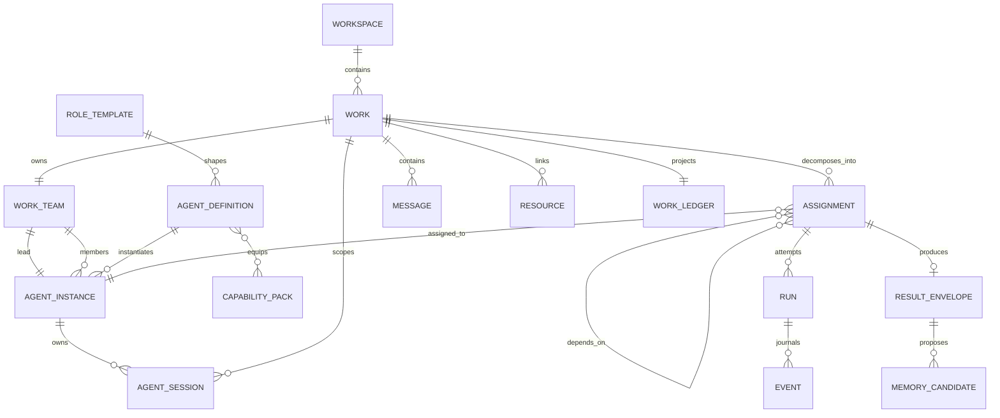
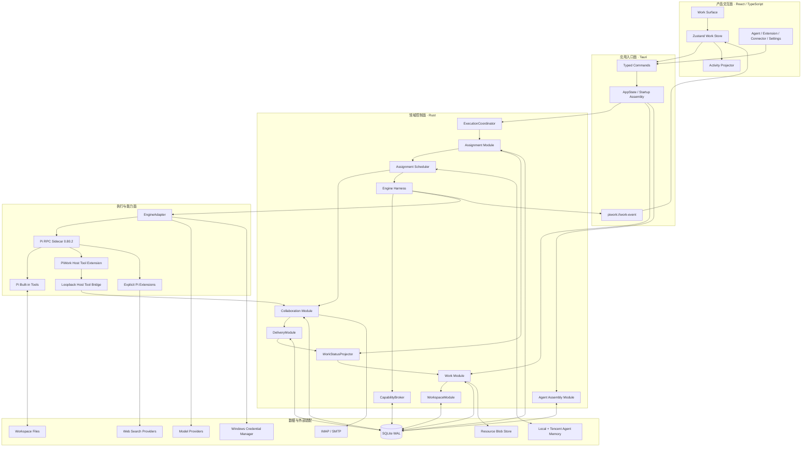
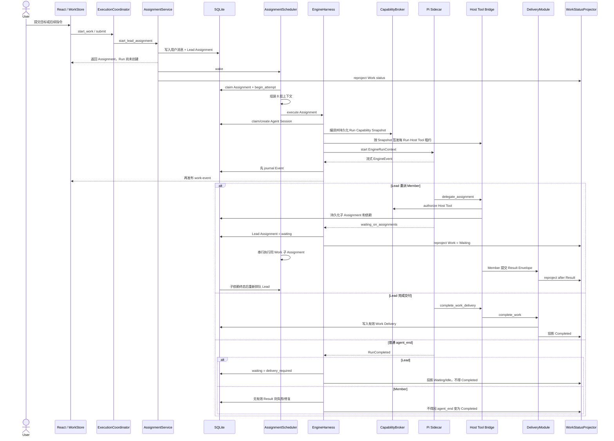
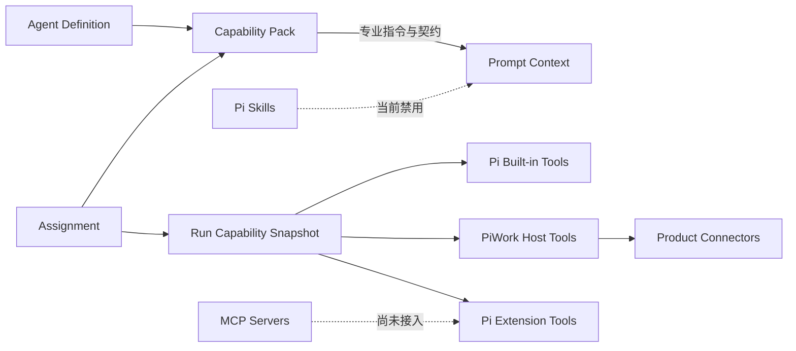
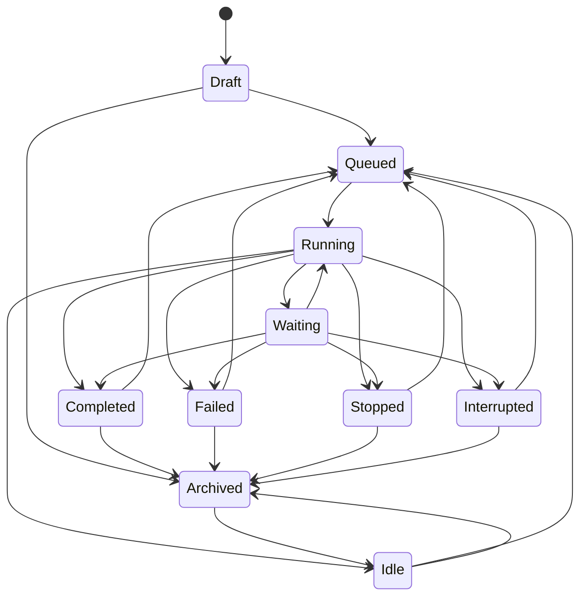
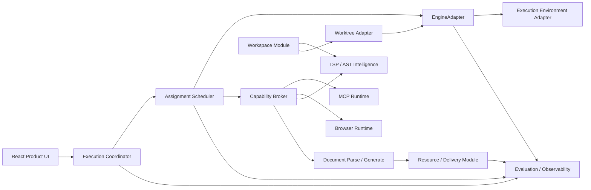

# PiWork 当前 Agent 架构全景

> 基线日期：2026-08-29  
> 文档性质：基于当前工作区代码的实现盘点，不是目标愿景，也不是历史规格复述。  
> 领域语言来源：[`CONTEXT.md`](../../CONTEXT.md)  
> 控制面接口：[`piwork-core-control-plane-interfaces.zh-CN.md`](./piwork-core-control-plane-interfaces.zh-CN.md)  
> 整改状态：[`Plan A：核心 Agent 架构整改`](./piwork-agent-remediation-roadmap.zh-CN.md)（阶段 1～5 模块已落地；阶段 0 测试安全网仍待补）  
> 后续计划：[`Plan B：能力平台与市场`](./piwork-capability-platform-market-implementation-plan.zh-CN.md)

## 1. 结论先行

PiWork 当前已经是一个 **以持久 Work 为产品中心、以 Assignment 为调度单位、以 Pi Run 为执行尝试** 的本地优先 Agent 系统，而不只是一个带工具调用的聊天界面。

生产路径使用打包的 Pi sidecar 与 `PiEngineAdapter`。确定性 fake engine 只作为测试替身。Tauri Work 命令只经过 `ExecutionCoordinator`；Run 启动前 `CapabilityBroker` 编译并持久化不可变 `RunCapabilitySnapshot`；Member 完成依赖有效 `Result Envelope`，Work Completed 只来自有效 Lead `Work Delivery`；Work 非归档执行状态由 `WorkStatusProjector` 从持久事实投影；Workspace 已有稳定 `workspace_id`。

当前架构可以概括为：

```text
React 产品界面
  → Tauri 类型化命令与事件
    → ExecutionCoordinator
      → Assignment Scheduler + Engine Harness
        → CapabilityBroker（Run Capability Snapshot）
        → EngineAdapter（生产 Pi / 测试 Fake）
          → 固定版本 Pi sidecar
            → Pi 内置工具 / PiWork Host Tools / 内置扩展
        → DeliveryModule + WorkStatusProjector
          → SQLite（Workspace / Work / Assignment / Run / Event / Delivery）
```

已经落地、**不要再按旧计划重复实现** 的控制面：

| 模块 | 代码位置 | 生产职责 |
|---|---|---|
| `ExecutionCoordinator` | `src-tauri/src/execution/` | `submit` / `control(Stop, Steer, InterruptAndReplace)` 是唯一生产执行入口 |
| `CapabilityBroker` | `src-tauri/src/capability/` | 编译 `RunCapabilitySnapshot`，Host Tool 调用时 `authorize_and_record` |
| `WorkStatusProjector` | `src-tauri/src/work/projector.rs` | `project_work_status(WorkExecutionFacts)` 计算 Work 非归档状态 |
| `DeliveryModule` | `src-tauri/src/delivery/` | Member `Result Envelope` 与 Lead `Work Delivery` 验收 |
| `WorkspaceModule` | `src-tauri/src/workspace/`（`WorkspaceRepository`） | 规范路径 identity、稳定 `workspace_id`、启动时 `reconcile_legacy_paths` |

配套事实：ADR `0001`～`0003` 已写入；migration `0016`～`0023` 已覆盖 Snapshot、Delivery、Workspace 与能力审计。`WorkService` 不再持有执行依赖；`EngineSupervisor` 只留在测试，不是生产路径。

当前最稳固的部分：

- SQLite 是产品事实源，Work、Assignment、Run、Event、Result、Delivery、Workspace、Capability Snapshot 和 Outbox 都能持久化。
- `EngineAdapter` 同时拥有 Pi 与 Fake 两个 Adapter，是已经成立的真实 seam。
- `EngineHarness` 把一次 Assignment 执行所需的 Agent Session、Run、Run Capability Snapshot、事件、Host Tool 租约和恢复行为集中在一个模块内。
- Lead / Member 已经是长期 Agent Instance，不再只是 Prompt 模板。
- Assignment 支持父子依赖、重试、死信、恢复确认和等待子任务后恢复 Lead。
- Host Tool Bridge 使用每 Run 租约、角色 allowlist、回环地址，并在调用时走 Broker。
- 本地资源、文档提取、模型凭据、邮件连接器、远程记忆均已进入真实运行链路。

当前必须优先处理的部分（验证与测试，不是再建一套控制面）：

1. **Pi 内置工具的执行前拦截尚未证明。** 进程仍带 `--approve` 启动；`AskEveryStep` 主要通过缩短 `--tools` 列表实现，`Balanced` 与 `AutoExecute` 对 Pi 内置工具 allowlist 没有实质差异。Broker 已对 Host Tool / Extension Tool 生效，不能据此宣称 Pi `read/edit/write/bash` 已是生产级边界。
2. **阶段 0 安全网不完整。** 生产装配仍有源码字符串断言；缺少带旧数据的 SQLite 迁移 fixture；queued/running/waiting 停止、重启后未知副作用、Host Tool 租约撤销、Event 先落库后发布等行为测试尚未锁死。
3. **CI 尚未覆盖 Windows Rust library tests。** 当前 GitHub Actions 在 Linux 上跑前端与 Rust 门槛；历史提到的 Windows `STATUS_ENTRYPOINT_NOT_FOUND` 仍需作为固定门槛捕获。
4. **高权限 Adapter 仍未接入。** MCP、Browser、LSP、Worktree、Sandbox 不在生产运行链中；在 Pi 内置工具 enforcement 验证完成前不要开放它们。

因此，接下来不需要重写现有 Agent 架构，也不应再实现 `ExecutionCoordinator`、`CapabilityBroker`、`DeliveryModule`、`WorkspaceModule` 或 `WorkStatusProjector`。正确方向是先补齐阶段 0 测试与迁移安全网，再验证权限 enforcement，然后向既有 seam 接入开源模块。

## 2. 领域模型

### 2.1 核心术语

| 术语 | 当前准确含义 | 不应混用为 |
|---|---|---|
| Workspace | 多个 Work 共享的项目根目录和长期记忆范围；已有稳定 `workspace_id`、规范路径 identity 与 policy links。LSP/索引/Worktree/沙箱生命周期仍未挂到该实体上 | Work、Session |
| Work | 用户希望长期完成的一个结果容器，拥有目标、团队、Assignment、Run、消息和事件历史 | Task、Chat、Run |
| Agent Definition | 一个 Agent 的角色、职责、指令、契约和默认运行配置 | 正在运行的 Agent |
| Agent Instance | 可跨 Work 参与、具有稳定身份和记忆的 Agent 成员 | Run、模型、Session |
| Work Team | 某个 Work 实际加入的 Lead 与 Member 集合 | 全局 Agent 列表 |
| Capability Pack | 为 Agent 增加专业流程、输入输出契约和工具需求的能力说明 | 工具本身、Pi Extension |
| Run Capability Snapshot | Run 启动前由 CapabilityBroker 编译并持久化的不可变授权事实 | Pi `--tools`、内存 allowlist、Prompt 权限文字 |
| Assignment | 分配给一个 Agent Instance 的一份持久责任，可依赖其他 Assignment | Work、Run |
| Agent Session | 一个 Agent 在一个 Work 中的可恢复引擎会话身份，可产生多代 Session | Run |
| Run | 执行一个 Assignment 的一次尝试；失败重试会产生新的 Run | Work、Agent Instance |
| Result Envelope | Member 提交给 Lead 的结构化结果，包括发现、证据、产物、验证、不确定性和记忆候选 | 普通聊天回复 |
| Work Delivery | Lead 在必需 Assignment 达到可接受状态后提交的最终 Work 成果；有效 Delivery 才能投影 Completed | Member Result Envelope、Run 完成、普通 `agent_end` |
| Work Ledger | 从 Work 事件投影出的目标、计划、决定、Assignment、产物和开放问题视图 | 独立事实源 |
| Resource | 导入 PiWork 管理的附件或派生产物，内容以 blob/derivative 管理 | 工作区任意文件 |
| Event | 已持久化的运行与协作事实，用于恢复、时间线和投影 | 只供 UI 使用的通知 |

### 2.2 实体关系图



图中的 `Workspace` 已有独立 `workspaces` 表和 `works.workspace_id`。同一规范路径的 Work 共享一个 Workspace identity；启动时 `reconcile_legacy_paths` 合并大小写、符号链接和 Windows 短路径别名。`works.root_path` 仍作为兼容列保留。尚未挂到 Workspace 上的是 LSP 索引、Worktree checkout 和沙箱生命周期，那些属于能力平台计划，不是再做一次 identity 迁移。

## 3. 系统分类

| 分类 | 负责什么 | 当前主要模块 | 当前成熟度 |
|---|---|---|---|
| 产品交互面 | Work 列表、时间线、输入、Agent 中心、扩展、连接器和设置 | `src/features/*`、Zustand `workStore` | 已形成完整桌面产品壳 |
| 应用入口面 | 类型化 IPC、应用装配、启动恢复、事件发布 | `lib.rs`、`AppState`、`commands.rs` | 可用，但装配逻辑集中在 `lib.rs` |
| Work 控制面 | Work 生命周期、消息、Run、状态投影与事件读取模型 | `work/*`、`execution/`、`work/projector.rs` | 持久化成熟；生产执行只走 Coordinator |
| Agent 与装配面 | Role、Definition、Instance、Team、Capability Pack 校验 | `agent/*` | 领域对象完整；Pack 需求进入 Snapshot，Pi 内置工具 enforcement 待验证 |
| Assignment 协作面 | 调度、父子依赖、重试、死信、Result、Ledger、记忆候选 | `assignment/*`、`collaboration/*` | 已是系统主执行路径 |
| 引擎执行面 | Session、Run、Pi 进程、事件翻译、取消和 Host Tool 租约 | `engine/*` | seam 设计较好；Pi `--approve` 仍在 |
| 能力与集成面 | Snapshot、Host Tools、Extensions、邮件、Web Access | `capability/*`、`extensions/*`、`connectors/*`、`piwork-host-tools.ts` | Broker 已落地；Pi 内置工具仍待执行前拦截验证 |
| 交付面 | Result Envelope、Artifact admission、Validation、Work Delivery | `delivery/*` | Lead 无 Delivery 不能 Completed；Member 无有效 Result 不能 Completed |
| Workspace 面 | 规范路径 identity、稳定 ID、legacy 合并、policy links | `workspace/*` | 一等 identity 已落地；索引/Worktree/沙箱未挂载 |
| 知识与资源面 | 附件、文档解析、blob、缩略图、本地/远程记忆 | `resource/*`、`document_runtime/*`、`memory/*` | 输入与召回较强，生成型 Artifact 较弱 |
| 基础设施面 | SQLite、迁移、凭据、路径、外部运行时检测 | `storage/*`、`secret.rs`、`paths.rs`、`environment/*` | 较稳定 |

## 4. 当前整体架构图



这里存在一个重要例外：产品没有对外开放 localhost HTTP API，但内部 Host Tool Bridge 会绑定临时回环地址，作为 Pi 扩展到 Rust 领域模块的受租约保护传输。

## 5. 一次 Work 执行的真实流程



### 5.1 上下文装配顺序

Scheduler 目前按固定顺序组装八层上下文，并执行总字符预算：

1. PiWork Base Protocol
2. Agent Definition
3. Capability Pack
4. Agent Memory
5. Work Brief
6. Assignment Packet
7. Dependency Result Envelopes
8. 显式文件、附件和近期消息

这个顺序是当前多 Agent 协作质量的核心。以后接入代码索引、文档知识库或 MCP 结果时，应进入显式 Context 或独立检索工具，不应绕过 Context Builder 直接拼接 Prompt。

## 6. 当前能力系统

PiWork 当前存在五类容易被混淆的“能力”：



| 能力类型 | 当前例子 | 当前授权方式 | 判断 |
|---|---|---|---|
| Capability Pack | 研究、工程、评审专业流程 | Agent 装配校验 + Assignment 选择 + Snapshot `expert_pack_ids` | Prompt 与 Snapshot 都记录 Pack；Pi 内置工具是否按 Pack 真正拦截仍待验证 |
| Pi 内置工具 | `read/grep/find/ls/edit/write/bash` | `--tools` allowlist；进程仍带 `--approve` | `AskEveryStep` 只给读工具；Balanced/Auto 均给全部工具。这是当前最大的权限缺口 |
| PiWork Host Tool | 委派、查询成员、提交结果、完成交付、邮件 | 每 Run token + Snapshot 精确工具 ID + Broker `authorize_and_record` | 生产路径已走 Broker；租约撤销与审计关联仍待补 characterization |
| Pi Extension | Web Access | `runtime_snapshot(agent_instance_id, work_id)` 消费 Agent grant 与 Workspace policy，再与 Snapshot 求交 | Web Access 已进入运行判定；MCP 仍未接入 |
| Connector | Email IMAP/SMTP | Workspace grant + Host Tool + Broker | 连接器不是 Pi Extension，而是通过 Host Tool 暴露产品动作 |

Pi 启动时当前明确使用 `--no-skills` 和 `--no-extensions`，然后只显式加载 PiWork 选中的扩展。因此社区 Pi Skill、MCP、LSP、浏览器和 Worktree 能力目前都不在生产运行链中。Broker 与 Workspace identity 已经存在，不构成“先实现控制面再考虑接入”的理由；真正的门槛是 Pi 内置工具能否在执行前被 Snapshot 拦住。

## 7. 状态与事实源

### 7.1 产品事实源

SQLite 是 PiWork 权威事实源，主要数据可按以下集合理解：

- Workspace：`workspaces`、`works.workspace_id`、Memory/Extension/Connector 的 Workspace policy links
- Work：`works`、`messages`、`runs`、`events`
- Agent：`role_templates`、`agent_definitions`、`agent_instances`、`work_agents`、`work_leads`
- Assignment：`assignments`、`assignment_dependencies`、`agent_sessions`、`assignment_results`
- 交付：`work_deliveries`、Artifact admission、Validation evidence、`assignment_results`
- 投影与恢复：`work_memory`、`assignment_event_outbox`、`memory_capture_outbox`
- 资源：`spaces`、`managed_resources`、`resource_blobs`、`resource_derivatives`、`resource_links`
- 能力：`run_capability_snapshots`、决策/执行审计、`capability_packs`、`extension_packages`、Agent grant、Workspace policy
- 外部连接：模型配置、邮件连接、邮件元数据、连接器审计、通知
- 记忆：本地确认记忆、记忆候选、Workspace 远程记忆绑定

Work Ledger 是 Event 的可重建投影，不应被当作第二事实源。React `workStore` 也是 UI 投影：它会合并持久详情与实时事件，通过每 Run sequence 去重，并避免旧 Run 覆盖新 Run 状态。

### 7.2 文件与秘密

| 数据 | 位置/Adapter |
|---|---|
| 产品数据库、引擎 Session、资源原件 | roaming application data |
| Run runtime、缓存、日志 | local application data |
| 模型、Web、邮件、记忆凭据 | Windows Credential Manager / macOS Keychain |
| 用户工程文件 | Work 的 `root_path` |
| 远程记忆 | Workspace → Task，Work → Session，Agent Instance → Agent ID |

## 8. 当前状态机



Assignment 另有独立状态：

```text
Queued → Claimed → Running → Waiting / Completed / Failed
                               ↘ Cancelled / Interrupted
失败可重试回 Queued；超过预算进入 DeadLetter；
不确定副作用的孤儿 Assignment 进入 RecoveryConfirmationRequired。
```

当前数据库和内存 Queue 都强制 **同一个 Work 同时最多一个 in-flight Assignment**。这保证同一工作目录不会被多个成员同时写坏，但也意味着同一 Work 内的多个只读 Research Assignment 目前不能并行。

## 9. 模块深度评估

### 9.1 值得保留的深模块

| Module | Interface 给调用者的能力 | 为什么值得保留 |
|---|---|---|
| `EngineAdapter` | start/resume/rotate/steer/abort + capability 描述 | 隐藏 Pi RPC、进程、Session 目录和模型配置；Fake/Pi 两个 Adapter 证明 seam 真实存在 |
| `EngineHarness` | 执行一个已 claim 的 Assignment | 内部集中处理 Session、Run、租约、启动超时、事件 journal 和终态 |
| `AssignmentService` | 把用户输入变成持久 Lead Assignment | UI 不需要理解 Queue、claim、retry 和调度器 |
| `ResourceService` | 导入、恢复、生成 Engine 附件 | 隐藏 blob、derivative、Xberg 与缩略图流程 |
| `WorkspaceMemoryService` | recall、capture、设置与 worker | 远程失败自动降级到确认过的本地 Agent Memory |
| Host Tool Bridge | 按 Run/角色调用产品工具 | Pi 扩展只做传输，领域逻辑和授权保留在 Rust |

### 9.2 已落地但仍需加深的 seam

这些模块已经存在于生产装配中，不要再当成“建议新建”。剩余工作是验证、补测试或删除遗留调用者。

| 已落地 seam | 当前证据 | 剩余风险 |
|---|---|---|
| `ExecutionCoordinator` | Tauri `start_work` / `stop_work` 只调用 Coordinator；`WorkService` 不再持有执行依赖 | queued/running/waiting 停止语义待补 characterization；`EngineSupervisor` 仍用于 `work_lifecycle` 测试 |
| `CapabilityBroker` + `RunCapabilitySnapshot` | Harness 在 Run 启动前 `snapshot()`；Host Tool Server `authorize_and_record` | Pi 仍 `--approve`；Balanced/Auto 对内置工具无差异；Ask 决策恢复与 UI 审批未闭环 |
| `WorkStatusProjector` | Scheduler / Harness / Delivery 调用 `reproject_work_status`；纯函数测试覆盖 Delivery/等待/死信 | 历史错误状态回填依赖 `rebuild_work_statuses`；缺少带旧库 fixture 的重放证明 |
| `DeliveryModule` | `complete_work_delivery` 只调用 Delivery；Lead `agent_end` 变为 `delivery_required`；Member 无 Result 不能 Completed | Validation 无 `source_event_id` 仍标 unverified；浏览器/文档 Adapter 尚未提交可验证证据 |
| `WorkspaceModule`（`WorkspaceRepository`） | 新建 Work `resolve_or_create`；启动 `reconcile_legacy_paths` | 历史 schema 升级待 fixture；LSP/Worktree/沙箱生命周期未挂载 |
| 两个 Memory 模块名称与职责重叠 | `collaboration::memory::MemoryService` 与 `memory::WorkspaceMemoryService` | 对外仍是两套入口；不阻塞阶段 0，也不应为此重写控制面 |

## 10. 剩余工作清单

阶段 1～5 的控制面模块已经落地。下面不再建议“建立”这些模块，只列出仍需验证、补测试或刻意不做的事项。

### P0：阶段 0 安全网（未完成，应立即做）

不要改产品语义。用现有 seam 锁住行为：

- 生产 engine 选择与 Pi tool allowlist 改为行为测试，删除 `include_str!("lib.rs")` 装配字符串断言。
- 至少一个历史 SQLite fixture 经真实 migration runner 升到当前 schema，并检查外键、行数、Workspace identity、Run/Assignment/Event/Delivery 可追溯关系。
- 通过 `ExecutionCoordinator` 表征 queued / running / waiting 停止，以及重复停止的稳定结果。
- 重启后未知副作用不得自动重放；Run 终态后 Host Tool lease 不得继续调用产品工具。
- Event 必须先 journal 到 SQLite 再发布；写入失败不得发布。
- CI 在 Windows runner 上执行 Rust library tests，并纳入上述安全网。

### P1：已落地控制面的剩余验证

#### P1-1 CapabilityBroker：Pi 内置工具 enforcement

Broker、Snapshot、Host Tool 审计已经存在。在接入 MCP/Browser 之前必须证明：

- Balanced 与 AutoExecute 对 `edit/write/bash` 有可观察差异。
- AskEveryStep 的写入不会因 `--approve` 自动通过。
- 未知工具、过期/撤销 Snapshot、Broker 故障默认拒绝。

在证明执行前可阻止之前，不宣称 permission mode 已实现生产安全。不要为此再写第二个 Broker。

#### P1-2 Delivery 与 Projector 的证据真实性

完成语义已经按 ADR `0003` 落地。剩余是：Validation 关联真实 Event、Artifact 导入 Resource、以及用旧数据证明 `rebuild_work_statuses` 可重放。

#### P1-3 Workspace 的升级安全

`workspace_id` 和 path identity 已经落地。剩余是历史库 fixture 与路径别名合并的回归，而不是再做一次 expand-and-contract 迁移。LSP/Worktree/沙箱生命周期属于 Plan B，不要塞进 Workspace identity 模块。

### P2：降低后续维护成本

- `EngineSupervisor` 只保留为测试替身时，不要接回 Tauri 命令；生产调用者已经走 Coordinator。
- 将 README、`AGENT.md` 和本文件保持为当前事实；`docs/superpowers/specs/` 下的旧设计稿视为历史基线，不要按其 `EngineSupervisor` 叙事实现。
- 为 Pi、内置扩展和外部模块建立版本矩阵、契约测试、哈希锁定和回滚。
- 保留同 Work 串行写默认值，但以后可让 Broker 允许隔离 worktree 中的并行写，或同 Workspace 的纯只读 Assignment 并行。

## 11. 未来模块的正确接入位置

本节只标接入 seam，不在本文决定具体开源包。图中的 `ExecutionCoordinator`、`CapabilityBroker`、`DeliveryModule`、`WorkspaceModule` 已经落地；未来 Adapter 接到这些已有入口，而不是再实现一套控制面。



| 未来能力 | 最合适接入点 | 不应接入的位置 |
|---|---|---|
| LSP / AST | Workspace Module 管理生命周期；Capability Broker 决定 Agent 是否可调用 | React 组件直接启动语言服务器 |
| MCP | 作为外部工具 Adapter；工具发现后生成 Run Capability Snapshot | 每个 Agent 自己读取任意 MCP 配置并启动进程 |
| 浏览器 | MCP/专用 Adapter + Broker + Artifact 截图/Trace | 直接给 Pi 无限制浏览器 Profile |
| Worktree | Workspace execution checkout Adapter，Assignment 启动前解析工作目录 | 在 Prompt 中要求 Agent 自己创建和回收 worktree |
| 文档解析 | 继续走 Resource derivative pipeline | 把原始 PDF 内容临时塞入 UI 状态 |
| 文档生成 | Delivery/Artifact Service 调用生成 Adapter，再进入 Resource | 让 Agent 只返回一个未经检查的文件路径 |
| 沙箱 | EngineAdapter 下方的 Execution Environment Adapter | 把权限 Prompt 当作操作系统隔离 |
| Eval/Tracing | 消费已有 Event/Result/Validation，不成为新的事实源 | 在每个领域模块内各写一套埋点格式 |

## 12. 推荐调整顺序

```text
1. 阶段 0 安全网：行为测试、迁移 fixture、跨平台 CI（模块已存在，测试未锁死）
2. 验证 CapabilityBroker 对 Pi 内置工具的执行前拦截（不要重写 Broker）
3. 再接入 LSP、MCP、浏览器、文档生成等开源模块
```

`ExecutionCoordinator`、`CapabilityBroker`、`WorkStatusProjector`、`DeliveryModule`、`WorkspaceModule` 已经在生产装配中。不要从第 1 步重新实现它们。前两步是收紧已有系统的证明，不需要替换 Pi、Scheduler、EngineHarness 或 SQLite。完成后，未来模块基本都能作为 Adapter 接入，而不会形成第二套 Agent 状态、权限或 Assignment 系统。

## 13. 关键代码索引

| 关注点 | 当前代码 |
|---|---|
| 应用装配与启动恢复 | [`src-tauri/src/lib.rs`](../../src-tauri/src/lib.rs) |
| 产品服务容器 | [`src-tauri/src/app_state.rs`](../../src-tauri/src/app_state.rs) |
| 生产执行入口 | [`src-tauri/src/execution/coordinator.rs`](../../src-tauri/src/execution/coordinator.rs) |
| Work CRUD / 归档（无执行依赖） | [`src-tauri/src/work/service.rs`](../../src-tauri/src/work/service.rs) |
| Work 状态投影 | [`src-tauri/src/work/projector.rs`](../../src-tauri/src/work/projector.rs) |
| Work / Run 状态机 | [`src-tauri/src/work/state_machine.rs`](../../src-tauri/src/work/state_machine.rs) |
| CapabilityBroker / Snapshot | [`src-tauri/src/capability/`](../../src-tauri/src/capability/) |
| DeliveryModule | [`src-tauri/src/delivery/mod.rs`](../../src-tauri/src/delivery/mod.rs) |
| Workspace identity | [`src-tauri/src/workspace/`](../../src-tauri/src/workspace/) |
| Agent 领域对象 | [`src-tauri/src/domain/agent.rs`](../../src-tauri/src/domain/agent.rs) |
| Assignment 领域对象 | [`src-tauri/src/domain/assignment.rs`](../../src-tauri/src/domain/assignment.rs) |
| Scheduler | [`src-tauri/src/assignment/scheduler.rs`](../../src-tauri/src/assignment/scheduler.rs) |
| Assignment 队列 | [`src-tauri/src/assignment/queue.rs`](../../src-tauri/src/assignment/queue.rs) |
| Engine interface | [`src-tauri/src/engine/mod.rs`](../../src-tauri/src/engine/mod.rs) |
| Engine Harness | [`src-tauri/src/engine/harness.rs`](../../src-tauri/src/engine/harness.rs) |
| Pi Adapter | [`src-tauri/src/engine/pi/mod.rs`](../../src-tauri/src/engine/pi/mod.rs) |
| Host Tool 传输扩展 | [`src-tauri/assets/piwork-host-tools.ts`](../../src-tauri/assets/piwork-host-tools.ts) |
| Host Tool 领域逻辑 | [`src-tauri/src/collaboration/service.rs`](../../src-tauri/src/collaboration/service.rs) |
| Result 校验 | [`src-tauri/src/delivery/result.rs`](../../src-tauri/src/delivery/result.rs)、[`collaboration/result.rs`](../../src-tauri/src/collaboration/result.rs) |
| 上下文装配 | [`src-tauri/src/collaboration/context.rs`](../../src-tauri/src/collaboration/context.rs) |
| 扩展运行快照 | [`src-tauri/src/extensions/mod.rs`](../../src-tauri/src/extensions/mod.rs) |
| 邮件连接器 | [`src-tauri/src/connectors/mod.rs`](../../src-tauri/src/connectors/mod.rs) |
| 资源与文档 | [`src-tauri/src/resource/service.rs`](../../src-tauri/src/resource/service.rs)、[`document_runtime`](../../src-tauri/src/document_runtime/mod.rs) |
| Workspace 远程记忆 | [`src-tauri/src/memory/mod.rs`](../../src-tauri/src/memory/mod.rs) |
| 数据库迁移 | [`src-tauri/migrations`](../../src-tauri/migrations) |
| 前端状态投影 | [`src/features/works/workStore.ts`](../../src/features/works/workStore.ts) |
| 活动事件投影 | [`src/features/activity/activityProjector.ts`](../../src/features/activity/activityProjector.ts) |
