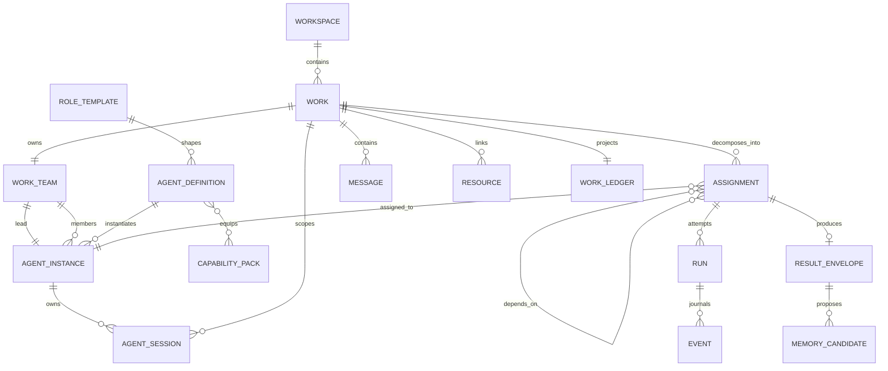
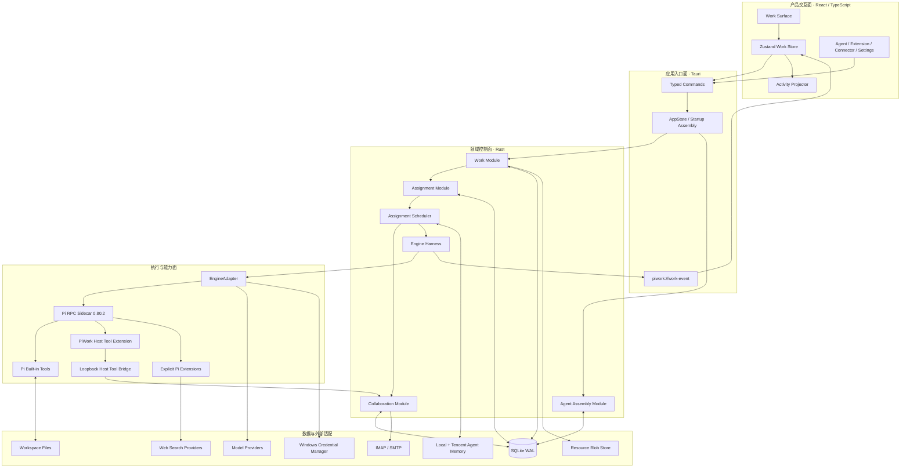
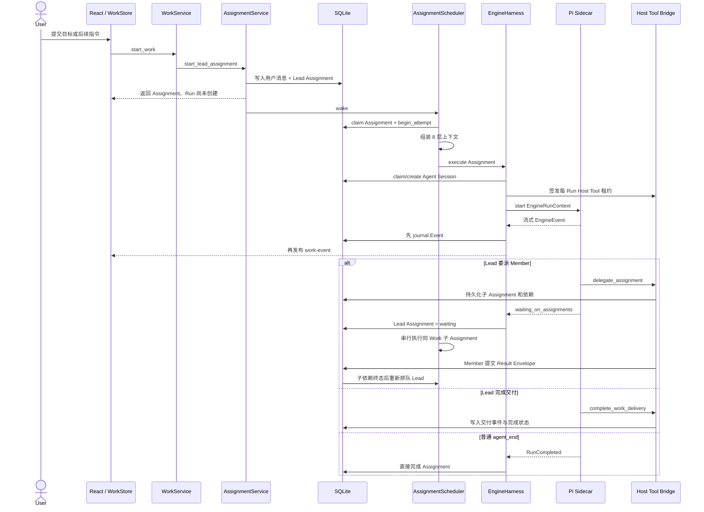
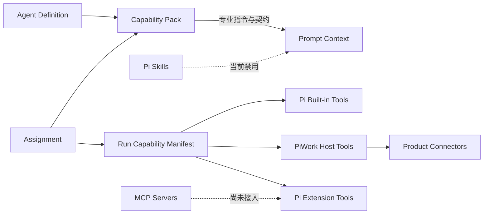
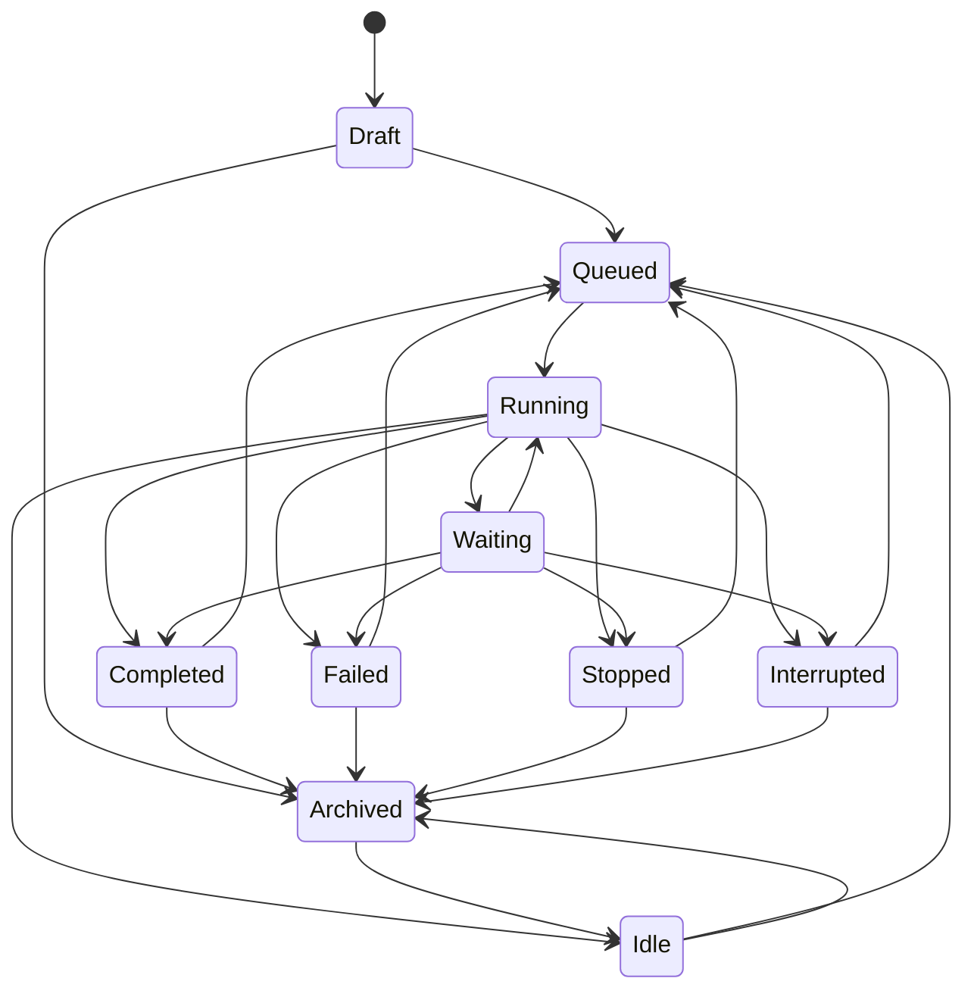
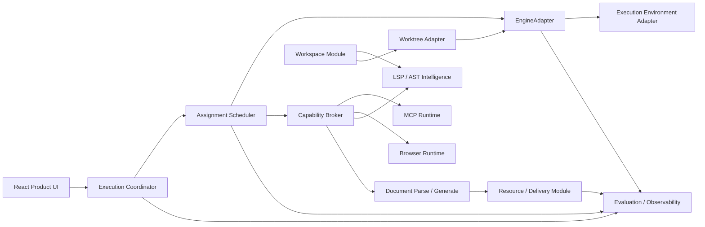

# PiWork 当前 Agent 架构全景

> 基线日期：2026-08-22  
> 文档性质：基于当前工作区代码的实现盘点，不是目标愿景，也不是历史规格复述。  
> 领域语言来源：[`CONTEXT.md`](../../CONTEXT.md)  
> 后续计划：[`Plan A：核心 Agent 架构整改`](./piwork-agent-remediation-roadmap.zh-CN.md)、[`Plan B：能力平台与市场`](./piwork-capability-platform-market-implementation-plan.zh-CN.md)

## 1. 结论先行

PiWork 当前已经是一个 **以持久 Work 为产品中心、以 Assignment 为调度单位、以 Pi Run 为执行尝试** 的本地优先 Agent 系统，而不只是一个带工具调用的聊天界面。

当前架构可以概括为：

```text
React 产品界面
  → Tauri 类型化命令与事件
    → Work / Agent / Assignment / Collaboration 控制面
      → Scheduler + Engine Harness
        → EngineAdapter
          → 固定版本 Pi sidecar
            → Pi 内置工具 / PiWork Host Tools / 内置扩展
```

当前最稳固的部分：

- SQLite 是产品事实源，Work、Assignment、Run、Event、Result 和 Outbox 都能持久化。
- `EngineAdapter` 同时拥有 Pi 与 Fake 两个 Adapter，是已经成立的真实 seam。
- `EngineHarness` 把一次 Assignment 执行所需的 Session、Run、事件、Host Tool 租约和恢复行为集中在一个模块内。
- Lead / Member 已经是长期 Agent Instance，不再只是 Prompt 模板。
- Assignment 支持父子依赖、重试、死信、恢复确认和等待子任务后恢复 Lead。
- Host Tool Bridge 使用每 Run 租约、角色 allowlist 和回环地址，产品动作不直接塞进 Pi 扩展实现。
- 本地资源、文档提取、模型凭据、邮件连接器、远程记忆均已进入真实运行链路。

当前必须优先调整的部分：

1. **权限模式还不是生产级执行边界。** Pi 进程带 `--approve` 启动；`AskEveryStep` 目前主要通过减少工具列表实现，`Balanced` 与 `AutoExecute` 对 Pi 内置工具没有实质差异。
2. **生产停止链路存在 seam 错位。** 生产 `WorkService` 使用 Assignment 路径启动，但 `stop_work` 仍只认识旧 `EngineSupervisor` 路径。
3. **Work 状态由单个 Assignment 结果反射，尚未成为真正的聚合状态。** 子 Assignment 完成时可能把仍需 Lead 汇总的 Work 暂时标为 Completed。
4. **结构化 Result、Artifact 和 Validation 还没有成为不可绕过的完成门槛。** 普通 `agent_end` 仍可能直接完成 Assignment。
5. **扩展授权表已经存在，但运行快照没有按 Agent / Work 真正执行授权。** 在接入 MCP、浏览器等高权限模块前必须补齐。

因此，接下来不需要重写现有 Agent 架构；正确方向是先把 **执行协调、能力授权、完成判定** 三个 seam 收紧，再向既有 seam 接入开源模块。

## 2. 领域模型

### 2.1 核心术语

| 术语 | 当前准确含义 | 不应混用为 |
|---|---|---|
| Workspace | 多个 Work 共享的项目根目录和长期记忆范围；代码中主要由规范化 `root_path` 表示，尚不是完整一等实体 | Work、Session |
| Work | 用户希望长期完成的一个结果容器，拥有目标、团队、Assignment、Run、消息和事件历史 | Task、Chat、Run |
| Agent Definition | 一个 Agent 的角色、职责、指令、契约和默认运行配置 | 正在运行的 Agent |
| Agent Instance | 可跨 Work 参与、具有稳定身份和记忆的 Agent 成员 | Run、模型、Session |
| Work Team | 某个 Work 实际加入的 Lead 与 Member 集合 | 全局 Agent 列表 |
| Capability Pack | 为 Agent 增加专业流程、输入输出契约和工具需求的能力说明 | 工具本身、Pi Extension |
| Assignment | 分配给一个 Agent Instance 的一份持久责任，可依赖其他 Assignment | Work、Run |
| Agent Session | 一个 Agent 在一个 Work 中的可恢复引擎会话身份，可产生多代 Session | Run |
| Run | 执行一个 Assignment 的一次尝试；失败重试会产生新的 Run | Work、Agent Instance |
| Result Envelope | Member 提交给 Lead 的结构化结果，包括发现、证据、产物、验证、不确定性和记忆候选 | 普通聊天回复 |
| Work Ledger | 从 Work 事件投影出的目标、计划、决定、Assignment、产物和开放问题视图 | 独立事实源 |
| Resource | 导入 PiWork 管理的附件或派生产物，内容以 blob/derivative 管理 | 工作区任意文件 |
| Event | 已持久化的运行与协作事实，用于恢复、时间线和投影 | 只供 UI 使用的通知 |

### 2.2 实体关系图



图中的 `Workspace` 是当前产品概念。实现中没有独立 `workspaces` 表；同一路径 Work 的共享关系主要通过 `works.root_path` 和 `memory_workspace_bindings.root_path` 表达。这是当前领域模型与持久化模型之间最大的空缺之一。

## 3. 系统分类

| 分类 | 负责什么 | 当前主要模块 | 当前成熟度 |
|---|---|---|---|
| 产品交互面 | Work 列表、时间线、输入、Agent 中心、扩展、连接器和设置 | `src/features/*`、Zustand `workStore` | 已形成完整桌面产品壳 |
| 应用入口面 | 类型化 IPC、应用装配、启动恢复、事件发布 | `lib.rs`、`AppState`、`commands.rs` | 可用，但装配逻辑集中在 `lib.rs` |
| Work 控制面 | Work 生命周期、消息、Run 与事件读取模型 | `work/*` | 持久化成熟，执行 seam 有双轨遗留 |
| Agent 与装配面 | Role、Definition、Instance、Team、Capability Pack 校验 | `agent/*` | 领域对象完整，能力包执行授权尚未闭环 |
| Assignment 协作面 | 调度、父子依赖、重试、死信、Result、Ledger、记忆候选 | `assignment/*`、`collaboration/*` | 已是系统主执行路径 |
| 引擎执行面 | Session、Run、Pi 进程、事件翻译、取消和 Host Tool 租约 | `engine/*` | seam 设计较好，权限桥不足 |
| 能力与集成面 | Pi 内置工具、Host Tools、Extensions、邮件、Web Access | `extensions/*`、`connectors/*`、`piwork-host-tools.ts` | 功能已运行，统一授权模型未完成 |
| 知识与资源面 | 附件、文档解析、blob、缩略图、本地/远程记忆 | `resource/*`、`document_runtime/*`、`memory/*` | 输入与召回较强，生成型 Artifact 较弱 |
| 基础设施面 | SQLite、迁移、凭据、路径、外部运行时检测 | `storage/*`、`secret.rs`、`paths.rs`、`environment/*` | 较稳定 |

## 4. 当前整体架构图



这里存在一个重要例外：产品没有对外开放 localhost HTTP API，但内部 Host Tool Bridge 会绑定临时回环地址，作为 Pi 扩展到 Rust 领域模块的受租约保护传输。

## 5. 一次 Work 执行的真实流程



### 5.1 上下文装配顺序

Scheduler 目前按固定顺序组装八层上下文，并执行总字符预算：

1. PiWork Base Protocol
2. Agent Definition
3. Capability Pack
4. Agent Memory
5. Work Brief
6. Assignment Packet
7. Dependency Result Envelopes
8. 显式文件、附件和近期消息

这个顺序是当前多 Agent 协作质量的核心。以后接入代码索引、文档知识库或 MCP 结果时，应进入显式 Context 或独立检索工具，不应绕过 Context Builder 直接拼接 Prompt。

## 6. 当前能力系统

PiWork 当前存在五类容易被混淆的“能力”：



| 能力类型 | 当前例子 | 当前授权方式 | 判断 |
|---|---|---|---|
| Capability Pack | 研究、工程、评审专业流程 | Agent 装配校验 + Assignment 选择 | 当前主要影响 Prompt；工具需求没有完整下沉到 Run 授权 |
| Pi 内置工具 | `read/grep/find/ls/edit/write/bash` | `--tools` allowlist | `AskEveryStep` 只给读工具；Balanced/Auto 均给全部工具 |
| PiWork Host Tool | 委派、查询成员、提交结果、完成交付、邮件 | 每 Run token + 角色 allowlist + Rust 再校验 | 当前最接近正确的 Capability Broker 形态 |
| Pi Extension | Web Access | 显式路径加载 + 全局工具 allowlist | 当前只有内置 Web Access；Agent/Work grant 尚未进入运行判定 |
| Connector | Email IMAP/SMTP | Work grant + Rust 领域逻辑 | 连接器不是 Pi Extension，而是通过 Host Tool 暴露产品动作 |

Pi 启动时当前明确使用 `--no-skills` 和 `--no-extensions`，然后只显式加载 PiWork 选中的扩展。因此社区 Pi Skill、MCP、LSP、浏览器和 Worktree 能力目前都不在生产运行链中。

## 7. 状态与事实源

### 7.1 产品事实源

SQLite 是 PiWork 权威事实源，主要数据可按以下集合理解：

- Work：`works`、`messages`、`runs`、`events`
- Agent：`role_templates`、`agent_definitions`、`agent_instances`、`work_agents`、`work_leads`
- Assignment：`assignments`、`assignment_dependencies`、`agent_sessions`、`assignment_results`
- 投影与恢复：`work_memory`、`assignment_event_outbox`、`memory_capture_outbox`
- 资源：`spaces`、`managed_resources`、`resource_blobs`、`resource_derivatives`、`resource_links`
- 能力：`capability_packs`、`extension_packages`、Agent grant、Work policy
- 外部连接：模型配置、邮件连接、邮件元数据、连接器审计、通知
- 记忆：本地确认记忆、记忆候选、Workspace 远程记忆绑定

Work Ledger 是 Event 的可重建投影，不应被当作第二事实源。React `workStore` 也是 UI 投影：它会合并持久详情与实时事件，通过每 Run sequence 去重，并避免旧 Run 覆盖新 Run 状态。

### 7.2 文件与秘密

| 数据 | 位置/Adapter |
|---|---|
| 产品数据库、引擎 Session、资源原件 | roaming application data |
| Run runtime、缓存、日志 | local application data |
| 模型、Web、邮件、记忆凭据 | Windows Credential Manager |
| 用户工程文件 | Work 的 `root_path` |
| 远程记忆 | Workspace → Task，Work → Session，Agent Instance → Agent ID |

## 8. 当前状态机



Assignment 另有独立状态：

```text
Queued → Claimed → Running → Waiting / Completed / Failed
                               ↘ Cancelled / Interrupted
失败可重试回 Queued；超过预算进入 DeadLetter；
不确定副作用的孤儿 Assignment 进入 RecoveryConfirmationRequired。
```

当前数据库和内存 Queue 都强制 **同一个 Work 同时最多一个 in-flight Assignment**。这保证同一工作目录不会被多个成员同时写坏，但也意味着同一 Work 内的多个只读 Research Assignment 目前不能并行。

## 9. 模块深度评估

### 9.1 值得保留的深模块

| Module | Interface 给调用者的能力 | 为什么值得保留 |
|---|---|---|
| `EngineAdapter` | start/resume/rotate/steer/abort + capability 描述 | 隐藏 Pi RPC、进程、Session 目录和模型配置；Fake/Pi 两个 Adapter 证明 seam 真实存在 |
| `EngineHarness` | 执行一个已 claim 的 Assignment | 内部集中处理 Session、Run、租约、启动超时、事件 journal 和终态 |
| `AssignmentService` | 把用户输入变成持久 Lead Assignment | UI 不需要理解 Queue、claim、retry 和调度器 |
| `ResourceService` | 导入、恢复、生成 Engine 附件 | 隐藏 blob、derivative、Xberg 与缩略图流程 |
| `WorkspaceMemoryService` | recall、capture、设置与 worker | 远程失败自动降级到确认过的本地 Agent Memory |
| Host Tool Bridge | 按 Run/角色调用产品工具 | Pi 扩展只做传输，领域逻辑和授权保留在 Rust |

### 9.2 需要加深或重画 seam 的模块

| 当前问题 | 证据 | 建议 seam |
|---|---|---|
| Work 执行存在旧 Supervisor 与新 Assignment 双轨 | `WorkService` 同时持有 `Execution` 和 `assignment_service` | 建立单一 `ExecutionCoordinator`，统一 start/stop/steer/interrupt/status |
| 权限只是上下文值和工具列表，不是完整策略 | Pi 启动使用 `--approve`；Balanced/Auto 工具相同 | 建立 `CapabilityBroker.authorize(run, capability, operation)` |
| 扩展 runtime 没有消费 Agent/Work 参数 | `runtime_snapshot(_agent_instance_id, _work_id)` 忽略两者 | 由 Capability Broker 生成不可变 `RunCapabilitySnapshot` |
| Work 状态由每次 Assignment outcome 直接写入 | Scheduler `reflect_work_terminal` | 建立 `WorkStatusProjector`，从所有 Assignment、Run 和交付事件计算 |
| Result/Artifact/Validation 分散 | Result 是 JSON，Artifact 是路径，Resource 是另一套对象 | 建立 `DeliveryService`，统一验收、验证、导入产物和完成判定 |
| 两个 Memory 模块名称与职责重叠 | `collaboration::memory::MemoryService` 与 `memory::WorkspaceMemoryService` | 对外只暴露一个 `MemoryModule`，内部保留 curated-local 与 remote 两个 Adapter |

## 10. 必要调整清单

### P0：接入任何高权限模块之前

#### P0-1 建立真正的 Capability Broker

Broker 至少应统一裁决：

- Pi 内置读写与 Bash
- PiWork Host Tools
- Pi Extensions
- Connector 操作
- 未来 MCP、浏览器、LSP、文档转换和发布动作

建议输入是不可变的：

```text
RunIdentity
+ Workspace/Work scope
+ Agent role and instance
+ Assignment permission scope
+ Work permission mode
+ requested capability and normalized operation
→ Allow / Deny / Ask + audit metadata
```

执行点仍可分布在 Pi Extension、Host Tool Bridge、MCP Adapter 和进程沙箱中，但裁决事实必须由 Rust 控制面产生。权限 UI 只有在这个 seam 成立后才具有真实语义。

#### P0-2 合并执行控制路径

生产装配使用 `WorkService::with_assignment_service`；但 `stop_work` 只在 `Execution::Supervisor` 下工作。建议删除对调用者可见的双轨，令 `AssignmentService` 或新的 `ExecutionCoordinator` 同时拥有：

```text
start(work, input)
stop(work)
steer(active_assignment, input)
interrupt_and_replace(work, input)
status(work)
```

内部可以继续使用 Scheduler Handle 与 EngineAdapter，UI 不需要知道两套执行模型。

### P1：保证多 Agent 结果可信

#### P1-1 让 Work 成为真正聚合

Work 状态应该由以下事实共同计算，而不是复制最后一个 Assignment 的状态：

- 是否存在正在执行或等待的 Lead
- 是否存在未终态的必需 Member Assignment
- 是否已经提交 Work Delivery
- 是否存在恢复确认、失败或死信

建议只允许 `WorkStatusProjector` 更新 Work 状态，Scheduler 只更新 Assignment/Run。

#### P1-2 强制结构化完成契约

- Member 没有有效 Result Envelope 时不得 Completed。
- Lead 没有 `complete_work_delivery` 时只能 Idle/Waiting，不能形成最终 Completed。
- Validation 需要关联真实命令结果或验证 Adapter，不应只接受 Agent 自述字符串。
- Artifact 路径需要规范化、存在性检查并导入 Resource/Artifact 管理。

#### P1-3 将 Workspace 提升为一等领域实体

建议未来增加稳定 `workspace_id`，至少承载：

- 规范根目录和可选 worktree 根
- 默认权限与沙箱模式
- 记忆 Task 绑定
- 索引/LSP 状态
- Extension/MCP/Connector 默认策略
- 同目录并发与 Git 策略

这样未来接入 LSP、Worktree、知识库和沙箱时，不必继续把路径字符串当成所有能力的关联键。

### P2：降低后续维护成本

- 将超大的 Repository implementation 按内部职责拆为状态事务、查询投影、结果、恢复和 Outbox；外部 interface 不增加。
- 为 Pi、内置扩展和外部模块建立版本矩阵、契约测试、哈希锁定和回滚。
- 将 README 和历史 specs 标记为“历史基线”，避免继续声称只有 Fake Engine。
- 保留同 Work 串行写默认值，但以后可让 Capability Broker 允许隔离 worktree 中的并行写，或同 Workspace 的纯只读 Assignment 并行。

## 11. 未来模块的正确接入位置

本节只标接入 seam，不在本文决定具体开源包。



| 未来能力 | 最合适接入点 | 不应接入的位置 |
|---|---|---|
| LSP / AST | Workspace Module 管理生命周期；Capability Broker 决定 Agent 是否可调用 | React 组件直接启动语言服务器 |
| MCP | 作为外部工具 Adapter；工具发现后生成 Run Capability Snapshot | 每个 Agent 自己读取任意 MCP 配置并启动进程 |
| 浏览器 | MCP/专用 Adapter + Broker + Artifact 截图/Trace | 直接给 Pi 无限制浏览器 Profile |
| Worktree | Workspace execution checkout Adapter，Assignment 启动前解析工作目录 | 在 Prompt 中要求 Agent 自己创建和回收 worktree |
| 文档解析 | 继续走 Resource derivative pipeline | 把原始 PDF 内容临时塞入 UI 状态 |
| 文档生成 | Delivery/Artifact Service 调用生成 Adapter，再进入 Resource | 让 Agent 只返回一个未经检查的文件路径 |
| 沙箱 | EngineAdapter 下方的 Execution Environment Adapter | 把权限 Prompt 当作操作系统隔离 |
| Eval/Tracing | 消费已有 Event/Result/Validation，不成为新的事实源 | 在每个领域模块内各写一套埋点格式 |

## 12. 推荐调整顺序

```text
1. ExecutionCoordinator：修正 start/stop/interrupt 单一执行 seam
2. CapabilityBroker：统一 Pi/Host/Extension/Connector 授权
3. WorkStatusProjector：从协作事实计算 Work 聚合状态
4. DeliveryService：强制 Result、Validation、Artifact 和最终交付
5. Workspace 一等化：为 LSP、索引、Worktree、沙箱建立稳定归属
6. 再接入 LSP、MCP、浏览器、文档生成等开源模块
```

前四步是在收紧已有系统，不需要替换 Pi、Scheduler、EngineHarness 或 SQLite。完成后，未来模块基本都能作为 Adapter 接入，而不会形成第二套 Agent 状态、权限或任务系统。

## 13. 关键代码索引

| 关注点 | 当前代码 |
|---|---|
| 应用装配与启动恢复 | [`src-tauri/src/lib.rs`](../../src-tauri/src/lib.rs) |
| 产品服务容器 | [`src-tauri/src/app_state.rs`](../../src-tauri/src/app_state.rs) |
| Work 入口与双执行路径 | [`src-tauri/src/work/service.rs`](../../src-tauri/src/work/service.rs) |
| Work / Run 状态机 | [`src-tauri/src/work/state_machine.rs`](../../src-tauri/src/work/state_machine.rs) |
| Agent 领域对象 | [`src-tauri/src/domain/agent.rs`](../../src-tauri/src/domain/agent.rs) |
| Assignment 领域对象 | [`src-tauri/src/domain/assignment.rs`](../../src-tauri/src/domain/assignment.rs) |
| Scheduler | [`src-tauri/src/assignment/scheduler.rs`](../../src-tauri/src/assignment/scheduler.rs) |
| Assignment 队列 | [`src-tauri/src/assignment/queue.rs`](../../src-tauri/src/assignment/queue.rs) |
| Engine interface | [`src-tauri/src/engine/mod.rs`](../../src-tauri/src/engine/mod.rs) |
| Engine Harness | [`src-tauri/src/engine/harness.rs`](../../src-tauri/src/engine/harness.rs) |
| Pi Adapter | [`src-tauri/src/engine/pi/mod.rs`](../../src-tauri/src/engine/pi/mod.rs) |
| Host Tool 传输扩展 | [`src-tauri/assets/piwork-host-tools.ts`](../../src-tauri/assets/piwork-host-tools.ts) |
| Host Tool 领域逻辑 | [`src-tauri/src/collaboration/service.rs`](../../src-tauri/src/collaboration/service.rs) |
| Result 校验 | [`src-tauri/src/collaboration/result.rs`](../../src-tauri/src/collaboration/result.rs) |
| 上下文装配 | [`src-tauri/src/collaboration/context.rs`](../../src-tauri/src/collaboration/context.rs) |
| 扩展运行快照 | [`src-tauri/src/extensions/mod.rs`](../../src-tauri/src/extensions/mod.rs) |
| 邮件连接器 | [`src-tauri/src/connectors/mod.rs`](../../src-tauri/src/connectors/mod.rs) |
| 资源与文档 | [`src-tauri/src/resource/service.rs`](../../src-tauri/src/resource/service.rs)、[`document_runtime`](../../src-tauri/src/document_runtime/mod.rs) |
| Workspace 远程记忆 | [`src-tauri/src/memory/mod.rs`](../../src-tauri/src/memory/mod.rs) |
| 数据库迁移 | [`src-tauri/migrations`](../../src-tauri/migrations) |
| 前端状态投影 | [`src/features/works/workStore.ts`](../../src/features/works/workStore.ts) |
| 活动事件投影 | [`src/features/activity/activityProjector.ts`](../../src/features/activity/activityProjector.ts) |
