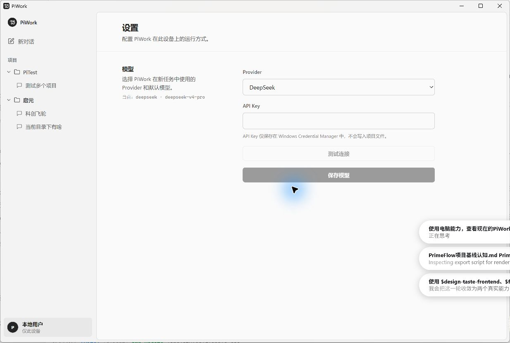
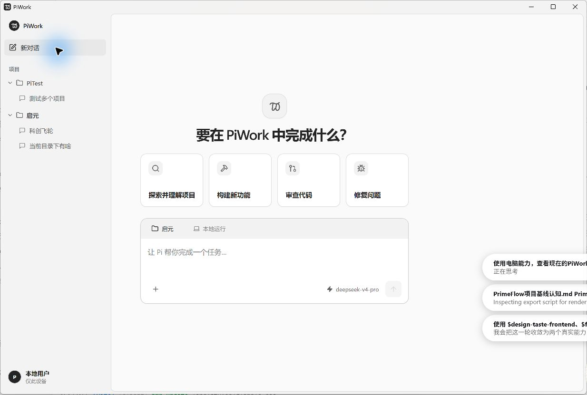
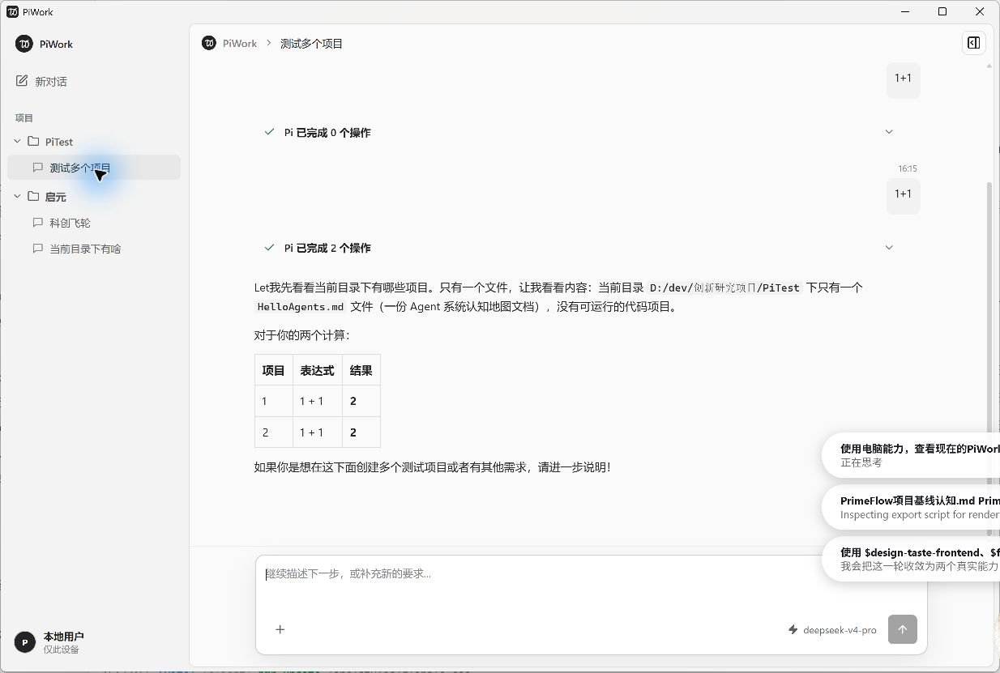
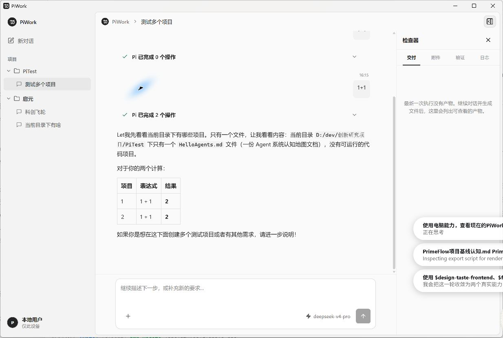
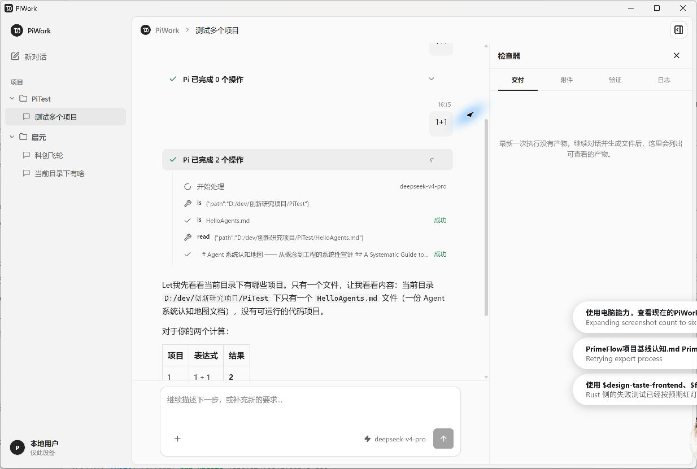
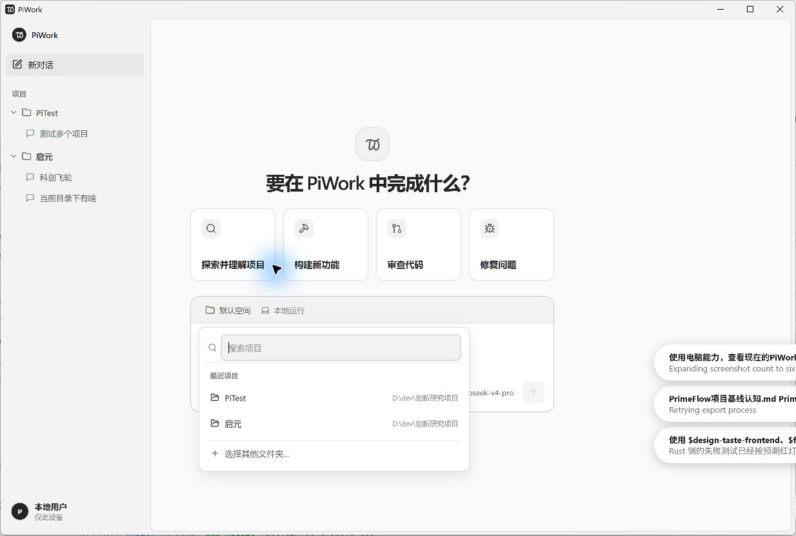
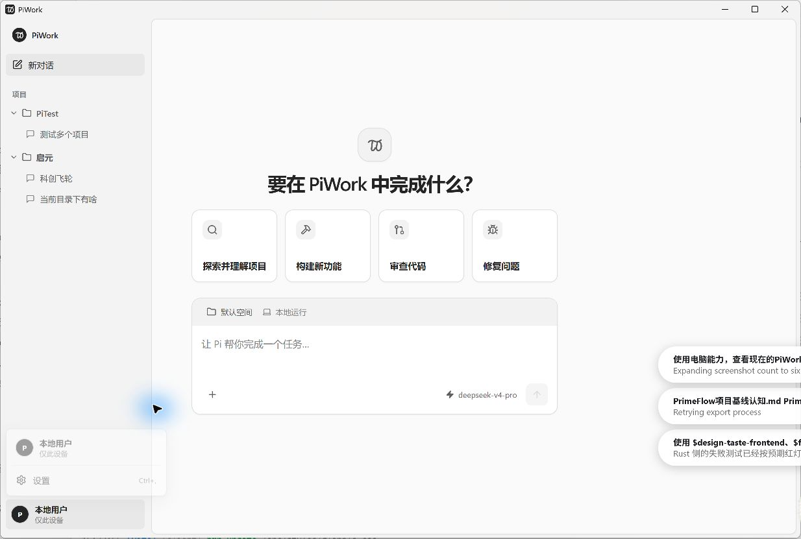
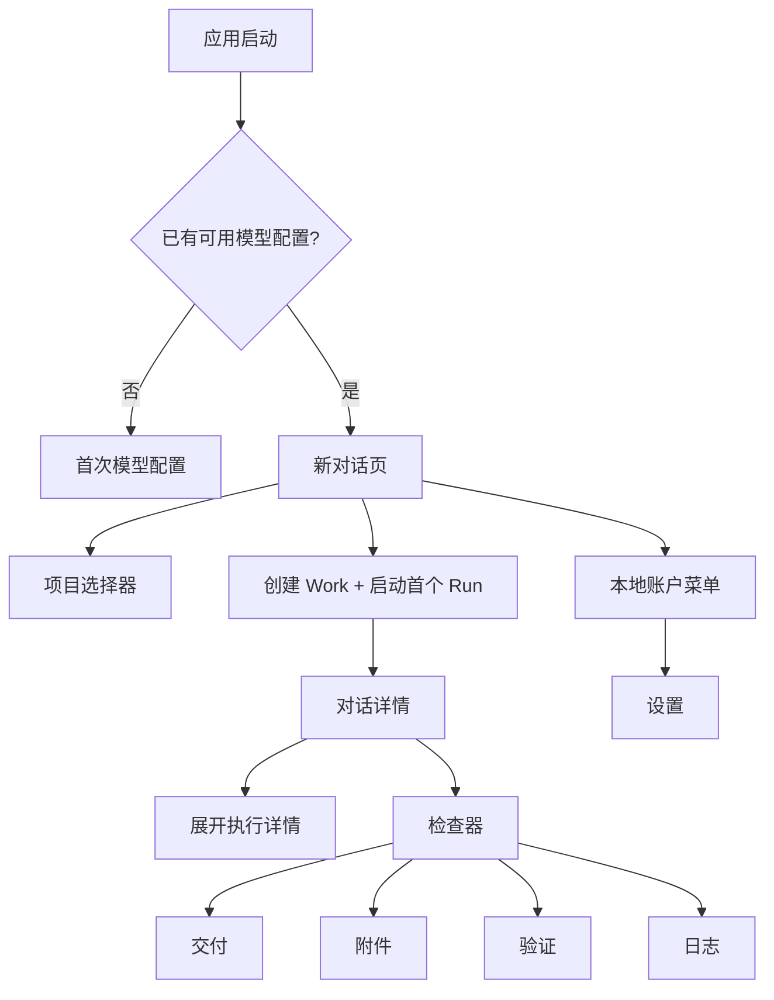
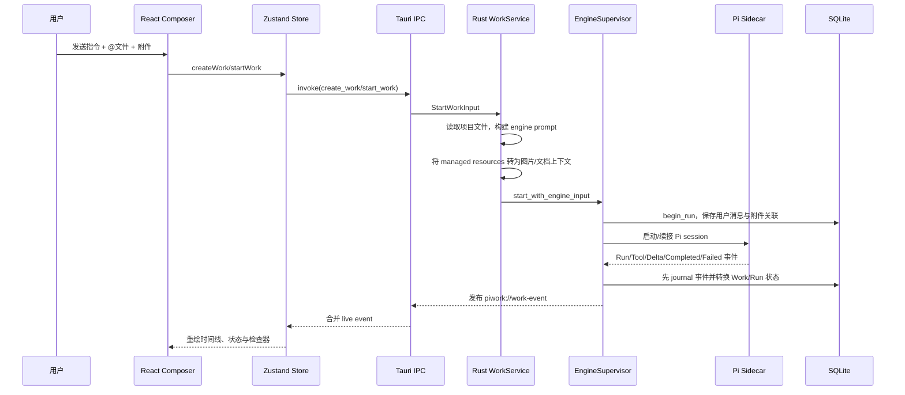

# PiWork 当前产品、交互与技术实现——页面重设计输入

- 基线日期：2026-08-02
- 产品版本：0.1.0
- 目标平台：Windows 10/11 x64 桌面端
- 证据来源：实际运行中的 PiWork 桌面窗口、当前工作区源码、SQLite migration 与自动化测试
- 文档用途：与本目录 7 张截图一起交给 Figma、MasterGo、即时设计、Canva 或其他设计生成工具，作为页面重设计的事实基线

> 截图说明：截图右侧偶尔出现的白色任务提示，以及鼠标附近的蓝色光晕，来自 Codex 的电脑操作/系统提示，不属于 PiWork UI。设计时请忽略。截图中可能含本机示例项目名与历史对话文本，仅用于呈现真实布局和信息密度。

---

## 1. 先给设计工具的结论

PiWork 不是普通 AI 聊天客户端。它是一个**以本地项目为边界、以持久对话（代码中的 Work）为协作容器、以多次执行（Run）为工作节奏的桌面 Agent 工作台**。

界面可以大幅重做，但应始终让用户理解四件事：

1. 当前在哪个本地项目中工作；
2. 当前打开的是哪一个长期对话/任务空间；
3. Pi 正在执行、已完成、失败或等待什么；
4. 本次执行产生了哪些工具活动、交付物、附件、验证和诊断。

设计关键词：**本地优先、桌面生产力、项目上下文、持续协作、执行透明、克制、专业、低噪声**。

不应设计成：社交聊天、营销型 AI 首页、只有消息气泡的问答器、把内部 RPC/sidecar/JSONL 暴露给普通用户的开发工具。

---

## 2. 当前截图索引

### 2.1 设置页



表现内容：左侧项目/对话导航仍然常驻；主区域显示模型 Provider、API Key、连接测试和保存模型。API Key 不回显，按钮在未输入新凭据时为 disabled。

### 2.2 新对话首页



表现内容：四个任务起点、项目上下文、首条指令 Composer、附件、当前模型和发送按钮。当前选择的示例项目是“启元”。

### 2.3 有历史内容的对话



表现内容：项目分组侧栏、面包屑式标题、按时间组织的用户指令、执行进度、Markdown 回答和底部持续 Composer。

### 2.4 打开检查器



表现内容：主时间线与右侧检查器并排；检查器包含“交付、附件、验证、日志”四个 tab，并支持拖拽调整宽度。

### 2.5 展开执行详情



表现内容：Run 摘要展开后显示模型、工具名、输入/输出摘要和成功状态；工具活动与最终回答分层显示。

### 2.6 项目选择器



表现内容：搜索最近项目、显示项目名与父路径、选择其他文件夹；弹层锚定在 Composer 的项目 chip 下方。

### 2.7 本地账户菜单



表现内容：当前仅有“本地用户 / 仅此设备”和“设置”；它不是云账号中心，也没有登录、同步或团队切换能力。

---

## 3. 产品背景与真实系统身份

### 3.1 产品主张

- **本地优先**：Work、Run、消息、事件、设置和附件索引由本机 SQLite 保存。
- **项目绑定**：每个 Work 关联一个本地 `rootPath`，Pi 在这个目录上下文内执行。
- **持续而非一次性**：同一个 Work 可以有多个 Run；完成、失败或中断后仍可继续。
- **行动可见**：工具调用、模型输出、完成、失败和交付结构都被转换为产品事件。
- **引擎可替换**：Pi 是隐藏的执行引擎，PiWork 自己掌握产品数据和生命周期。
- **桌面能力**：原生目录/文件选择、安全凭据、本地进程、managed resources 与系统文件能力都在 Tauri/Rust 层。

### 3.2 当前主要用户

- 在本地代码仓库、研究资料或项目目录中持续工作的个人用户；
- 希望 Agent 能读取项目、调用工具、生成文件并保留历史的人；
- 需要知道“做了什么、结果在哪里、验证是否通过”的开发者或知识工作者。

### 3.3 核心用户任务

1. 选定一个本地项目并描述目标；
2. 让 Pi 探索、构建、审查或修复；
3. 在同一对话中继续补充要求；
4. 查看执行活动和最终回答；
5. 查看产物、附件、验证与日志；
6. 在设置中更换 Provider 与默认模型。

---

## 4. 领域术语：设计时不要混淆

| 产品术语 | 代码/数据术语 | 实际含义 | 当前 UI |
| --- | --- | --- | --- |
| 项目 | `rootPath` | Pi 可工作的本地目录边界 | 侧栏顶层分组、Composer 项目 chip |
| 对话 | `Work` | 持久协作空间，包含目标、项目、多次 Run、消息和资源 | 项目下的一行；打开后进入时间线 |
| 一次执行 | `Run` | 用户提交一条指令后产生的一轮 Agent 生命周期 | 时间、用户消息、执行进度、回答/失败 |
| 消息 | `Message` | 用户或助手的公开内容 | 右侧用户块、Markdown 助手正文 |
| 执行事件 | `WorkEvent` | Run 内的流式事实 | Run 开始、工具开始/结束、增量回答、完成、失败 |
| 项目文件引用 | `referencedFiles` | `@` 选择当前项目内文本文件，发送时读取内容快照 | Composer 内 inline mention |
| 上传附件 | `ManagedResource` | 由 PiWork 复制并管理的图片/文档资源 | 附件 chip、消息附件、检查器附件 tab |
| 检查器 | `WorkInspector` | 交付和诊断侧面板 | 交付、附件、验证、日志 |

### 4.1 `@` 项目文件和上传附件不是同一种东西

| 维度 | `@` 项目文件 | 上传附件 |
| --- | --- | --- |
| 来源 | 当前项目目录 | 原生文件选择器中的任意受支持文件 |
| 生命周期 | 每次发送时按路径读取 | 原件复制进 PiWork 管理存储 |
| UI | 编辑器内绿色/强调的 inline token | chip、缩略图、附件库 |
| 注入引擎 | 文本放入 `<referenced_files>` 上下文 | 图片原生输入；文档解析为受限 Markdown 文本 |
| 持久化 | 保存消息语义，但不复制项目文件 | 资源、blob、derivative、消息关联均持久化 |

设计中必须继续区分这两类对象，不能统一成一个含义模糊的“上传”。

---

## 5. 当前信息架构



当前用户可直接进入的核心视图只有：

- 新对话；
- 对话详情；
- 设置；
- 首次模型配置（仅未配置时）。

代码中还有 `home` 和 `all` 视图组件，但当前侧栏没有直接入口，不应作为已稳定的导航承诺。

---

## 6. 页面与交互说明

### 6.1 全局窗口

- 默认尺寸：`1232 × 800`；最小尺寸：`900 × 640`。
- 单窗口 Tauri 应用，无 URL 路由；React 根组件按模型状态和本地视图状态切换。
- 左侧栏常驻，右侧为新对话、对话详情或设置。
- 在 `<= 960px` 时侧栏会收成图标栏；在 `<= 1150px` 时检查器改为覆盖式侧面板。

证据：`src-tauri/tauri.conf.json:13-23`、`src/features/workspace/WorkSurface.tsx:122-209`、`src/styles/linear-fidelity.css:1239-1354`。

### 6.2 左侧项目与对话导航

结构：

1. PiWork 品牌；
2. 新对话；
3. “项目”分组标题；
4. 按 `rootPath` 聚合的项目；
5. 项目展开/折叠；
6. 项目内新建对话；
7. 对话行与状态图标；
8. 底部“本地用户 / 仅此设备”。

规则：

- 归档 Work 不显示；
- 项目按最近更新排序；
- 项目内部对话按最近更新排序；
- running/queued 使用旋转图标；failed/interrupted/stopped 使用警示图标；其余使用消息图标；
- 项目完整路径只放在 tooltip；可见文本是目录末级名称。

设计机会：同名项目、长标题、状态只靠小图标、历史很多时的查找与分组都需要更强方案。

证据：`src/features/works/WorkSidebar.tsx:31-146`。

### 6.3 新对话页

核心结构：

- 品牌 mark 与标题“要在 PiWork 中完成什么？”；
- 四个任务起点：探索并理解项目、构建新功能、审查代码、修复问题；
- 项目上下文栏；
- 首条任务编辑器；
- 附件入口；
- 当前模型只读标识；
- 发送按钮。

任务起点只负责预填 prompt，不会立即执行。发送条件：

- 有文本，或至少一个 ready 且已选择的附件；
- 有有效项目目录（显式选择或默认项目）；
- 当前不在提交中。

创建时标题取首行前 40 个字符；权限模式当前固定为 `balanced`。

证据：`src/features/workspace/NewWorkStart.tsx:18-21`、`:153-190`、`:192-367`。

### 6.4 项目选择器

- 搜索最近 20 个去重项目路径；
- 结果显示项目名和父路径；
- 支持“选择其他文件夹…”打开原生目录选择器；
- 点击外部或按 Escape 关闭；
- 切换项目会清除当前 `@` 文件 mentions，避免把旧项目文件错误带入新项目。

证据：`src/features/workspace/NewWorkStart.tsx:59-65`、`:101-151`、`:249-288`。

### 6.5 对话详情与时间线

顶部：PiWork 品牌/面包屑、对话标题、检查器开关。

中部：按 Run 展示真实历史：

1. 时间；
2. 用户消息与本次消息附件；
3. 可折叠执行进度；
4. 助手 Markdown；
5. 完成后的交付摘要/产物/验证/限制，或失败提示。

底部：持续 Composer，支持文本、`@` 项目文件、上传附件、当前模型与发送。

证据：`src/features/workspace/WorkTimeline.tsx:104-186`、`:219-253`。

### 6.6 执行进度

折叠状态显示“Pi 已完成 N 个操作”或运行状态。展开状态会显示：

- Run 开始与模型；
- `toolStarted`：工具名与输入摘要；
- `toolFinished`：输出摘要、成功/失败；
- 运行/完成图标和层级线。

这是 PiWork 区别于普通聊天产品的关键表达，应保留“过程可见但不压过结果”的层次。

证据：`src/features/workspace/ExecutionProgressCard.tsx`、`src/features/workspace/WorkTimeline.tsx:69-79`。

### 6.7 右侧检查器

四个 tab：

- **交付**：从所有 `runCompleted.artifacts` 汇总字符串路径；当前还不是可点击文件预览。
- **附件**：列出 Work 级 managed resources。
- **验证**：汇总完成事件里的 validation 字符串。
- **日志**：列出非增量输出事件以及产品化诊断。

桌面宽屏下检查器参与 grid 分栏，可拖拽宽度并双击恢复默认；较窄窗口变成覆盖式 drawer。

设计时不要把“交付”画成已具备完整文件预览、版本历史或 Diff 的文件管理器。

证据：`src/features/workspace/WorkInspector.tsx:10-120`、`:128-198`；`src/features/workspace/WorkSurface.tsx:91-116`。

### 6.8 本地账户与设置

账户菜单当前只表达“本地用户 / 仅此设备”，没有云账号、头像上传、团队、订阅或同步。

设置页当前只有模型配置：

- Provider；
- API Key；
- 自定义 Provider 时的 Base URL；
- 测试连接；
- 连接成功后选择模型；
- 保存。

Provider：OpenAI、Anthropic、Google Gemini、OpenRouter、DeepSeek、OpenAI-compatible。

API Key 存入 Windows Credential Manager，不写入项目文件或普通 SQLite 设置。

证据：`src/features/model-setup/ModelSetup.tsx:12-18`、`src-tauri/src/model/credentials.rs:11-36`。

---

## 7. 关键交互流程

### 7.1 首次启动

```text
启动桌面应用
  → 读取模型配置
  → 未配置：进入连接页
  → 测试 Provider/API Key
  → 返回可用模型
  → 用户选择默认模型并保存
  → 进入新对话页
```

### 7.2 创建第一条对话

```text
选择项目（或使用默认项目）
  → 可选：点击任务起点预填 prompt
  → 可选：使用 @ 引用项目文件
  → 可选：上传图片/文档并等待 ready
  → 点击发送
  → 创建 Work
  → 把 draft 附件绑定到 Work
  → 创建首个 Run 和用户消息
  → 进入对话详情
  → 持续接收执行事件
```

### 7.3 在已有对话中继续

Work 处于 `idle/completed/failed/stopped/interrupted` 时，Composer 会启动一个新 Run。

Work 处于 `queued/running/waiting` 时，当前代码把输入放入**前端内存队列**。它还不是持久化 steering/follow-up 调度，重载后不会自动执行。因此设计不能把它承诺为可靠的后台排队能力。

证据：`src/features/workspace/WorkComposer.tsx:14-17`、`src/features/works/workStore.ts:611-631`。

### 7.4 失败和诊断

- 主时间线只显示安全、产品化错误文案；
- “打开诊断”会打开检查器日志 tab；
- 原始内部错误不会直接成为主界面正文；
- 引擎启动异常、事件流异常和恢复异常均可转换为失败事件。

---

## 8. 状态模型

### 8.1 Work 状态

| 状态 | 含义 | 当前设计语义 |
| --- | --- | --- |
| `draft` | 尚未成功开始 | 草稿/未开始 |
| `queued` | 等待执行 | 活跃，侧栏 spinner |
| `running` | 正在执行 | 活跃，侧栏 spinner |
| `waiting` | 等待外部条件/用户 | 已有领域状态，但没有专门审批面板 |
| `idle` | 无活动 Run | 可继续 |
| `completed` | 最近 Run 完成 | 可继续，不代表 Work 永久关闭 |
| `failed` | 最近 Run 失败 | 可重试/继续 |
| `stopped` | 已停止 | 可继续，但当前 UI 没有停止按钮 |
| `interrupted` | 应用/进程异常中断 | 可恢复语义，但当前 UI 主要表现为失败类状态 |
| `archived` | 已归档 | 侧栏隐藏；当前无归档操作入口 |

### 8.2 Run 事件契约

固定 channel：`piwork://work-event`。

```ts
type WorkEventPayload =
  | { type: "runStarted"; modelLabel: string }
  | { type: "assistantDelta"; text: string }
  | { type: "toolStarted"; toolCallId: string; toolName: string; inputSummary: string }
  | { type: "toolFinished"; toolCallId: string; toolName: string; outputSummary: string; success: boolean }
  | { type: "runCompleted"; summary: string; artifacts: string[]; validation: string[]; limitations: string[] }
  | { type: "runFailed"; message: string };
```

每个事件带 `workId`、`runId`、从 1 开始单调递增的 `sequence` 和 `occurredAt`。前端按 Run/sequence 去重，防止旧事件覆盖新状态。

---

## 9. 技术实现

### 9.1 技术栈

| 层 | 技术 | 作用 |
| --- | --- | --- |
| 桌面壳 | Tauri 2 / WebView2 | 原生窗口、IPC、目录/文件选择、sidecar |
| 前端 | React 19 + TypeScript + Vite | 页面、交互、可访问性语义 |
| 状态 | Zustand | Work 列表、选中项、时间线投影、资源、临时队列 |
| 国际化 | i18next | 中文/英文文案 |
| UI | 原生 CSS tokens + Lucide | 视觉系统与图标 |
| 动效 | GSAP + `@gsap/react` | 页面状态、执行反馈、品牌动效 |
| Markdown | react-markdown + remark-gfm | 助手回答、表格、代码 |
| 后端 | Rust + Tokio | 命令、服务、执行监督、资源处理 |
| 数据库 | SQLite + SQLx，WAL | Work/Run/Message/Event/Resource 事实源 |
| 引擎 | 打包 Pi sidecar / RPC adapter | Agent 执行和工具事件 |
| 凭据 | Windows Credential Manager | API Key 安全保存 |

### 9.2 一次真实请求的完整链路



关键事实：

- React 不是事实源；重新打开时会从 SQLite hydrate。
- Supervisor 阻止同一 Work 同时存在多个活动 Run。
- 事件**先写数据库，再发布给前端**；UI 丢一次推送也可通过重新 hydrate 恢复。
- Pi session 是引擎续接手段，不是产品历史的唯一来源。

证据：

- `src/features/workspace/NewWorkStart.tsx:153-183`；
- `src/app/tauriClient.ts:85-104`；
- `src-tauri/src/work/service.rs:87-138`；
- `src-tauri/src/engine/supervisor.rs:202-267`、`:307-326`、`:508-586`；
- `src/features/works/workStore.ts:567-609`。

### 9.3 状态、资源与控制边界

| 边界 | 权威位置 | 为什么分开 |
| --- | --- | --- |
| 产品持久状态 | SQLite | 重启、崩溃、漏事件后可恢复 |
| 前端投影状态 | Zustand | 快速交互、事件合并、选中态；可丢弃重建 |
| 活动 Run 控制 | Rust `EngineSupervisor.active` | 约束并发、生命周期和异常终止 |
| Agent 续接状态 | Pi session 目录 | 隐藏引擎实现，不污染产品领域 |
| API Key | Credential Manager | 不进入项目文件和普通数据库 |
| 附件原件 | managed blob store | 去重、生命周期、未来复制/同步边界 |
| 文档解析结果 | resource derivative/cache | 原件、可重建衍生物和消息选择解耦 |

### 9.4 附件和文档能力边界

- 图片单文件最大 10 MiB；单次 Run 最多 8 张、合计 24 MiB；最大解码边长 16384。
- 文档单文件最大 50 MiB。
- 单次 Run 最多注入 6 份文档；单文档最多 24,000 字符，总计最多 64,000 字符。
- PDF、DOCX、XLSX、CSV 等文档由独立 runtime 解析；超时 120 秒。
- 扫描 PDF 可记录 `used_ocr`；derivative 类型当前是 `canonical_markdown`。

设计应为 processing、ready、failed、截断、OCR、超限预留明确反馈；当前 UI 对这些限制提示不足。

证据：`src-tauri/src/resource/service.rs:31-36`、`src-tauri/src/resource/context.rs:3-5`、`src-tauri/src/document_runtime/process.rs:20-22`。

---

## 10. 当前视觉基线

### 10.1 风格判断

当前风格接近 Linear/现代 Windows 生产力工具：低饱和灰阶、细边框、浅层级阴影、紧凑控件、大量留白、状态色克制使用。

### 10.2 当前 tokens

| 类别 | 当前值 |
| --- | --- |
| UI 字体 | Segoe UI Variable Text / Segoe UI / Microsoft YaHei UI |
| Display 字体 | Segoe UI Variable Display |
| 等宽字体 | Cascadia Mono / Cascadia Code / Consolas |
| 主文字 | `#242424` |
| 次文字 | `#5f5f5f` |
| 弱文字 | `#858585` |
| 画布/侧栏 | `#f3f3f3` |
| 面板 | `#fafafa` |
| raised | `#ffffff` |
| 默认边框 | `#dedede` |
| 成功 | `#2d8659` |
| 等待 | `#9a5b00` |
| 失败 | `#c64c57` |
| 间距序列 | 4 / 8 / 12 / 16 / 20 / 24 / 32 / 40 px |
| 圆角 | 4 / 6 / 8 px，圆形为 999px |

代码已提供随系统切换的 dark tokens，但本次实际截图为 light theme。

证据：`src/styles/tokens.css:1-63`、`:65-106`。

---

## 11. 当前缺口：设计时不要误承诺

### 11.1 尚无完整产品能力

- Work 重命名、归档、删除、复制；
- 真正持久化的 steering/follow-up 队列；
- 停止当前 Run、重试、恢复中断的完整操作面板；
- 权限模式选择与审批界面；
- 文件 Diff、逐文件变更索引、撤销；
- 交付物可点击打开、预览、版本、导出；
- 云账号、同步、Team Space、计费；
- 后台任务、系统通知、托盘；
- 全局搜索、项目搜索或附件搜索；
- 模型在单次 Composer 中切换。

### 11.2 数据存在但表达不足

- `goal` 和 `permissionMode` 已持久化，但详情页不展示；
- 完整 `rootPath` 大多隐藏在 tooltip；
- Work/Run 状态的非颜色文本表达不足；
- Run 的耗时、开始/完成时间和重试关系不够清楚；
- 附件大小、处理进度、失败原因、OCR/截断没有完整 UI；
- artifact/validation 仍只是字符串，不是结构化对象；
- Inspector 在无产物时价值较弱；
- 长历史的跳转、折叠、未读新输出和滚动策略需要设计。

---

## 12. 重设计必须保留的稳定语义

1. 项目是 Agent 的本地执行边界。
2. 对话/Work 是一级持久对象，不是一条临时 chat。
3. 一个 Work 可以有多个 Run，完成后仍可继续。
4. `@` 项目文件与上传附件必须保持不同的生命周期表达。
5. Work 中“已有附件”与“本次消息已选择附件”必须区分。
6. queued/running/waiting/completed/failed/interrupted 要有可读状态，不只靠颜色。
7. 工具活动和最终回答要分层。
8. 交付、验证与诊断要有稳定去处。
9. 主 UI 展示产品化错误，诊断区展示脱敏技术细节。
10. Pi 是隐藏引擎；普通用户不需要理解 sidecar、RPC、session 文件。
11. 不要依赖永久可见的本地绝对路径；展示名称和必要的路径上下文即可。
12. 可为未来 Personal/Team Space 预留上层导航，但不要现在制造不存在的云能力。

---

## 13. 推荐设计输出清单

### 13.1 必须覆盖的页面

1. 首次模型配置；
2. 新对话首页；
3. 项目选择器；
4. 有历史的对话详情；
5. 执行详情折叠/展开；
6. 检查器四个 tab；
7. 本地账户菜单；
8. 设置页。

### 13.2 必须覆盖的状态

- loading、empty、hover、focus、selected、disabled、submitting；
- queued、running、waiting、completed、failed、interrupted；
- 长回答、多 Run、工具很多、无工具；
- 附件 staging、processing、ready、failed、移除；
- 项目同名、路径过长、对话很多；
- 900×640 最小窗口、1232×800 默认窗口、宽屏检查器；
- 中英文长文本；
- light/dark theme；
- reduced motion 和键盘焦点。

### 13.3 推荐评审问题

1. 用户能否在 3 秒内知道当前项目和当前对话？
2. 用户能否区分对话与一次执行？
3. 用户能否区分 `@` 文件和上传附件？
4. 执行状态是否不依赖颜色？
5. 工具活动是否透明但不会淹没最终交付？
6. 阅读旧历史时，新输出是否会抢走滚动位置？
7. 无产物时检查器是否仍有价值？
8. 900×640 下核心操作是否无需横向滚动？
9. 未实现功能是否被画成了会误导用户的可点击入口？
10. 未来加入团队空间后，项目→对话的信息架构是否还能成立？

---

## 14. 可直接粘贴给设计软件的 brief

```text
请为 Windows 桌面应用 PiWork 设计一套高保真产品界面。

PiWork 是本地优先的 AI Agent 工作台，不是普通聊天客户端。核心信息架构是：
本地项目 → 持久对话（Work）→ 多次执行（Run）→ 消息、工具活动、交付、附件、验证和日志。

目标用户是开发者和知识工作者。产品气质要专业、克制、可靠、低噪声，保留当前 Linear/Windows 生产力工具式的灰阶基础，但提升信息层级、状态表达和品牌识别。不要做成营销首页或社交聊天。

必须设计：
1. 项目分组侧栏与对话列表；
2. 新对话页，含四个任务起点、项目选择、首条指令、附件、模型与发送；
3. 项目选择 popover；
4. 对话详情，按 Run 展示时间、用户指令、执行进度、工具活动、Markdown 回答、交付/失败；
5. 底部持续 Composer；
6. 可调整宽度的右侧检查器，含交付、附件、验证、日志；
7. 本地账户菜单与模型设置；
8. loading、empty、running、waiting、completed、failed、interrupted、附件处理中/失败等状态；
9. 1232×800 默认窗口与 900×640 最小窗口；
10. light/dark、键盘焦点、中文和英文长文本。

语义约束：
- 项目是本地执行边界；
- 一个对话可以有多个 Run；
- @项目文件和上传附件是两种不同对象；
- 工具活动与最终回答分层；
- 状态不能只靠颜色；
- 当前没有云账号、团队同步、完整 Diff、停止 Run、产物预览/版本、持久 follow-up 队列，不要把它们设计成已经可用。

请先基于附带截图复刻当前页面结构，再提出一套更清晰的重设计方案，并输出组件、交互状态、响应式规则和设计 token。
```

---

## 15. 开发证据阅读顺序

1. `src/app/App.tsx`：启动与模型配置门槛；
2. `src/features/workspace/WorkSurface.tsx`：页面状态和主布局；
3. `src/features/works/WorkSidebar.tsx`：项目/对话导航；
4. `src/features/workspace/NewWorkStart.tsx`：新对话完整交互；
5. `src/features/workspace/WorkTimeline.tsx`：Run 时间线投影；
6. `src/features/workspace/ExecutionProgressCard.tsx`：工具活动；
7. `src/features/workspace/WorkComposer.tsx`：继续 Work 和临时队列语义；
8. `src/features/workspace/WorkInspector.tsx`：交付/附件/验证/日志；
9. `src/features/works/workStore.ts`：前端 hydrate、事件去重与合并；
10. `src/app/tauriClient.ts`：IPC facade；
11. `src-tauri/src/work/service.rs`：项目文件和附件如何进入引擎；
12. `src-tauri/src/engine/supervisor.rs`：Run 生命周期、journal 与发布；
13. `src-tauri/src/engine/pi/mod.rs`：真实 Pi adapter；
14. `src-tauri/src/resource/service.rs`：附件限制与上下文；
15. `src-tauri/migrations/*.sql`：持久化事实模型；
16. `src/styles/tokens.css`、`workspace.css`、`linear-fidelity.css`：当前视觉基线。

---

## 16. 最终交接摘要

PiWork 已经有完整的本地 Agent 垂直闭环：模型连接、项目选择、持久 Work、多 Run 时间线、真实 Pi 工具活动、`@` 项目文件、managed attachments、交付/验证/日志检查器、SQLite 和安全凭据。

重设计最重要的不是换皮，而是把三组关系表达清楚：

1. **项目、对话与 Run 的层级；**
2. **项目文件引用与持久附件的不同生命周期；**
3. **执行过程、最终回答、交付物和诊断信息的层级。**

只要这三条保持清晰，侧栏、首页、Composer、时间线、检查器和品牌视觉都可以大胆重构。
