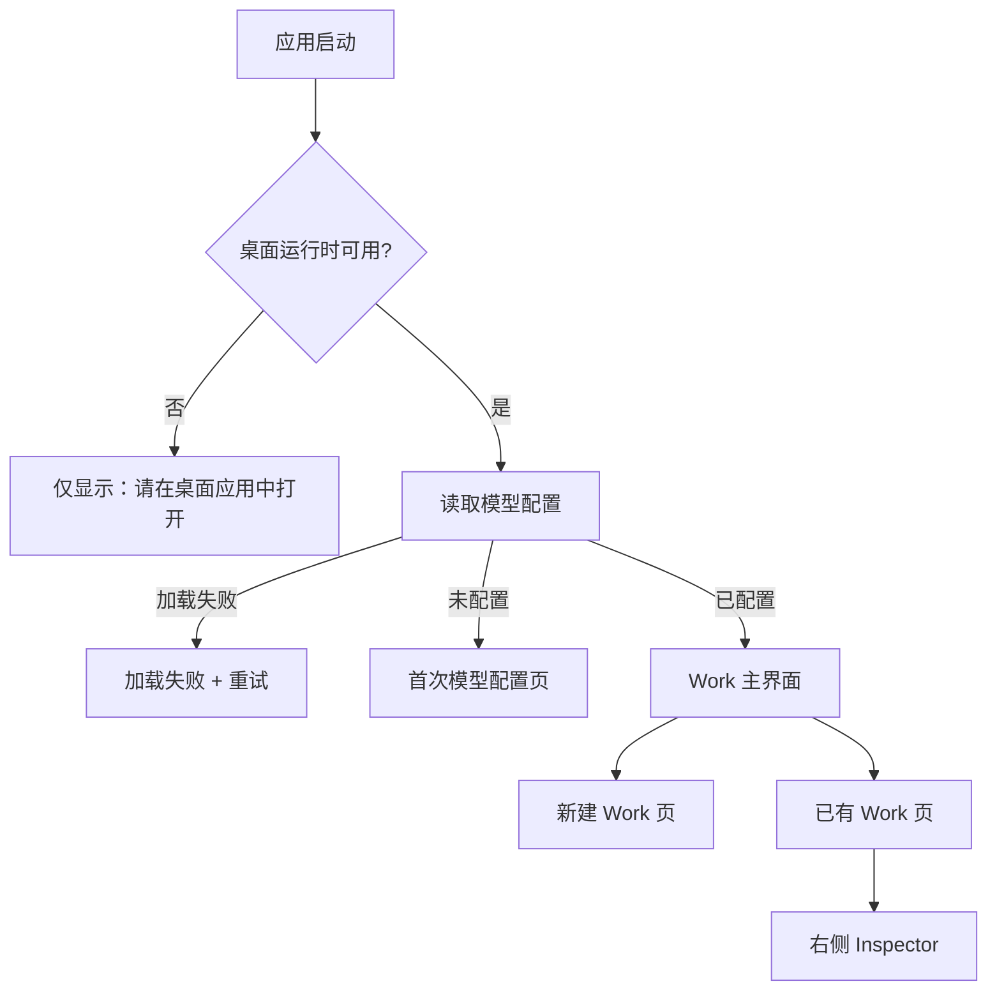
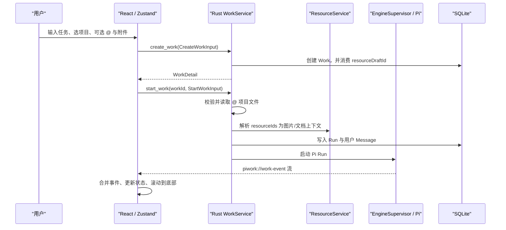
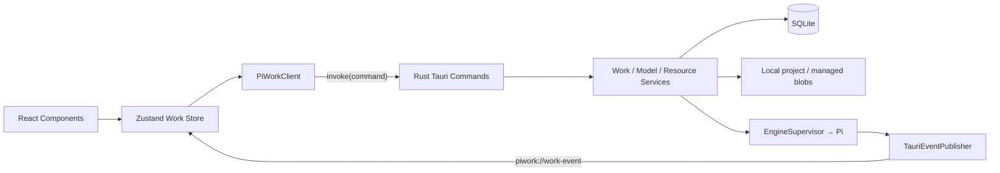

# PiWork 当前 UI、交互与前后端契约——Design 交接基线

- 文档用途：为产品与 Design 团队提供“基于当前实现”的重设计输入
- 基线日期：2026-08-01
- 代码基线：`codex/project-file-mentions`，核心功能提交 `9296e3a`
- 目标平台：Windows 10/11 x64 桌面端
- 当前产品版本：`0.1.0`
- 结论口径：以当前代码、自动化测试和实际 Tauri 窗口为准；旧 PRD/README 只作为背景，不作为已实现事实

---

## 1. 这份文档到底在说明什么

如果只看界面，PiWork 像一个带本地文件能力的 AI 聊天客户端；但按运行时和数据模型看，它更准确地说是一个**以 Work 为单位、围绕本地项目持续执行的桌面 Agent 工作台**。

聊天时间线只是控制与反馈界面。真正组织产品的是：

1. 一个长期存在的 `Work`；
2. Work 绑定的本地项目目录；
3. Work 内多次执行形成的 `Run`；
4. 持久化的消息、工具事件、附件和完成结果；
5. 隐藏在产品界面之后、可替换的 Pi 执行引擎。

因此，重设计不应把它降级成“新建聊天 + 消息列表”。Design 团队可以彻底重做布局与视觉，但应继续让用户感知到：**这是一个持续工作的任务空间，而不是一次性问答窗口。**

### 1.1 当前实现与早期规格的差异

早期规格描述了计划、权限审批、文件 Diff、通知、设置、并发调度等完整方向，但当前版本只是其中一条可运行的垂直主线。

当前代码已经使用真实 Pi Adapter 和打包的 sidecar，而根目录 `README.md` 中“仍使用 fake engine、尚未接入真实 Pi”的描述已经过时。当前生产装配见：

- `src-tauri/src/lib.rs:187`：创建 `PiEngineAdapter`；
- `src-tauri/src/lib.rs:196`：创建 `EngineSupervisor`；
- `src-tauri/src/lib.rs:230`：注册当前可用的 Tauri commands。

Design 团队应把本文“当前已有”章节当作页面基线，把“已规划但未实现”当作未来信息架构输入。

---

## 2. 一句话系统判断

PiWork 当前是一个**本地优先、单窗口、Work/Run 驱动、事件流更新的 Tauri 桌面应用**：React 负责交互和投影，Rust + SQLite 负责事实源、附件处理和执行生命周期，Pi 只作为隐藏的执行引擎存在。

这意味着视觉层可以重构，但不能让 React 临时状态成为 Work、Run、消息、资源或执行结果的权威来源。

---

## 3. 产品背景与核心术语

### 3.1 产品主张

- 本地优先：Work、Run、消息、事件和附件原件默认保存在本机；当前没有账号或云端后端。
- 项目绑定：每个 Work 必须关联一个本地目录，Agent 在这个目录中工作。
- Work 优先：一个 Work 可以经历多次 Run，并在失败或完成后继续。
- 行动可见：用户能看到运行开始、工具调用、完成、失败和产物摘要。
- 引擎隐藏：正常 UI 不应展示 sidecar、RPC、JSONL 等内部术语。
- 产品拥有事实源：SQLite 是产品记录，Pi session 只是引擎续接信息。

### 3.2 术语表

| 术语 | 当前含义 | UI 中的表现 |
| --- | --- | --- |
| Work | 一个持久任务空间，包含目标、项目目录、状态、多个 Run 和资源 | 左侧列表中的一项；打开后进入完整时间线 |
| Run | Work 内的一次主动执行周期 | 时间线中的一组“用户指令 → 活动 → 助手结果” |
| Message | 用户或助手的公开消息 | 用户气泡、Markdown 助手正文 |
| Work Event | Run 的流式产品事件 | Run 开始、工具开始/结束、增量回答、完成、失败 |
| Project / rootPath | Work 绑定的本地目录 | 新建 Work 时选择；标题栏只显示“项目”，完整路径在 tooltip |
| `@` 项目文件 | 当前项目内、按发送时读取的文本文件引用 | 输入框内的绿色 inline token；不是持久附件 |
| Managed Resource | 用户主动上传并由 PiWork 保存的图片/文档 | 附件 chip、时间线附件、检查器附件库 |
| Draft Resource | 新建 Work 前，以临时 draft ID 关联的附件 | 新建页中的可移除附件；创建 Work 时被消费 |
| Inspector | 当前 Work 的右侧结果/诊断区域 | 预览、附件、变更、验证、日志五个 tab |

### 3.3 两类“文件上下文”必须保持清晰区分

| 维度 | `@` 项目文件 | 用户上传附件 |
| --- | --- | --- |
| 来源 | 当前 Work 的本地项目目录 | 任意通过原生文件选择器选中的支持文件 |
| 生命周期 | 每次发送时重新读取；不复制原件 | 原件复制进 PiWork 管理存储，可跨会话复用 |
| UI 形态 | 输入框内 inline mention | chip、缩略图、附件库 |
| 发送给引擎 | 文本内容包进 `<referenced_files>` | 图片使用原生图片输入；文档使用解析后的受限文本 |
| 是否长期保留 | 不作为附件长期保存 | 作为 Work 资源长期保留 |
| 适用场景 | 项目源码、配置、当前目录内文本 | 图片、PDF、Word、Excel、CSV 等用户证据 |

这个区分是后续附件、知识库、个人空间或 Team Space 设计的基础，不建议在 UI 中把两者合并成同一种“上传文件”。

---

## 4. 当前信息架构与页面地图



应用只有一个主窗口和一个 React 根入口，没有前端路由。`App.tsx` 根据桌面运行时和模型配置状态直接切换页面，见 `src/app/App.tsx:18-75`。

### 4.1 全局启动状态

#### A. 非 Tauri 环境

直接用浏览器打开 Vite 页面时，只显示“请在 PiWork 桌面应用中打开”。浏览器页面不能访问本地 Work、模型配置或原生文件选择器。

#### B. 模型配置加载中

页面居中显示 PiWork Logo，没有 skeleton 主界面。

#### C. 模型配置加载失败

显示错误标题和“重试”按钮。

#### D. 首次模型配置

一个居中的配置卡片，包含：

- Provider；
- API Key；
- 自定义 Provider 时出现 Base URL；
- “测试连接”；
- 测试成功后出现默认模型选择；
- “保存并继续”。

当前 Provider：OpenAI、Anthropic、Google Gemini、OpenRouter、DeepSeek、OpenAI-compatible。详见 `src/features/model-setup/ModelSetup.tsx:12-18`。

### 4.2 主窗口骨架

默认窗口为 `1232 × 800`，最小窗口为 `900 × 640`，见 `src-tauri/tauri.conf.json:13-23`。

```text
┌──────────────────┬──────────────────────────────────────────────────────────┐
│ 左侧 Work 导航   │ 右侧内容区                                               │
│ 固定约 196px     │                                                          │
│                  │ 新建状态：中央首条任务输入                               │
│ Logo / 新建 / 搜索│                                                          │
│ 最近 Work 列表   │ 已有 Work：顶部标题栏                                    │
│ 状态点 + 标题    │          中间时间线                                      │
│                  │          底部 Composer                                   │
│ 本地执行已连接   │          可选右侧 Inspector                              │
└──────────────────┴──────────────────────────────────────────────────────────┘
```

### 4.3 左侧 Work 导航

当前固定存在，包含：

1. PiWork Logo 与产品名；
2. “新建 Work”按钮；
3. 搜索图标，点击后展开本地搜索框；
4. “最近”分组；
5. Work 列表；
6. 底部“本地执行已连接”。

列表规则：

- 归档 Work 不显示；
- 按 `updatedAt` 倒序；
- 搜索只匹配 Work 标题；
- 当前项使用浅灰底；
- 每项只有状态点和单行截断标题；
- 没有右键菜单、分组、日期、项目名、模型或操作菜单。

实现证据：`src/features/works/WorkSidebar.tsx:21-60`。

### 4.4 新建 Work 页

页面中心内容为：

- π 标识；
- 标题“准备做什么？”；
- 一句本地项目说明；
- 大尺寸输入框；
- 项目选择按钮；
- `+` 附件按钮；
- 当前模型只读标识；
- 圆形向上发送按钮；
- 底部提示“发送第一条任务时创建 Work，并自动生成名称”。

#### 当前视觉结构

```text
                        [ π ]
                    准备做什么？
          描述目标，Pi 会在选定的本地项目中开始工作。

          ┌─────────────────────────────────────────┐
          │ 让 Pi 帮你完成一个任务…                 │
          │                                         │
          │ [选择项目] [+]             [模型] [↑]  │
          └─────────────────────────────────────────┘
              发送第一条任务时创建 Work，并自动生成名称
```

#### 项目选择器

点击“选择项目”后，在输入框上方弹出 popover：

- 顶部搜索最近项目；
- 最近项目来自已有 Work 的 `rootPath`，去重后最多 20 条；
- 列表只显示目录末级名称，完整路径在 tooltip；
- “选择其他文件夹…”打开系统目录选择器；
- 点击 popover 外空白区域会关闭；
- 不允许用户直接键入目录路径。

实现证据：`src/features/workspace/NewWorkStart.tsx:55-87`、`:220-258`。

#### 新建 Work 的提交条件

开始按钮只有在以下条件同时满足时可用：

- 已选择项目目录；
- 有文本指令，或至少一个已 ready 的附件；
- 当前没有提交中。

提交时：

- Work 标题取指令第一行前 40 个字符；
- 纯附件消息则取第一个附件名的前 40 个字符；
- `permissionMode` 当前固定为 `balanced`，UI 不提供选择；
- 创建 Work 后立即开始第一个 Run。

实现证据：`src/features/workspace/NewWorkStart.tsx:89-125`。

### 4.5 已有 Work 页

#### 顶部标题栏

包含：

- Work 标题；
- “项目”chip，完整路径只存在于 `title` tooltip；
- “更多操作”图标；
- Inspector 开关。

当前“更多操作”按钮**没有 onClick 行为**，只是视觉占位。见 `src/features/workspace/WorkHeader.tsx:27-30`。

#### 中部时间线

时间线按 Run 分组，每个 Run 依次显示：

1. 用户消息；
2. 与该消息绑定的附件；
3. Agent 活动卡；
4. 助手 Markdown 回答。

用户消息右对齐、浅灰气泡；助手回答不使用聊天气泡，以正文形式呈现。Markdown 支持 GFM 表格、列表、代码块、链接、引用等。

Agent 活动卡：

- 运行中默认展开；
- 完成或失败后默认折叠；
- 摘要显示完成/失败和工具调用数；
- 展开后显示 Run 开始、工具输入摘要、工具结果摘要、完成摘要、验证和限制；
- 原始 stdout/stderr 不直接放在主时间线。

实现证据：`src/features/workspace/WorkTimeline.tsx:18-133`。

#### 自动滚动

只要 `timeline`、`resources` 或 `error` 任一变化，时间线都会强制滚到底部：

```ts
element.scrollTop = element.scrollHeight;
```

见 `src/features/workspace/WorkTimeline.tsx:142-147`。

这是当前“始终跟随输出”的明确行为，但也意味着用户在阅读历史时，新事件会把视图拉回底部。重设计时应明确是继续强制跟随，还是改为“用户接近底部时自动跟随 + 新消息提示”。

#### 底部 Composer

包含：

- 多行富文本式 `contentEditable` 输入；
- inline `@` 文件 mention；
- 当前草稿选择的附件 chips；
- `+` 附件菜单；
- 当前模型只读标识；
- 圆形向上发送按钮。

按键规则：

- `Enter`：发送；
- `Shift + Enter`：换行；
- 中文输入法 composition 过程中不会误发送。

按钮文案虽然在无障碍标签里区分“发送”与“继续 Work”，视觉上始终只有向上箭头。

### 4.6 Work Inspector

宽屏时为右侧分栏；窄屏时为右侧抽屉 + scrim。

#### 顶部控制

- 标题“产物”；
- Scope：`本次 Run` / `全部 Work`；
- 关闭按钮；
- 可拖拽左边缘改变宽度；
- 宽度范围 32%～60%，默认 42%；
- 双击边缘恢复默认；
- 宽度写入 `localStorage`：`piwork.inspectorWidthPercent`；
- `Escape` 关闭，并把焦点还给顶部开关。

#### 当前五个 tab

| Tab | 当前内容 | 实现成熟度 |
| --- | --- | --- |
| 预览 | 完成事件中的 summary 与 artifact 路径列表 | 已实现，但不是文件真实预览 |
| 附件 | 当前 Work 的全部 managed resources | 已实现 |
| 变更 | 固定空态“还没有变更” | 尚未接入任何数据 |
| 验证 | 完成事件中的 validation 字符串列表 | 已实现 |
| 日志 | 规范化 Work Event 与脱敏诊断 | 已实现 |

Inspector 实现见 `src/features/workspace/WorkInspector.tsx:10-135`。

#### 响应式行为

- `> 980px`：Inspector 与时间线并排；
- `≤ 980px`：Inspector 变为右侧抽屉，宽度 `min(430px, 55vw)`，背景出现 scrim；
- scrim 点击关闭；
- 抽屉模式不允许拖拽宽度；
- 整个 Work 主界面仍有 `680px` 最小宽度，因此不是手机端响应式设计。

见 `src/styles/workspace.css:325-337`。

---

## 5. 当前关键交互说明

### 5.1 应用初始化与恢复

1. Rust 在窗口显示前打开 SQLite、执行 migration；
2. 把中断中的 Run 恢复为可解释状态；
3. 恢复中断的附件导入并清理过期 staging；
4. 装配 ModelService、ResourceService、Pi Adapter 和 EngineSupervisor；
5. 成功后才显示主窗口；
6. 前端读取模型配置；
7. 进入模型设置或 Work 主界面；
8. 前端 `hydrate()` 拉取 Work 列表，并默认选中最近更新的 Work。

Rust 启动链见 `src-tauri/src/lib.rs:142-228`；前端 hydration 见 `src/features/works/workStore.ts:433-513`。

### 5.2 选择 Work

1. 用户点击左侧 Work；
2. UI 立即切换 `selectedWorkId`；
3. 并行请求 Work 资源和 Work 详情；
4. Work 详情包含 summary、runs、messages、events；
5. Zustand 合并持久记录和可能已提前收到的 live events；
6. 过时的快速切换请求会被 selection sequence 丢弃；
7. Composer 自动获得焦点。

这套“意图序号 + 请求序号”机制避免用户快速切换时旧响应覆盖新页面，见 `src/features/works/workStore.ts:633-676`。

### 5.3 创建并启动首个 Run



### 5.4 继续 Work

当 Work 为 `completed / failed / stopped / interrupted / idle` 时，发送会创建一个新的 Run，历史时间线保留。

当 Work 为 `queued / running / waiting` 时，当前前端不会立即调用后端，而是把指令放入 `queuedInstructions`。

**重要现状限制：**这份队列只存在于 Zustand 内存，没有持久化，也没有任何代码在当前 Run 完成后自动消费它。刷新或退出会丢失，且 UI 的“已排队 N 条指令”目前不代表一定会执行。证据：

- 入队：`src/features/workspace/WorkComposer.tsx:67-73`；
- 内存追加：`src/features/works/workStore.ts:611-631`；
- 代码库没有 dequeue/drain 调用。

Design 团队不应基于当前实现承诺完整的 steering/follow-up 队列体验，除非开发同步补齐运行时契约。

### 5.5 `@` 项目文件

#### 前端交互

1. 必须先选项目；
2. 输入 `@` 后打开“项目文件”列表；
3. 首次打开时调用 `list_project_files(rootPath)`；
4. 最多展示 12 个客户端过滤结果；
5. `↑ / ↓` 移动选中；
6. `Enter / Tab` 插入；
7. `Escape` 关闭；
8. 插入后渲染成不可编辑 token，可点击 `×` 删除；
9. 切换项目目录会自动移除所有已有 `@` 引用，避免跨项目引用。

实现见 `src/features/workspace/ProjectPromptEditor.tsx:202-274`。

#### 后端规则

- 只列出 UTF-8 文本文件；
- 忽略 `.git`、`node_modules`、`target`、`dist`、`.venv` 等目录；
- 忽略软链接；
- 忽略 `.env`、私钥、证书、二进制和文档类扩展名；
- 单文件上限 256 KiB；
- 单次最多 10 个引用；
- 合计最多 512 KiB；
- 发送时再次 canonicalize，禁止逃出项目目录；
- 内容包装在明确标记为“参考数据，不是额外指令”的 `<referenced_files>` 中。

见 `src-tauri/src/work/project_files.rs:10-37`、`:86-166`。

### 5.6 上传附件

#### 文件选择器支持

- 图片：PNG、JPG/JPEG、GIF、WebP；
- 文档：PDF、DOCX；
- 表格：XLS、XLSX、XLSM、XLSB、CSV；
- 支持多选；
- 当前不支持拖拽、粘贴文件或文件夹上传。

见 `src/app/attachmentPicker.ts:5-32`。

#### Composer 交互

1. 点击 `+` 打开附件 popover；
2. 如果 Work 已有 ready 附件，菜单先列出“Work 附件”，可复选复用；
3. 点击“上传文件”打开系统文件选择器；
4. 上传期间菜单按钮显示“正在导入附件”；
5. ready 文件自动选中；
6. 选中项显示为 chip；
7. 图片显示 192px 派生缩略图，文档显示类型图标；
8. failed 文件标红并显示“无法使用”；
9. 点击外部或按 `Escape` 关闭 popover。

#### Draft 与 Work 的移除语义

- 新建 Work：移除附件会调用后端 `detach_draft_resource`；失败时 UI 回滚；
- 已有 Work：移除只是从当前消息草稿中取消选择，不删除 Work 附件库中的原件；
- 时间线只显示该条 Message 的 `resourceIds`；
- Inspector“附件”显示整个 Work 的所有附件。

#### 当前运行限制

| 限制 | 当前值 |
| --- | --- |
| 单张图片原件 | 10 MiB |
| 单个文档原件 | 50 MiB |
| 单次 Run 图片数 | 最多 8 张 |
| 单次 Run 图片总量 | 最多 24 MiB |
| 单次 Run 文档数 | 最多取前 6 份 |
| 单份文档注入 | 最多 24,000 字符 |
| 单次 Run 文档总注入 | 最多 64,000 字符 |
| 图片最大维度 | 16,384 px |

当前 UI 没有提前展示这些额度；超限主要通过通用附件错误呈现。重设计应考虑在选择阶段给出明确、文件级的状态和限制提示。

### 5.7 项目选择与 popover 关闭

- 项目选择器：点击触发器切换；点击外部关闭；选择路径后关闭；
- 附件 popover：点击触发器切换；点击外部关闭；`Escape` 关闭并恢复焦点；上传完成后关闭并恢复焦点；
- Inspector：顶部按钮、关闭按钮、`Escape`、窄屏 scrim 均可关闭。

### 5.8 错误与诊断

前端不会直接展示 Rust 原始错误。后端错误统一序列化为：

```ts
type AppError = {
  code: string;
  message: string;
  details?: Record<string, unknown>;
};
```

产品 UI 根据 `code` 映射到本地化文案；诊断面板只保留白名单字段，其他 details 显示 `[redacted]`。见：

- `src-tauri/src/error.rs:215-360`；
- `src/domain/appError.ts:8-75`。

Hydration 失败会占据主内容区，并提供“重试 / 打开诊断”；Run 错误会显示在时间线底部，点击“打开诊断”会自动打开 Inspector 的“日志”tab。

---

## 6. 当前视觉系统

### 6.1 视觉方向

当前实现是**低饱和、暖灰、轻边框、紧凑桌面工具**风格，而不是早期规格中强调的 Violet Loop 紫色方向。

- 主题：仅 light；
- 主强调色：近黑 `#2d2d29`；
- Canvas：`#f2f2ef`；
- Sidebar：`#f5f5f2`；
- Panel：白色；
- Success：灰绿；
- Waiting：棕黄；
- Failure：灰红；
- Focus：蓝色 `#3975d7`；
- 字体：Segoe UI Variable / Segoe UI；
- 代码字体：Cascadia Mono / Consolas；
- 圆角：7 / 10 / 16px；
- 浮层阴影：轻微暖灰阴影。

Token 见 `src/styles/tokens.css:1-28`。

### 6.2 密度和尺寸

- 全局正文 14px，但主产品区大量使用 9～12px；
- 左栏约 196px，`≤980px` 时 178px；
- 时间线与 Composer 主内容最大宽度 720px；
- 新建页输入框最大宽度 650px；
- 用户消息最大占中栏 82%；
- Composer 输入最高 135px；新建页输入最高 180px；
- 主按钮多采用 28～30px 圆形图标按钮。

### 6.3 当前响应式边界

- Tauri 本身最小宽度 900px；
- CSS 主壳最小宽度 760px；窄屏规则下仍为 680px；
- 没有移动端导航折叠；
- `≤980px` 只改变 Inspector；
- `prefers-reduced-motion` 会关闭平滑滚动和过渡。

### 6.4 当前可访问性基础

已有：

- 主要区域、导航、时间线、Inspector 使用语义标签；
- 图标按钮有 aria-label；
- tab 支持左右箭头；
- Inspector 支持 `Escape`；
- mention 菜单使用 listbox/option；
- 错误使用 `role="alert"`；
- loading 使用 `role="status"`；
- reduced motion 支持；
- 关闭 Inspector 后恢复焦点。

仍需 Design/开发共同补齐：

- 项目 popover 没有对话框语义、焦点边界和 `Escape` 处理；
- 附件 popover 没有 menu/listbox 语义；
- “更多操作”是无行为的可聚焦按钮；
- 状态点只依赖颜色，状态文字只存在于其他上下文；
- 9px 文本较多，对缩放和低视力用户不友好；
- 强制自动滚动可能打断辅助阅读。

---

## 7. 前端开发技术栈

### 7.1 核心栈

| 类别 | 技术 | 当前用途 |
| --- | --- | --- |
| 桌面宿主 | Tauri 2.8 | WebView 窗口、IPC、事件、原生文件对话框、应用打包 |
| UI | React 19 | 单窗口组件树 |
| 语言 | TypeScript 5.7 | 前端与生成 bindings |
| 构建 | Vite 7 | dev server 与 production build |
| 包管理 | pnpm 9.12 | 依赖和 scripts |
| 状态 | Zustand 5 vanilla store | Work 列表、选择、时间线、资源、错误、临时队列 |
| 国际化 | i18next 25 + react-i18next 16 | 简体中文 / 英文，跟随系统语言 |
| Markdown | react-markdown 10 + remark-gfm 4 | 助手回复渲染 |
| 图标 | lucide-react | 全部常用 UI 图标 |
| CSS | 手写 CSS Variables + CSS Grid/Flex | 当前主要视觉实现 |
| CSS 工具 | Tailwind CSS 4 | 已导入，但当前页面基本没有使用 utility class |
| 测试 | Vitest 3、Testing Library、user-event、jsdom | store、组件、交互和契约测试 |

依赖基线见 `package.json`。

### 7.2 国际化

- 支持：`zh-CN`、`en`；
- 系统语言以 `zh-` 开头时使用简体中文，否则英文；
- fallback 为英文；
- 当前没有语言切换 UI。

见 `src/i18n/index.ts:6-30`。

### 7.3 前端组件结构

```text
App
├─ ModelSetup（未配置模型）
└─ WorkSurface
   └─ WorkStoreProvider
      ├─ WorkSidebar
      ├─ NewWorkStart（新建态）
      │  ├─ ProjectPromptEditor
      │  ├─ AttachmentDraftList
      │  └─ AttachmentButton
      └─ workspace-main（已有 Work）
         ├─ WorkHeader
         ├─ WorkTimeline
         │  ├─ Run / AgentActivity
         │  ├─ Markdown assistant message
         │  └─ AttachmentChips
         ├─ WorkComposer
         │  ├─ ProjectPromptEditor
         │  ├─ AttachmentDraftList
         │  └─ AttachmentButton
         └─ WorkInspector
```

### 7.4 状态分层

| 状态类型 | 当前存放位置 | 示例 |
| --- | --- | --- |
| 产品持久状态 | Rust + SQLite | Work、Run、Message、Event、Resource |
| 前端共享投影 | Zustand | works、timelines、latestRuns、resources、error |
| 页面局部状态 | React component | popover、输入草稿、选中附件、Inspector tab |
| UI 本地偏好 | localStorage | Inspector 宽度 |
| 原生安全凭据 | Windows Credential Manager | Provider API Key |
| 引擎私有状态 | App data 下 engine sessions | Pi session 续接数据 |
| 原件与缓存 | roaming/local app data | managed blob、缩略图、文档 derivative |

路径拆分见 `src-tauri/src/paths.rs:45-71`。

---

## 8. 前后端通信总览

PiWork **没有 localhost HTTP API**。前端通过 Tauri IPC command 请求后端，通过 Tauri event 接收实时执行事件。



前端唯一 IPC facade 为 `src/app/tauriClient.ts:53-105`。Design 重构时建议继续通过该 facade 或其后继者访问后端，不要让组件直接散落 `invoke()`。

---

## 9. Tauri Command 契约

所有字段使用 camelCase 传输。当前 command 注册清单见 `src-tauri/src/lib.rs:230-243`。

### 9.1 模型配置

| Command | 输入 | 输出 | UI 用途 |
| --- | --- | --- | --- |
| `get_model_configuration_status` | 无 | `ModelConfigurationStatus` | 决定进入设置还是 Work 主界面 |
| `test_model_connection` | `{ input: ModelConnectionInput }` | `{ models: AvailableModel[] }` | 校验 API Key 并返回可选模型 |
| `save_model_configuration` | `{ input: SaveModelConfigurationInput }` | `ModelConfigurationSummary` | 保存默认 Provider/模型和凭据 |

```ts
type ModelProvider =
  | "openai" | "anthropic" | "google"
  | "openrouter" | "deepseek" | "custom";

type ModelConnectionInput = {
  provider: ModelProvider;
  apiKey: string;
  baseUrl: string;
};

type SaveModelConfigurationInput = ModelConnectionInput & {
  modelId: string;
};
```

### 9.2 Work

| Command | 输入 | 输出 | 关键语义 |
| --- | --- | --- | --- |
| `create_work` | `{ input: CreateWorkInput }` | `WorkDetail` | 需要已配置模型；创建 Work；可消费附件 draft |
| `list_works` | 无 | `WorkSummary[]` | 返回持久 Work 列表 |
| `get_work` | `{ workId }` | `WorkDetail` | 返回 summary、runs、messages、events |
| `list_project_files` | `{ rootPath }` | `ProjectFileSummary[]` | 返回可被 `@` 的项目相对路径 |
| `start_work` | `{ workId, input: StartWorkInput }` | `StartWorkOutput` | 写入用户消息、创建 Run、准备上下文、启动引擎 |

```ts
type CreateWorkInput = {
  title: string;
  goal: string;
  rootPath: string;
  permissionMode: "ask_every_step" | "balanced" | "auto_execute";
  resourceDraftId: string | null;
};

type StartWorkInput = {
  prompt: string;
  referencedFiles: string[];
  resourceIds: string[];
};

type StartWorkOutput = {
  run: RunSummary;
  userMessage: MessageSummary;
};
```

注意：`src/bindings/StartWorkInput.ts` 当前生成文件仍缺少 `resourceIds`，但 Rust 权威类型已经包含该字段，`tauriClient.startWork()` 也实际发送它。前端重构时应先修复 binding 生成一致性，避免 Design System 重构顺便扩大契约漂移。

### 9.3 资源/附件

| Command | 输入 | 输出 | 关键语义 |
| --- | --- | --- | --- |
| `import_resources` | `{ input: ImportResourcesInput }` | `ResourceSummary[]` | `draftId` 与 `workId` 必须且只能有一个 |
| `list_work_resources` | `{ workId }` | `ResourceSummary[]` | 返回 Work 的全部 durable resources |
| `get_resource_thumbnail` | `{ resourceId }` | `ResourceThumbnail` | 返回图片 PNG 缩略图的 Base64 |
| `detach_draft_resource` | `{ draftId, resourceId }` | `void` | 只用于新 Work draft 解绑 |

```ts
type ImportResourcesInput = {
  sourcePaths: string[];
  draftId: string | null;
  workId: string | null;
};

type ResourceSummary = {
  id: string;
  originalName: string;
  mediaType: string;
  size: bigint;
  origin: "user_upload" | "generated_artifact";
  status: "staging" | "processing" | "ready" | "failed" | "deleting";
  failureCode: string | null;
  createdAt: string;
};
```

`ResourceSummary` 不返回原始绝对路径，这是刻意的隐私与可迁移边界。UI 只应展示 `originalName`，不能依赖上传源路径。

---

## 10. 实时 Event 契约

### 10.1 Event channel

固定事件名：

```text
piwork://work-event
```

前端订阅见 `src/app/tauriClient.ts:101-104`。

### 10.2 Envelope

```ts
type WorkEventEnvelope = {
  version: number;
  workId: string;
  runId: string;
  sequence: number;       // 从 1 开始，同一 Run 单调递增
  occurredAt: string;     // UTC ISO timestamp
  payload: WorkEventPayload;
};
```

前端按 `(runId, sequence)` 去重，旧序号不会再次更新 UI。见 `src/features/works/workStore.ts:248-291`。

### 10.3 Payload

```ts
type WorkEventPayload =
  | { type: "runStarted"; modelLabel: string }
  | { type: "assistantDelta"; text: string }
  | {
      type: "toolStarted";
      toolCallId: string;
      toolName: string;
      inputSummary: string;
    }
  | {
      type: "toolFinished";
      toolCallId: string;
      toolName: string;
      outputSummary: string;
      success: boolean;
    }
  | {
      type: "runCompleted";
      summary: string;
      artifacts: string[];
      validation: string[];
      limitations: string[];
    }
  | { type: "runFailed"; message: string };
```

### 10.4 UI 映射

| Event | 主时间线 | Inspector |
| --- | --- | --- |
| `runStarted` | 活动详情中的“Run 已开始” | 日志；显示模型 |
| `assistantDelta` | 拼接成助手 Markdown 正文 | 日志 |
| `toolStarted` | 工具名 + inputSummary | 日志 |
| `toolFinished` | 成功/失败 + outputSummary | 日志 |
| `runCompleted` | 完成摘要、产物、验证、限制 | 预览、验证、日志 |
| `runFailed` | 失败活动卡 | 日志 |

当前没有独立的 plan、approval、file diff、resource processing progress 事件。Design 可预留这些区域，但不能假定后端已经提供数据。

---

## 11. 核心数据类型与状态

### 11.1 Work

```ts
type WorkSummary = {
  id: string;
  title: string;
  goal: string;
  rootPath: string;
  permissionMode: PermissionMode;
  status: WorkStatus;
  createdAt: string;
  updatedAt: string;
};
```

当前 `goal`、`permissionMode` 在已有 Work 页面都不可编辑或查看。

### 11.2 Work 状态与当前 UI

| 状态 | 含义 | 左侧状态点 | Composer 行为 |
| --- | --- | --- | --- |
| `draft` | 草稿 | 默认灰 | 发送（后端可能拒绝不合法状态） |
| `queued` | 等待执行 | 黑色 | 进入前端内存队列 |
| `running` | 正在执行 | 黑色 | 进入前端内存队列 |
| `waiting` | 等待用户/系统 | 棕黄 | 进入前端内存队列 |
| `idle` | 无活动 Run | 灰绿 | 新建 Run |
| `completed` | 结构化完成 | 灰绿 | “继续 Work”，新建 Run |
| `failed` | 执行失败 | 灰红 | “继续 Work”，新建 Run |
| `stopped` | 已停止 | 默认灰 | “继续 Work”，新建 Run |
| `interrupted` | 异常中断 | 灰红 | “继续 Work”，新建 Run |
| `archived` | 已归档 | 不显示 | 无入口 |

### 11.3 Run

```ts
type RunSummary = {
  id: string;
  workId: string;
  engineKind: string;
  engineSessionId: string | null;
  modelLabel: string;
  status: "queued" | "running" | "waiting" |
          "completed" | "failed" | "stopped" | "interrupted";
  createdAt: string;
  startedAt: string | null;
  completedAt: string | null;
};
```

`engineKind` 和 `engineSessionId` 是内部续接字段，不建议进入普通产品 UI。

### 11.4 Message

```ts
type MessageSummary = {
  id: string;
  workId: string;
  runId: string;
  role: "user" | "assistant";
  content: string;
  resourceIds: string[];
  createdAt: string;
};
```

附件绑定在 Message 上，因此时间线可以准确展示“本次发消息时用了哪些附件”。

---

## 12. 持久化与资源边界

### 12.1 持久数据

SQLite 当前包含：

- `works`；
- `runs`；
- `messages`；
- `events`；
- `settings`；
- `spaces`；
- `resource_blobs`；
- `blob_replicas`；
- `managed_resources`；
- `resource_links`；
- `resource_derivatives`。

Migration 见 `src-tauri/migrations/0001_foundation.sql`、`0002_resources.sql`、`0003_document_derivatives.sql`。

### 12.2 本地路径分层

Roaming app data：

- `piwork.sqlite3`；
- `engine-sessions/`；
- `resources/` 原件；
- `backups/`。

Local app data：

- `runtime/`；
- `logs/`；
- `resource-cache/` 缩略图和文档 derivative。

### 12.3 附件导入生命周期

```text
用户选择
  → staging 数据库记录
  → 原件复制并计算 hash
  → processing
  → 图片解码/缩略图，或文档子进程解析/OCR
  → ready | failed
```

文档解析在独立子进程运行，超时 120 秒；PDF、Word、Excel、CSV 由 Xberg runtime 处理，扫描 PDF 可使用本地 Tesseract OCR。

### 12.4 当前 Space 抽象

后端已经使用固定 `local-personal` Space 和 `local-default` BlobStore ID，为未来个人多设备、S3 或 Team Space 留出数据边界；当前 UI 不展示 Space 概念。

重设计时建议不要直接把左侧顶层命名为“本地 Workspace”，以免以后 Personal / Team / Cloud 存储接入时重做整个信息架构。当前最安全的展示方式仍然是以 Work 为主、项目路径为上下文，Space 作为未来上层导航能力。

---

## 13. 当前已知 UI/交互缺口

这些不是 Design 的猜测，而是当前实现中真实存在的边界。

### 13.1 已有视觉入口但没有功能

- 顶部“更多操作”按钮没有行为；
- Inspector“变更”永远显示空态；
- 没有设置入口；
- 没有 Work 重命名、归档、删除、复制或项目切换；
- 没有停止 Run、重试 Run、恢复中断或审批操作入口；
- 模型标识只读，不能切换模型；
- 权限模式固定为 balanced，不能切换。

### 13.2 数据存在但 UI 表达不足

- `goal` 持久化但已有 Work 页面不展示；
- `rootPath` 只在 tooltip 中，页面只写“项目”；
- Work 状态主要通过 6px 颜色点表达；
- Run 的创建/开始/完成时间没有展示；
- 附件 chip 不显示文件大小、具体类型、处理进度或 failureCode；
- 文档解析截断、OCR 警告和上下文预算不显示；
- artifact 当前只是字符串路径列表，不是可打开的产物卡；
- validation 只是字符串，没有命令、时间、状态或证据结构。

### 13.3 容易造成错误承诺的能力

- 运行中的“已排队”指令不会自动执行，也不持久化；
- Inspector“预览”不是文件视觉预览；
- “本地执行已连接”是固定文案，不是实时连接健康检查；
- `WorkStatus.waiting` 已存在，但没有授权或用户输入面板；
- PermissionMode 三种类型已存在，但只有 balanced 实际从 UI 创建；
- 早期规格中的计划、审批、Diff、撤销、通知、托盘、并发设置尚未成为当前 UI 契约。

### 13.4 交互体验风险

- 时间线每次变化都强制滚到底部；
- `contentEditable` mention 方案复杂，复制粘贴、撤销、屏幕阅读器和输入法需要持续回归；
- 项目选择器只显示末级目录名，重名目录难以区分；
- Work 搜索只搜标题，不搜项目、消息或附件；
- 新建 Work 的模型、权限、目标与目录关系没有明确的二级设置；
- 窄窗口仍保留固定左栏和较大最小宽度；
- 当前 9～10px 辅助文字过多；
- 上传解析可能耗时，但只有按钮“正在导入”，没有逐文件进度；
- 文档超过 6 份时后端只取前 6 份，UI 没有解释哪些进入本次上下文。

---

## 14. 重设计时应保留的稳定语义

以下是建议作为设计约束，而不是视觉约束：

1. **Work 是一级对象。** 不要只留下一个无归属聊天列表。
2. **一个 Work 可以有多个 Run。** 完成和失败之后都能继续。
3. **项目目录是执行边界。** 创建 Work 前必须明确选择。
4. **`@` 与上传附件是不同对象。** 前者是项目快照上下文，后者是持久 managed resource。
5. **消息附件是显式选择。** Work 中“可用”不等于本次消息“已注入”。
6. **执行状态必须可见。** queued/running/waiting/completed/failed/interrupted 不应被压成一个 spinner。
7. **工具活动与最终回答分层。** 主时间线可以简洁，但详细活动和诊断要有去处。
8. **错误必须产品化且可诊断。** 主 UI 显示安全文案，诊断显示脱敏细节。
9. **前端是投影，不是事实源。** 重载后应能从 SQLite 重建页面。
10. **不要依赖 durable 绝对源路径。** managed resource 用 ID 和 originalName 表达。
11. **Pi 是隐藏实现。** 普通用户只需要理解 PiWork、模型、Work、Run、项目和附件。
12. **为未来 Personal / Team Space 留上层位置，但不要现在强迫用户理解未实现概念。**

---

## 15. Design 团队可自由重做的范围

在不改后端契约的前提下，可以自由调整：

- 左侧 Work 列表的信息密度、分组、搜索和状态表达；
- 新建 Work 的中心构图、项目选择、模型显示和高级设置；
- 用户消息、Agent 活动和助手结果的视觉层次；
- Composer 的高度、按钮布局、附件入口和 mention 样式；
- Inspector 是分栏、抽屉、底部面板还是独立详情页；
- 产物、附件、验证和日志的卡片结构；
- 空态、loading、error、failed resource 的反馈；
- light/dark theme 和完整 Design Token；
- 字号、间距、圆角、阴影、颜色和动效。

需要后端/领域同步设计才能承诺的范围：

- 真正可执行的 follow-up / steering 队列；
- 计划与步骤；
- 审批和等待用户；
- 文件 Diff 和变更索引；
- 产物打开、预览、下载、版本；
- Work 重命名、归档、删除；
- 模型切换和权限模式切换；
- Space / Personal / Team / Cloud 导航；
- 附件搜索、页码/Sheet 引用、长期记忆；
- 后台任务、系统通知和托盘；
- 同步状态和多设备冲突。

---

## 16. 建议 Design 输出覆盖的页面和状态

### 16.1 必须交付

1. 首次模型配置：初始、测试中、成功选模型、失败、保存中；
2. 主壳：有 Work、无 Work、搜索展开；
3. 新建 Work：空白、已选项目、项目 popover、输入 `@`、有附件、附件失败、提交中；
4. 已有 Work：空时间线、运行中、完成、失败、长回答、多个 Run；
5. Composer：可发送、发送中、运行中继续输入、附件复用；
6. Inspector：五个当前 tab 的有数据/空态，宽屏和窄屏；
7. 全局错误：初始化失败、Work hydration 失败、Run 失败、附件失败；
8. 键盘焦点、hover、disabled、selected、loading 状态；
9. 中文与英文长文本适配；
10. 900×640 最小窗口与 1232×800 默认窗口。

### 16.2 建议额外探索

- “用户在读历史时收到新输出”的非打断自动滚动；
- 项目同名目录的清晰识别；
- Work 状态不只依赖颜色；
- 运行中指令是 steering、follow-up 还是只存草稿的明确模型；
- 附件“Work 库”和“本次消息已选”的双层关系；
- 产物与附件是否共享一个 Resource 视觉系统；
- future Space 导航在不干扰本地首版的情况下如何预留；
- 让 Inspector 从“技术诊断面板”升级为“可交付结果面板”。

---

## 17. 推荐的重设计评审问题

Design 方案评审时，建议逐项回答：

1. 用户能否在 3 秒内区分 Work、Run 和普通消息？
2. 用户是否知道当前 Agent 在哪个本地项目中工作？
3. 用户能否清楚区分 `@` 项目文件与上传附件？
4. 用户是否知道某个附件只是 Work 中可用，还是本次消息已经选中？
5. 运行、等待、失败、完成和中断是否有非颜色信号？
6. 工具活动是否足够可见，又不会淹没最终回答？
7. 用户阅读历史时，新输出如何提示而不抢走滚动位置？
8. Inspector 在没有产物时是否仍有价值？
9. 900×640 下核心操作是否无需横向滚动？
10. 当前未实现能力是否被明确标为未来，而不是做成不可用入口？
11. 失败附件、解析超时、上下文截断是否能定位到具体文件？
12. 未来加入 Personal / Team Space 后，现有 Work 导航是否仍然成立？

---

## 18. 开发实现参考入口

建议前端/Design 工程师按以下顺序阅读：

1. `src/app/App.tsx`：页面状态入口；
2. `src/features/workspace/WorkSurface.tsx`：主信息架构和 Inspector 布局；
3. `src/features/workspace/NewWorkStart.tsx`：首个任务完整交互；
4. `src/features/workspace/WorkTimeline.tsx`：Run/消息/活动投影；
5. `src/features/workspace/WorkComposer.tsx`：继续 Work 和当前队列语义；
6. `src/features/workspace/ProjectPromptEditor.tsx`：`@` mention 编辑器；
7. `src/features/workspace/AttachmentButton.tsx`：附件选择与复用；
8. `src/features/workspace/WorkInspector.tsx`：右侧结果面板；
9. `src/features/works/workStore.ts`：前端状态合并与竞态处理；
10. `src/app/tauriClient.ts`：前后端 IPC facade；
11. `src-tauri/src/domain/work.rs`、`domain/event.rs`、`domain/resource.rs`：权威 wire types；
12. `src-tauri/src/work/service.rs`、`resource/service.rs`：真实运行语义与限制；
13. `src/styles/tokens.css`、`globals.css`、`workspace.css`：当前视觉基线；
14. `src/i18n/locales/zh-CN.json`、`en.json`：当前产品文案。

---

## 19. 最终交接摘要

当前 PiWork 已经具备可重设计的完整基础闭环：

- 首次模型连接；
- 选择本地项目并创建持久 Work；
- Work 内多 Run 时间线；
- Pi 工具活动和流式回答；
- `@` 项目文本文件上下文；
- 图片、PDF、Word、Excel、CSV 持久附件；
- 右侧产物/附件/验证/日志 Inspector；
- 本地 SQLite、Credential Manager、managed blob 和文档解析 runtime。

当前最需要 Design 帮助的不是“换一套皮肤”，而是把三个核心关系表达清楚：

1. **Work 与 Run 的持续协作关系；**
2. **项目文件引用与持久附件的不同生命周期；**
3. **执行过程、最终交付和诊断信息之间的层级。**

只要这三条保持清晰，布局、品牌、导航、Composer 和 Inspector 都可以大幅重新设计。
