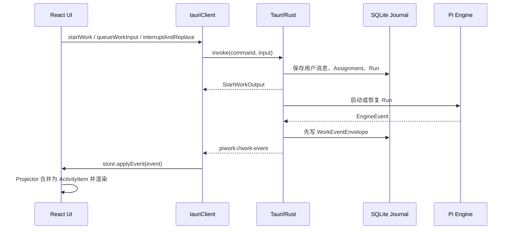

# PiWork 前端交互契约与事件类型

> 状态：按当前代码整理（2026-08-22）  
> 范围：Work 执行、Agent/Assignment 协作、执行过程 UI、通知实时通道  
> 产品术语：仓库当前产品名为 CoDo；本文沿用代码中的 `Work`、`Run`、`Assignment`、`Agent Instance`

## 1. 这份文档解决什么问题

本文描述当前代码中后端与前端之间已经存在的交互契约，包括：

1. 前端可以调用哪些与 Work 执行相关的命令；
2. 后端会通过哪些实时通道向前端发送数据；
3. `WorkEventEnvelope` 的公共信封格式；
4. 41 种 `WorkEventPayload` 的字段、来源和展示语义；
5. 前端如何把原始事件投影为 9 类 UI Activity；
6. 哪些事件应该进入主时间线、执行进度卡、Inspector 或通知中心；
7. 当前契约中已经发现、需要后续收敛的缺口。

本文严格区分以下两件事：

- **当前代码契约**：Rust/TypeScript 中已经定义或实现的行为；
- **UI 设计建议**：为了形成稳定的信息层级而建议采用的展示方式，不代表后端已经增加新事件。

## 2. 总体交互模型

前端与 Tauri 后端有两种交互方式：

- **命令（request/response）**：前端使用 `invoke(...)` 发起操作或读取快照；
- **事件（push）**：后端使用 Tauri event 向前端推送实时变化。



核心原则是：**SQLite 中的事件 Journal 是事实源，实时事件是让 UI 及时更新的传输方式，重新打开 Work 时仍以 `get_work` 返回的持久化数据恢复。**

## 3. 实时通道

### 3.1 Work 执行事件

| 项目 | 当前值 |
| --- | --- |
| Tauri event name | `piwork://work-event` |
| payload | `WorkEventEnvelope` |
| 前端入口 | `tauriClient.listenToWorkEvents(handler)` |
| Store 入口 | `store.applyEvent(event)` |
| 持久化恢复 | `get_work(workId).events` |

前端挂载时的顺序是：

1. 先注册 `piwork://work-event` listener；
2. 再调用 `drain_assignment_event_outbox`；
3. Assignment outbox 可能进行至少一次投递；
4. 前端使用稳定 `eventId` 合并持久化事件和实时事件。

交付保证并不完全相同：

- **Engine 事件**：先写 Journal，再尽力实时发布；即使实时发布丢失，后续 `get_work` hydration 仍可恢复；
- **Assignment/协作事件**：写 Journal 和 outbox 后至少一次投递，消费者必须按 `eventId` 幂等去重。

### 3.2 应用通知事件

| 项目 | 当前值 |
| --- | --- |
| Tauri event name | `piwork://notification` |
| payload | `AppNotificationSummary` |
| 前端入口 | `tauriClient.listenToAppNotifications(handler)` |
| UI | Notification Center、toast、未读列表 |

前端声明的通知类型为：

```ts
type AppNotificationSummary = {
  id: string;
  category: "mail" | "approval" | "plugin" | "connector";
  connectionId: string | null;
  workId: string | null;
  title: string;
  summary: string;
  action: Record<string, unknown>;
  readAt: string | null;
  expiresAt: string | null;
  createdAt: string;
};
```

当前后端会实际生产 `mail`（新邮件）、`connector`（连接异常）和 `approval`（连接器敏感操作待确认）通知；`plugin` 已被前端类型预留，但当前没有找到生产者。

## 4. `WorkEventEnvelope` 公共信封

所有 Work 事件共用同一信封，真正的事件类型由 `payload.type` 判别。

```ts
type WorkEventEnvelope = {
  version: number;
  eventId?: string;
  workId: string;
  runId: string | null;
  turnId?: string;
  sessionId?: string;
  agentId?: string;
  assignmentId?: string;
  causationId?: string;
  correlationId?: string;
  sequence: number;
  occurredAt: string;
  payload: WorkEventPayload;
};
```

### 4.1 字段语义

| 字段 | 类型 | 必填 | 语义 |
| --- | --- | --- | --- |
| `version` | `number` | 是 | 协议版本；当前新事件为 v2，旧 v1 仍可读取 |
| `eventId` | `string` | v2 是 | 全局稳定事件 ID；live、outbox、hydration 去重的首选键 |
| `workId` | `string` | 是 | 所属 Work |
| `runId` | `string \| null` | 是 | 所属 Run；Run 创建前的 Assignment 事件可以为 `null` |
| `turnId` | `string` | 否 | Turn 身份；当前 Engine 事件通常直接使用 `runId` |
| `sessionId` | `string` | 否 | Engine/Agent session 身份 |
| `agentId` | `string` | 否 | 产生/负责该活动的 Agent Instance |
| `assignmentId` | `string` | 否 | 所属 Assignment |
| `causationId` | `string` | 否 | 直接导致当前事件的上一事件 ID；当前 Engine 流形成链 |
| `correlationId` | `string` | 否 | 一组相关事件的关联键；Engine 常用 `runId`，Assignment 常用 `assignmentId` |
| `sequence` | `number` | 是 | 从 1 开始的有序序号；作用域是 Run，或尚无 Run 的 Assignment |
| `occurredAt` | ISO-8601 UTC string | 是 | 事件发生时间 |
| `payload` | discriminated union | 是 | 事件内容，使用 `payload.type` 收窄类型 |

重要约束：

- 不要把 `sequence` 当成整个 Work 的全局序号；不同 Run 可以同时出现相同 sequence；
- v2 应优先使用 `eventId` 作为 React key 和幂等键；
- `runId === null` 不等于非法事件，它表示 Assignment 尚未进入一次具体 Run；
- 可选 identity 字段在 JSON 中可能直接省略，而不是传 `null`。

### 4.2 一个实际形状示例

```json
{
  "version": 2,
  "eventId": "event-uuid",
  "workId": "work-uuid",
  "runId": "run-uuid",
  "turnId": "run-uuid",
  "sessionId": "pi-session-id",
  "causationId": "previous-event-uuid",
  "correlationId": "run-uuid",
  "sequence": 7,
  "occurredAt": "2026-08-22T12:00:00Z",
  "payload": {
    "type": "toolProgress",
    "toolCallId": "tool-call-1",
    "toolName": "read",
    "outputSummary": "读取中"
  }
}
```

## 5. 事件来源标记

下文用以下标记描述“当前是否真的会产生”：

| 标记 | 含义 |
| --- | --- |
| **Pi** | 当前 Pi RPC adapter 会真实产生 |
| **Domain** | Assignment、协作、Memory 等领域服务会真实产生 |
| **测试/预留** | 类型和 Projector 已支持，也可能出现在 Fake engine 或测试 fixture 中，但当前 Pi adapter 不会产生 |
| **仅声明** | union 中已声明、前端也能处理，但当前生产代码没有找到事件生产者 |

## 6. 全部 41 种 `WorkEventPayload`

### 6.1 Run 与回答输出

| `payload.type` | 附加字段 | 当前来源 | 前端语义 |
| --- | --- | --- | --- |
| `runStarted` | `modelLabel: string` | **Pi** | Run 已开始；驱动 Work/进度状态，普通主 Feed 不单独展示 |
| `assistantDelta` | `text: string` | **Pi** | 助手正文增量；同一 Turn 连续拼接为一条回答 |
| `thoughtDelta` | `text: string` | **Pi** | 思考增量；同一 Turn 连续拼接，主 UI 默认折叠 |
| `runCompleted` | `summary: string`, `artifacts: string[]`, `validation: string[]`, `limitations: string[]` | **Pi** | Run 成功结束；驱动完成态和交付详情 |
| `runFailed` | `message: string` | **Pi** | Run 失败；驱动失败态，主 UI 不直接泄露原始内部错误 |

设计含义：`assistantDelta` 是用户已经看见的主要回答；`runCompleted.summary` 是终态摘要，不能覆盖或替换已经流式显示的正文。当前时间线会对完全重复的文本去重。

### 6.2 计划事件

| `payload.type` | 附加字段 | 当前来源 | 前端语义 |
| --- | --- | --- | --- |
| `planChanged` | `planId: string`, `revision: number`, `text: string` | **测试/预留** | Engine 侧计划；按 `planId` 聚合，只接受更高 revision，默认折叠 |
| `workPlanUpdated` | `planId: string`, `revision: number`, `text: string` | **Domain** | Work 协作账本中的持久计划；Inspector Plan 使用 |

这两个事件目前不是同一个概念：`planChanged` 投影成 `ActivityItem.type = "plan"`；`workPlanUpdated` 投影成协作类 `assignment/planUpdated`，并由 Plan Inspector 单独读取。

### 6.3 工具调用生命周期

| `payload.type` | 附加字段 | 当前来源 | 前端语义 |
| --- | --- | --- | --- |
| `toolPending` | `toolCallId`, `toolName`, `inputSummary` | **测试/预留** | 等待执行；工具状态 `pending` |
| `toolStarted` | `toolCallId`, `toolName`, `inputSummary` | **Pi** | 开始执行；工具状态 `executing` |
| `toolProgress` | `toolCallId`, `toolName`, `outputSummary` | **Pi** | 中间进度；更新已有工具行，不新增一行 |
| `toolFinished` | `toolCallId`, `toolName`, `outputSummary`, `success: boolean` | **Pi** | 结束；状态为 `completed` 或 `failed` |

工具调用的 UI identity 是 `run/assignment identity + toolCallId`。四种原始事件必须合并成一个稳定的工具条目，而不是截图式地把开始、进度、结束分别画三行。

工具展示状态：

```ts
type ToolStatus = "pending" | "executing" | "completed" | "failed";
```

当前工具展示分类：

| `renderClass` | 典型工具 | 动作词 | 进度阶段 |
| --- | --- | --- | --- |
| `file-read` | `read`、`grep`、`find`、`ls` | 读取 | analyze |
| `file-edit` | `edit`、`write` | 修改 | execute |
| `shell` | `bash` | 执行 | 含 test/check/lint/build 时为 validate，否则 execute |
| `generic` | 其他工具 | 调用 | execute |

连续、同组、同类、成功且数量至少 2 的工具还可能被前端折叠成 `toolBurst`，例如“读取了 4 项”。失败工具不会被吞进 burst。

### 6.4 权限、等待、健康与 Session

| `payload.type` | 附加字段 | 当前来源 | 前端语义 |
| --- | --- | --- | --- |
| `permissionRequested` | `requestId`, `toolCallId?`, `title`, `detail` | **测试/预留** | 紧急权限请求；未终态时显示在进度卡外侧 |
| `permissionResolved` | `requestId`, `outcome` | **测试/预留** | 按 `requestId` 更新已有权限条目 |
| `waiting` | `reason: string` | **Pi** | Run 暂停等待；`waiting_on_assignments` 表示主理人等待子 Assignment |
| `liveness` | `state` | **测试/预留** | `alive` 被主 Feed 抑制；`stalled` 当前主要留在原始记录/进度信号中 |
| `sessionChanged` | `transition`, `reason?` | **Pi** | Session 变化；当前 Pi 会在恢复时产生 `resumed`，协议同时容纳 created/rotated；主 Feed 可见 |

枚举值：

```ts
type PermissionOutcome =
  | "allowed_once"
  | "allowed_for_run"
  | "denied"
  | "cancelled";

type LivenessState = "alive" | "stalled";

type SessionTransition = "created" | "resumed" | "rotated";
```

当前 Pi capability 明确为 `permission_requests: false`、`plan_updates: false`，所以 UI 可以先定义好视觉语言，但不能假设当前 Pi 会发出权限请求或 Engine 计划更新。

### 6.5 产物、验证、用量和兜底事件

| `payload.type` | 附加字段 | 当前来源 | 前端语义 |
| --- | --- | --- | --- |
| `artifactProduced` | `path: string` | **测试/预留** | 单个产物信号；当前主 Feed 不单独展示，Ledger/原始记录可用 |
| `validationProduced` | `command`, `success`, `summary` | **测试/预留** | 单次验证结果；当前主 Feed 不单独展示 |
| `usageUpdated` | `inputTokens`, `outputTokens`, `cacheReadTokens`, `cacheWriteTokens`, `totalTokens` | **Pi** | 同一 Turn 只保留最新累计值；主 Feed隐藏，原始记录可见 |
| `rawEngineEvent` | `kind`, `payloadJson` | **Pi** | 未识别的 Pi RPC 事件；只进入 Raw Activity，不污染主时间线 |

`rawEngineEvent` 是兼容新/未知 Engine 事件的安全阀，不应被当作普通用户活动行。其内容在后端已经过敏感信息和本地路径脱敏、长度限制。

### 6.6 Assignment 生命周期

| `payload.type` | 附加字段 | 当前来源 | 前端语义 |
| --- | --- | --- | --- |
| `assignmentQueued` | `assignmentId`, `assignedAgentId`, `title`, `priority` | **Domain** | Assignment 已排队 |
| `assignmentClaimed` | `assignmentId`, `agentInstanceId`, `agentSessionId: string \| null` | **Domain** | Agent 已领取 |
| `assignmentStarted` | `assignmentId`, `agentInstanceId`, `agentSessionId`, `runId` | **Domain** | 已开始执行并建立 Run |
| `assignmentWaiting` | `assignmentId`, `agentInstanceId`, `agentSessionId`, `reason` | **Domain** | Assignment 等待 |
| `assignmentRetryScheduled` | `assignmentId`, `agentInstanceId`, `attemptCount`, `nextAttemptAt`, `reason` | **Domain** | 已安排重试 |
| `assignmentCompleted` | `assignmentId`, `agentInstanceId`, `agentSessionId`, `resultSummary` | **Domain** | Assignment 完成 |
| `assignmentCancelled` | `assignmentId`, `agentInstanceId`, `agentSessionId: string \| null`, `runId: string \| null`, `reason` | **Domain** | 取消 |
| `assignmentFailed` | `assignmentId`, `agentInstanceId`, `agentSessionId`, `error` | **Domain** | 本次失败 |
| `assignmentInterrupted` | `assignmentId`, `agentInstanceId`, `agentSessionId: string \| null`, `reason` | **Domain** | 被中断 |
| `assignmentDeadLettered` | `assignmentId`, `agentInstanceId`, `attemptCount`, `error` | **Domain** | 超过重试策略，进入 dead letter |
| `assignmentRecoveryRequired` | `assignmentId`, `agentInstanceId`, `recoveryReason` | **Domain** | 重启恢复需要用户确认 |
| `leadResumed` | `assignmentId`, `dependencyGeneration` | **Domain** | 子任务完成后主理人恢复 |

Assignment 状态快照的枚举为：

```ts
type AssignmentStatus =
  | "queued"
  | "claimed"
  | "running"
  | "waiting"
  | "completed"
  | "failed"
  | "cancelled"
  | "interrupted"
  | "dead_letter"
  | "recovery_confirmation_required";
```

原始 Assignment 事件完整保留在 Journal；主时间线中的同一 Assignment 活动会按 `assignmentId` 更新为最新投影状态，不承担完整审计记录职责。

### 6.7 委派、队列控制、结果与 Work 协作

| `payload.type` | 附加字段 | 当前来源 | 前端语义 |
| --- | --- | --- | --- |
| `queueControlApplied` | `mode`, `assignmentId`, `replacedAssignmentId: string \| null`, `summary` | **仅声明** | 队列控制结果；前端已能显示，当前没有生产者 |
| `assignmentDelegated` | `assignmentId`, `parentAssignmentId`, `assignedAgentId`, `title` | **Domain** | 父 Assignment 委派子 Assignment |
| `assignmentResultSubmitted` | `assignmentId`, `agentInstanceId`, `status`, `summary` | **Domain** | Agent 提交结构化结果 |
| `assignmentResultRejected` | `assignmentId`, `agentInstanceId`, `reason` | **Domain** | 结果被拒绝 |
| `delegationRequested` | `assignmentId`, `agentInstanceId`, `suggestedAgentId?`, `capabilityPackId?`, `reason` | **仅声明** | 请求再次委派；前端已能投影，当前没有生产者 |
| `workDecisionRecorded` | `decisionId`, `summary`, `version` | **Domain** | Work 决策写入协作账本 |
| `workDeliveryCompleted` | `summary`, `artifacts: string[]`, `validation: string[]`, `limitations: string[]` | **Domain** | Work 层最终交付；在主时间线显示为交付摘要 |

相关枚举：

```ts
type QueueControlMode =
  | "enqueue_next"
  | "steer_current"
  | "interrupt_and_replace";

type ResultStatus = "completed" | "failed" | "needs_clarification";
```

### 6.8 Memory 候选

| `payload.type` | 附加字段 | 当前来源 | 前端语义 |
| --- | --- | --- | --- |
| `memoryCandidateProposed` | `candidateId`, `authorAgentId`, `content` | **Domain** | 提出待确认的长期记忆候选 |
| `memoryCandidateResolved` | `candidateId`, `status`, `resolvedBy` | **Domain** | 用户确认或拒绝候选 |

```ts
type MemoryCandidateStatus = "proposed" | "confirmed" | "rejected";
```

Memory 候选主要由 Memory Inspector 展示和操作；主时间线会隐藏这类内部 decision 投影。

## 7. 前端不是直接渲染 41 种事件

原始事件先经过 `projectActivity(events)`，被归并为 9 类 `ActivityItem`：

| `ActivityItem.type` | 来源事件 | 合并规则 | 主 UI |
| --- | --- | --- | --- |
| `message` | `assistantDelta` | 同一 Turn 连续追加文本 | 作为助手正文展示，不放进 Activity Feed |
| `thought` | `thoughtDelta` | 同一 Turn 连续追加文本 | 默认折叠 |
| `plan` | `planChanged` | 同 `planId` 仅保留更高 revision | 默认折叠 |
| `tool` | 四种 tool 事件 | 同 `toolCallId` 合并生命周期 | 进度卡详情；显示动作、对象、状态、预览 |
| `permission` | requested/resolved | 同 `requestId` 原位更新 | 未解决时突出显示 |
| `lifecycle` | run/wait/liveness/session/artifact/validation | 每个生命周期信号形成条目 | 仅 waiting、sessionChanged、runFailed 进入主 Feed |
| `usage` | `usageUpdated` | 同 Turn 覆盖为最新累计值 | 主 Feed 抑制，Raw 可见 |
| `raw` | `rawEngineEvent` | 按稳定 event identity 保留 | 只进入 Raw Activity |
| `assignment` | Assignment/协作/Memory 事件 | 有 Assignment 时按 `assignmentId` 更新 | 选择性进入 Feed，完整历史在 Raw/Inspector |

### 7.1 为什么要保留“原始事件”和“展示类型”两层

- 原始事件适合恢复、审计、调试和跨版本兼容；
- 展示类型适合稳定 UI，不让用户看到 transport 噪音；
- 一个工具调用可能产生多条原始事件，但 UI 应该是一条持续更新的记录；
- `assistantDelta`、`thoughtDelta` 是流式片段，不应该每个 delta 生成一个 DOM 行；
- `rawEngineEvent`、usage、alive heartbeat 对调试有价值，但对主时间线没有足够信息价值。

## 8. 当前执行进度卡的状态契约

进度卡不是后端直接发送的模型，而是前端根据事件推导：

```ts
type ExecutionProgressModel = {
  status: "preparing" | "running" | "waiting" | "completed" | "failed";
  currentPhase: "prepare" | "analyze" | "execute" | "validate" | "deliver";
  phases: ExecutionPhase[];
  toolCount: number;
  failedToolCount: number;
  failureMessage: string | null;
  waitingReason: string | null;
};
```

### 8.1 状态推导

| 条件 | `status` |
| --- | --- |
| 尚无工具、无终态、无 waiting | `preparing` |
| 已出现工具、无终态、无 waiting | `running` |
| 最新流中出现 `waiting` | `waiting` |
| 出现 `runCompleted`、`assignmentCompleted` 或 `workDeliveryCompleted` | `completed` |
| 出现 `runFailed` | `failed` |

### 8.2 五阶段不是后端事实

`prepare → analyze → execute → validate → deliver` 是前端展示模型：

- `analyze/execute/validate` 根据工具名称和 input/output summary 启发式分类；
- 未发生的阶段可显示 `skipped`；
- 一个阶段内的数量来自唯一 `toolCallId` 数量；
- 终态后 `deliver` 变为 completed 或 failed；
- 所以 UI 不应把阶段条理解为后端承诺的严格工作流或准确百分比。

## 9. 主时间线、进度卡和 Inspector 的信息分层

建议继续采用当前代码已经形成的三层结构：

| 层级 | 面向谁 | 应展示 | 不应展示 |
| --- | --- | --- | --- |
| 主时间线 | 普通用户 | 用户消息、助手正文、权限阻塞、最终交付、明确失败 | raw RPC、token 用量、heartbeat、重复 tool frame |
| 执行进度卡 | 想了解过程的用户 | thought/plan 折叠、工具聚合、waiting、session、Assignment 协作状态 | 每个 delta、完整 JSON、敏感错误正文 |
| Inspector / Raw Activity | 调试和高级用户 | 完整 Journal、所有 payload、identity、correlation、usage、raw | 不做“看起来像最终答案”的重包装 |

对应截图中的“完成 N 个操作 + 阶段 + 可展开调用记录”，应该由以下模型组合，而不是新增一个大而全的后端事件：

- 标题和完成态：`ExecutionProgressModel.status + toolCount`；
- 五阶段：前端 `phases` 推导；
- 调用记录：投影后的 `ActivityItem.type = "tool"`；
- 展开/折叠：纯前端 UI 状态；
- 最终回答：`assistantDelta` 聚合正文和 `workDeliveryCompleted.summary`；
- 完整审计：原始 `WorkEventEnvelope[]`。

## 10. 与 Work 相关的前端命令契约

这里只列执行 UI 直接相关的命令，不展开模型设置、插件、邮箱连接器等独立页面命令。

| 前端方法 / Tauri command | 输入 | 返回 | 用途 |
| --- | --- | --- | --- |
| `createWork` / `create_work` | `CreateWorkInput` | `WorkDetail` | 创建 Work |
| `listWorks` / `list_works` | 无 | `WorkSummary[]` | 左侧 Work 列表 |
| `getWork` / `get_work` | `workId` | `WorkDetail` | 恢复 Work、Run、消息和事件 Journal |
| `startWork` / `start_work` | `workId`, `{ prompt, referencedFiles, resourceIds }` | `StartWorkOutput` | 新建 Lead Assignment 并开始/排队执行 |
| `stopWork` / `stop_work` | `workId` | `WorkDetail` | 停止当前执行 |
| `archiveWork` / `archive_work` | `workId` | `WorkDetail` | 归档 Work |
| `restoreWork` / `restore_work` | `workId` | `WorkDetail` | 恢复为 idle |
| `listWorkAssignments` / `list_work_assignments` | `workId` | `AssignmentSummary[]` | Assignment Inspector |
| `queueWorkInput` / `queue_work_input` | `workId`, `QueueWorkInput` | `StartWorkOutput` | 排入后续指令 |
| `interruptAndReplace` / `interrupt_and_replace` | `workId`, `InterruptWorkInput` | `StartWorkOutput` | 中断并用新指令替换 |
| `confirmAssignmentRecovery` / `confirm_assignment_recovery` | `assignmentId`, `resume` | `AssignmentSummary` | 处理重启后的恢复确认 |
| `listMemoryCandidates` / `list_memory_candidates` | `workId` | `MemoryCandidateSummary[]` | 读取待确认记忆 |
| `resolveMemoryCandidate` / `resolve_memory_candidate` | `candidateId`, `confirm` | `MemoryCandidateSummary` | 确认或拒绝记忆 |
| `drainAssignmentEventOutbox` / `drain_assignment_event_outbox` | 无 | `void` | listener 注册后的内部补投递，不是用户操作 |

主要返回类型：

```ts
type WorkDetail = {
  summary: WorkSummary;
  runs: RunSummary[];
  messages: MessageSummary[];
  events: WorkEventEnvelope[];
};

type StartWorkOutput = {
  assignment: AssignmentSummary;
  run: RunSummary | null;
  userMessage: UserMessageSummary;
};
```

`run` 可以为 `null`：这表示 Assignment 已经接受但尚未开始一次 Run，UI 应显示 queued/preparing，而不是把它当作失败。

### 10.1 命令错误契约

所有 Tauri command 错误在前端统一归一化为：

```ts
type AppError = {
  code: string;
  message: string;
  details?: Record<string, unknown>;
};
```

UI 应优先使用 `code` 选择本地化文案，`details` 只用于安全的上下文和 diagnostics。后端已经主动隐藏数据库、I/O、Engine 内部错误细节。

## 11. Store 合并与恢复规则

当前前端有两条数据入口：

- 实时入口：`liveEvent`；
- 快照入口：`WorkDetail` hydration。

关键规则：

1. timeline item 的首选 key 是 `event:${eventId}`；
2. 旧 v1 事件没有 `eventId` 时，回退到 Run/Assignment + sequence；
3. live 流使用每个 Run/Assignment 的最后 sequence 拒绝旧帧；
4. hydration 使用稳定 item key 合并 live 和持久化数据；
5. 多个 Run 不能只按 sequence 混排，应结合 `occurredAt`、Run identity 和 event identity；
6. Work 顶层状态只允许当前/更新的 Run 事件推进，旧 Run 的迟到事件不能覆盖新 Run 状态。

## 12. 当前已知契约缺口

这些是代码现状，不是本文新增需求，但会直接影响后续 UI 设计和联调。

### 12.1 `StartWorkInput` 生成绑定与实际运行时不一致

Rust `StartWorkInput` 和 `tauriClient.startWork` 都包含 `resourceIds`，但当前生成的 `src/bindings/StartWorkInput.ts` 仍只有：

```ts
{ prompt: string; referencedFiles: string[] }
```

后续应重新生成或修正 bindings，避免其他调用方按过期类型实现。

### 12.2 权限事件目前没有完整交互闭环

前端可以展示 `permissionRequested/permissionResolved`，但当前 `PiWorkClient` 没有对应的 Work permission resolve command，Activity Feed 也只有状态展示，没有允许/拒绝按钮；同时当前 Pi adapter 声明 `permission_requests: false`。

因此现阶段权限 UI 应视为协议预留，不应按“已经可操作”验收。

### 12.3 声明支持不等于当前 Pi 会产生

`planChanged`、`toolPending`、permission、liveness、standalone artifact/validation 等事件已经进入 union 和 Projector，但当前 Pi adapter 不会产生其中大部分。UI 设计应优先覆盖：

1. `assistantDelta`；
2. `thoughtDelta`；
3. `toolStarted/toolProgress/toolFinished`；
4. `waiting`；
5. `runCompleted/runFailed`；
6. Assignment 协作事件；
7. `workDeliveryCompleted`；
8. `usageUpdated/rawEngineEvent` 的 Inspector 体验。

### 12.4 通知 category 的 Rust/TypeScript 宽窄不一致

TypeScript 把 category 限制为四个字符串，Rust 当前结构使用普通 `String`。如果后端新增 category 而前端未同步，编译期类型不会保护实际 wire 数据；后续适合在 Rust 侧也改为共享 enum。

### 12.5 五阶段进度是启发式展示，不是协议事件

当前后端没有 `phaseStarted` 或进度百分比事件。UI 可以展示五阶段，但文案应使用“当前正在…”和状态点，不应暗示精确完成比例、剩余时间或严格顺序。

## 13. UI 设计优先级建议

基于事件成熟度，建议按以下顺序设计组件：

1. **回答层**：用户消息、流式回答、交付摘要、失败；
2. **工具层**：pending/running/completed/failed 四态、错误展开、burst 聚合；
3. **编排层**：queued/running/waiting/retry/delegated/lead resumed；
4. **阻塞层**：waiting、recovery required、未来 permission request；
5. **证据层**：artifacts、validation、limitations；
6. **调试层**：usage、raw event、identity、correlation、causation。

所有状态差异都应同时使用图标/文字/结构表达，不能只依赖颜色。增量事件到达频率可能很高，动画应绑定“语义状态变化”，不要绑定每一个 delta frame。

## 14. 代码事实源

本文件按以下代码整理，冲突时优先级从上到下：

1. `src-tauri/src/domain/event.rs`：wire envelope 与 41 种 payload 的 Rust 事实源；
2. `src/bindings/WorkEventEnvelope.ts`、`src/bindings/WorkEventPayload.ts`：生成的 TypeScript wire 类型；
3. `src-tauri/src/engine/pi/mod.rs`：当前 Pi RPC 实际能生产的事件；
4. `src-tauri/src/assignment/repository.rs`、`src-tauri/src/collaboration/service.rs`：Assignment/协作事件生产与 outbox；
5. `src/app/tauriClient.ts`：前端命令和 Tauri event 名称；
6. `src/features/works/useWorkEvents.ts`、`src/features/works/workStore.ts`：订阅、去重和恢复；
7. `src/features/activity/activityProjector.ts`、`activityTypes.ts`：原始事件到 UI Activity 的投影；
8. `src/features/workspace/WorkTimeline.tsx`、`ExecutionProgressCard.tsx`、`executionProgress.ts`：当前可见 UI 行为；
9. `src/features/activity/RawActivityRail.tsx`：完整原始事件审计视图。

---

如果未来增加新事件，至少应同时更新：Rust payload union、生成的 TypeScript binding、Projector 的 exhaustive switch、Raw Activity、主 Feed 可见性规则、fixture/tests，以及本文档的“当前来源”和 UI 映射。
