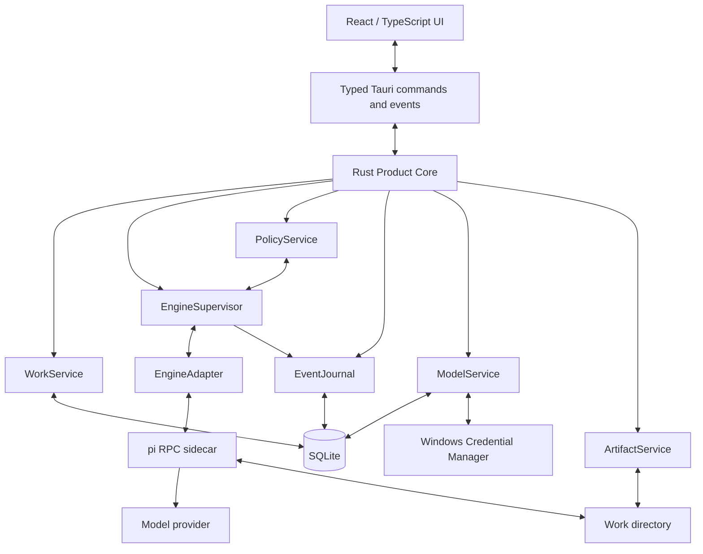

# PiWork 1.0 Product and Architecture Design

- Status: approved design
- Date: 2026-07-28
- Target: Windows 10/11 x64

## 1. Product thesis

PiWork is a local-first desktop AI work product. It turns a user goal and a local directory into a durable, collaborative Work that can inspect files, modify them, run commands, validate outcomes, and deliver artifacts.

PiWork is the product. The pi coding agent is a bundled, replaceable execution engine hidden behind a PiWork-owned engine interface. Users do not need to install pi, Node.js, or Bun, and normal product surfaces do not expose pi implementation terminology.

The long-term direction is a capability product in the spirit of Genspark: richer tools, apps, automations, and execution engines can be added later. PiWork 1.0 deliberately proves one vertical: reliable local project execution on Windows.

## 2. Design principles

1. **Work, not chat.** Chat is the control surface for a durable task workspace.
2. **Collaborative, not one-shot.** A Work supports repeated human steering and multiple execution Runs over time.
3. **Product owns the truth.** SQLite, not a pi session file, is the PiWork product data source.
4. **Engine behind an adapter.** pi can be upgraded or replaced without changing Work semantics.
5. **Visible action, hidden plumbing.** Users see plans, tool actions, changes, authorization, and results, but not RPC or sidecar internals.
6. **Local-first by default.** No PiWork account, cloud backend, prompt collection, or default telemetry.
7. **Honest safety.** PiWork distinguishes authorization from sandboxing and never promises rollback it cannot guarantee.

## 3. Vocabulary and domain model

### Work

A durable human-agent collaboration space with:

- a goal and evolving instructions;
- one canonical local working directory;
- a permission mode;
- a message and event timeline;
- zero or more Runs;
- a current plan;
- authorization history;
- indexed file changes and artifacts;
- a product status.

A Work is approximately a productized persistent task conversation, not a generic chat thread. Multiple Works may point to the same directory, but only one executes there at a time by default.

### Run

One period of active execution within a Work. Continuing a completed, stopped, failed, or idle Work creates a new Run in the same Work. History and artifact lineage remain connected.

### Engine session

An opaque engine-specific continuation reference associated with a Run. For the pi adapter this points to a pi JSONL session. It is never treated as the PiWork product record.

### Artifact

A file or deliverable surfaced by PiWork as an outcome of a Work. Files stay in the user's working directory; PiWork stores metadata, provenance, validation status, and an optional preview reference.

### Completion

Completion is a structured product event containing a result summary, artifacts, validation evidence, and known limitations. An engine merely becoming idle is not completion. A completed Work can be reopened and refined.

## 4. Scope

### 4.1 PiWork 1.0 includes

- Windows 10/11 x64 desktop application built with Tauri 2 and Rust.
- React, TypeScript, and Vite frontend.
- Simplified Chinese and English, following the system language by default.
- First-run model onboarding.
- Curated API-key setup for OpenAI, Anthropic, Google, OpenRouter, and DeepSeek.
- Custom OpenAI-compatible provider setup using the `openai-completions` API shape.
- One-time import of an existing pi configuration into PiWork-owned storage.
- Durable Works bound to local directories.
- Repeated human-agent interaction and multiple Runs per Work.
- Streaming messages, plans, tool activity, approvals, file changes, logs, and artifacts.
- Three permission modes with Balanced as the default.
- Direct operation in the selected directory.
- Git diff display and limited non-Git file backup.
- Up to five concurrent executing Works by default, configurable by the user.
- Default serialization for Works that share the same canonical directory.
- Windows notifications and system tray behavior.
- Explicit interrupted-state recovery.
- NSIS per-user installer and uninstaller.
- Diagnostics and redacted support export.

### 4.2 Explicitly outside PiWork 1.0

- PiWork accounts, cloud sync, or a PiWork backend.
- New OAuth/subscription login flows.
- Automatic import or execution of arbitrary user-installed pi extensions and skills.
- Bulk conversion of historical pi sessions into PiWork Works.
- Web research and general browser automation.
- Office document, spreadsheet, or slide generation as first-class surfaces.
- Apps/connectors, scheduled tasks, and automation.
- Multi-agent orchestration.
- Project/Space grouping above Works.
- An isolated Git worktree or directory-copy execution mode.
- A daemon that continues after PiWork exits.
- ARM64, Microsoft Store, and portable distributions.
- Enabled automatic updates.
- A promise of complete undo for arbitrary commands.

These are future product directions, not incomplete 1.0 requirements.

## 5. Brand and visual language

### 5.1 Brand

- Product name: **PiWork**.
- Direction: **Violet Loop**.
- Logo: **Continuous Loop**, a continuous pi-shaped curve representing both pi and the agent loop.
- Neutral surfaces carry most of the interface; violet is reserved for focus, state, selection, and primary action.
- Every normal Onyx logo, product name, description, URL, and brand asset is replaced by PiWork.

### 5.2 Onyx relationship and attribution

PiWork may selectively port or adapt MIT-licensed components, interaction patterns, and design tokens from non-`ee` portions of the Onyx repository. It will not fork the complete Onyx web application and will not import Onyx server-domain features.

Onyx attribution is not shown in normal PiWork UI. Required copyright and license text is included in the installer/package as a standalone `NOTICE` and third-party license artifact. Files under Onyx `ee` directories are excluded.

### 5.3 Main window

The main Work surface uses three responsive columns:

1. **Left — Work navigation**
   - PiWork identity and New Work action.
   - Work list grouped or filtered by running, waiting, completed, failed, or stopped state.
   - Per-Work live status.
   - Product destinations such as artifacts, models, settings, and diagnostics.

2. **Center — collaboration timeline**
   - Work goal and current directory.
   - Human and assistant messages.
   - concise progress and reasoning summaries;
   - plan changes and tool activity;
   - collapsed raw command output;
   - composer with file attachment, model, and permission controls.

3. **Right — Work inspector**
   - plan and step progress;
   - authorization requests;
   - file changes and Git diff;
   - artifacts and validation evidence;
   - expandable logs and diagnostics.

The right column becomes a drawer on narrower windows. The selected Work remains usable without it.

### 5.4 Engine visibility

Normal UI displays PiWork terminology. It may display the chosen model and provider because those affect user control, quality, and cost. It does not display pi, sidecar, RPC, or JSONL terminology.

Raw engine version and sidecar logs exist only in Advanced Diagnostics.

## 6. First-run model onboarding

When PiWork has no valid model configuration, it opens the model setup flow before permitting a Work to run.

The flow offers:

1. A curated provider with an API key.
2. A custom OpenAI-compatible endpoint with display name, base URL, API key, model ID, and connection test.
3. One-time import from the user's existing pi configuration.

Successful setup requires a connection test and selection of a default model. The user can later add providers and select a different model per Work or Run.

Advanced pi compatibility fields are preserved where possible but are not exposed in the primary setup flow. A raw advanced editor may be added inside Settings if it can validate and recover from invalid input.

### 6.1 Import semantics

Import is a conversion, not synchronization:

- PiWork reads existing pi model/provider settings and credentials once.
- Imported values are normalized into PiWork storage and generated engine configuration.
- PiWork does not subsequently watch or write `~/.pi/agent`.
- PiWork uses its own app-data and engine-data directories.
- Re-import is an explicit user action and presents a conflict summary before changing current configuration.
- Existing pi session history is not converted into Works in 1.0.
- Existing user pi extensions and skills are not copied or executed automatically; PiWork loads only its bundled product extension set.

### 6.2 Credential handling

- API keys are stored in Windows Credential Manager.
- SQLite stores provider and model metadata only.
- Generated `models.json` references PiWork-created environment variable names rather than literal keys.
- The Rust supervisor injects only the credentials required by a sidecar.
- Literal API keys found during import are moved to Credential Manager and removed from generated configuration.
- Imported OAuth credential entries may remain in a PiWork-private pi compatibility `auth.json`, protected by the current-user ACL. PiWork 1.0 does not create new OAuth logins. These tokens never enter SQLite, diagnostics, or exports.

## 7. System architecture

PiWork is a modular Tauri application. It does not run a localhost HTTP API.

### 7.1 Rust modules

#### WorkService

- Owns the Work and Run state machines.
- Creates, continues, stops, completes, archives, and recovers Works.
- Enforces the global concurrency limit.
- Serializes active Runs by canonical working directory unless explicitly overridden.

#### EngineSupervisor

- Starts, monitors, and terminates engine processes.
- Maintains one engine instance per actively executing Work.
- Performs strict LF-delimited JSONL framing for pi RPC.
- Correlates commands and responses, normalizes events, and enforces timeouts.
- Detects process death and marks the Run interrupted.
- Supports a bundled pi binary by default and an advanced user-supplied executable path.

#### EngineAdapter

The product-facing engine contract includes the equivalent of:

- start or restore a session for a Work and Run;
- send a prompt;
- steer an active Run;
- enqueue follow-up input;
- answer an authorization/UI request;
- change model or thinking level;
- abort execution;
- read engine state;
- subscribe to normalized events;
- dispose the engine instance.

No UI or product module imports pi-specific protocol types directly.

#### PolicyService

- Owns global and per-Work permission settings.
- Classifies paths and requested operations.
- Records requests and decisions.
- Routes approval requests to the active UI or Windows notification.
- Defaults to denial when the policy bridge cannot obtain a valid decision.

#### EventJournal

- Converts engine-specific events into versioned PiWork events.
- Persists important state in a SQLite transaction before publishing a UI event.
- Assigns monotonic per-Run sequence numbers for replay and deduplication.
- Excludes raw hidden reasoning from PiWork product storage.

#### ModelService

- Stores non-secret provider and model configuration.
- Validates curated and custom providers.
- Generates pi-compatible runtime configuration.
- Retrieves credentials from Windows Credential Manager for process injection.

#### ArtifactService

- Tracks files touched or declared as deliverables.
- Reads Git status and diff without changing Git state.
- Maintains limited before-images for non-Git files modified through observable edit/write tools.
- Never claims to reverse arbitrary shell-command effects.

#### NotificationService

- Sends notifications for completion, failure, and authorization needs.
- Opens the relevant Work when the notification is activated.
- Synchronizes tray state with running and waiting Work counts.

#### Diagnostics

- Maintains bounded, redacted logs.
- Reports PiWork, operating system, WebView, database schema, bundled engine, and process status.
- Exports a support bundle that excludes prompts, file content, API keys, OAuth tokens, and environment secrets by default.

## 8. pi adapter

### 8.1 Distribution and launch

- PiWork bundles a pinned Windows pi executable as a Tauri sidecar.
- The sidecar is launched with `--mode rpc`.
- `PI_CODING_AGENT_DIR` points to PiWork-private engine configuration.
- `PI_CODING_AGENT_SESSION_DIR` points to PiWork-private persistent engine sessions.
- PiWork controls the working directory per Work.
- A bundled PiWork permission extension is forced into every engine instance.
- Advanced settings may select a compatible external pi executable after a version and capability check.

Users never need Node.js or Bun at runtime.

### 8.2 RPC rules

- Only LF (`\n`) frames records.
- A trailing CR is tolerated for CRLF input.
- Every PiWork command uses a correlation ID.
- Unknown events are retained in a bounded diagnostic channel but do not crash other Works.
- Malformed output isolates the affected adapter instance.
- Stdout is reserved for RPC; stderr is captured as bounded redacted diagnostics.

### 8.3 Permission bridge

pi itself has no sandbox. PiWork therefore bundles an extension that intercepts `tool_call` before execution.

The extension:

1. Normalizes the tool name, paths, command, and declared side effects.
2. Applies the current policy snapshot.
3. Automatically allows permitted operations.
4. Blocks forbidden operations.
5. Uses RPC UI requests for decisions that require the user.
6. Defaults to block on timeout, disconnect, invalid response, or policy error.

Rust remains the authoritative store for policy and decisions. The in-process extension is the enforcement point immediately before the pi tool executes.

## 9. Persistence

SQLite is the PiWork product source of truth and uses versioned migrations from the first release.

Persistent product data lives under the current user's roaming application-data directory, logically `%APPDATA%\PiWork`. This includes the SQLite database, product configuration, and persistent private engine sessions. Machine-local and disposable data lives under `%LOCALAPPDATA%\PiWork`, including bounded logs, temporary sidecar runtime directories, caches, and retained file backups. Exact subdirectory names are centralized in one Rust path service rather than duplicated across modules.

The logical schema includes:

- `works`: identity, title, current goal, canonical directory, product status, permission mode, timestamps.
- `runs`: Work reference, engine kind, engine session reference, model, status, start/end timestamps, completion and error summaries.
- `messages`: Work and Run references, role, public content kind, structured content, timestamps.
- `events`: Run reference, monotonic sequence, versioned event type, normalized payload, timestamp.
- `plans` and `plan_steps`: current and historical structured plans.
- `approval_requests` and `approval_decisions`: request details, risk, scope, response, and timestamps.
- `artifacts`: path, kind, provenance, validation state, and optional preview metadata.
- `file_backups`: observable pre-change file snapshots and retention metadata.
- `model_configs`: provider/model metadata and references to vault entries, never secrets.
- `settings`: typed product settings such as language, concurrency, tray behavior, and external engine path.
- `schema_migrations`: applied migration versions.

Large command output is bounded and may be stored in compressed append-only log files referenced by SQLite rather than in the primary database. Retention is user-configurable.

## 10. Work lifecycle and collaboration

### 10.1 Product states

A Work can be draft, queued, running, waiting for user, idle, completed, failed, stopped, interrupted, or archived.

- **Draft:** goal or directory is not ready to run.
- **Queued:** waiting for concurrency capacity or same-directory serialization.
- **Running:** the engine is actively processing or executing tools.
- **Waiting for user:** authorization or necessary user input is outstanding.
- **Idle:** the engine settled without structured completion; the Work remains open to continue.
- **Completed:** the agent submitted a structured result, artifacts, validation, and limitations.
- **Failed:** a non-recoverable Run error occurred; history is retained and retry is available.
- **Stopped:** the user stopped the current Run; the Work can continue later.
- **Interrupted:** PiWork or the sidecar ended unexpectedly; explicit resume is required.
- **Archived:** hidden from normal lists but retained locally.

### 10.2 Continuous collaboration

During a Run the user may:

- send steering instructions that alter the next model turn;
- enqueue a follow-up for after the current loop settles;
- pause or stop execution;
- approve or deny requested operations;
- revise the goal or plan.

After completion the user may continue in the same Work. PiWork creates a new Run, keeps the existing history and artifacts, and changes the Work back to an active state. Completion is a checkpoint, not a terminal lock.

### 10.3 Planning

- Simple requests may execute without a formal plan.
- Non-trivial requests produce a visible structured plan.
- A visible plan does not block normal execution by default.
- Risky steps pause at the authorization boundary.
- A “plan only” option prevents execution until the user explicitly continues.

## 11. Permission model

### 11.1 Modes

#### Ask Every Step

- Reads and searches may proceed.
- Writes and commands require confirmation.

#### Balanced — default

- Reads, searches, and normal edits inside the Work directory are allowed.
- Low-risk tests, builds, formatting, and read-only Git commands may be allowed and logged.
- Directory-external access and high-risk operations require confirmation.
- Privilege elevation and critical system changes are blocked by default.

#### Auto Execute

- Most in-directory actions proceed automatically.
- System-level, privilege-changing, and clearly irreversible actions still require confirmation or remain blocked.
- The user can always observe activity and stop immediately.

### 11.2 Mandatory authorization examples

- deletes or destructive bulk changes;
- writes outside the canonical Work directory;
- dependency or software installation;
- commands with external side effects;
- `git push` or equivalent publication;
- registry or system configuration changes.

### 11.3 Default-block examples

- elevation to administrator;
- destructive access to Windows or user-profile roots;
- disabling security controls;
- operations whose parsed target cannot be resolved safely.

Authorization is not a sandbox. PiWork communicates that distinction in onboarding and settings.

## 12. Concurrency and background behavior

- Saved Works are unlimited.
- The default maximum number of simultaneously executing Works is five.
- The user may configure the global limit.
- At most one Work executes in a given canonical directory by default.
- The user may explicitly override same-directory serialization after a warning.
- Each executing Work owns a distinct sidecar process.
- Switching Works does not stop a Run.
- Closing the main window minimizes PiWork to the tray by default.
- The first close explains tray behavior and offers “close means exit.”
- Exiting while Runs are active requires an explicit decision.
- PiWork 1.0 does not continue after the application fully exits.

## 13. Failure handling and recovery

### Provider or network failure

Show a user-facing error and backoff state. Only model requests known not to have produced tool side effects may be retried automatically by the engine. Tool calls are never automatically replayed after ambiguous failure.

### Sidecar crash

Mark the Run interrupted, retain the tail of redacted diagnostics, and keep the Work history. Rebuild and restore only after the user chooses Continue.

### RPC corruption or timeout

Isolate the affected adapter. Do not affect other Works. Preserve correlation information for diagnostics.

### Database write failure

Stop sending new engine instructions when PiWork cannot durably record critical state. Enter a read-only recovery surface rather than permitting execution that the product cannot remember.

### Missing or inaccessible Work directory

Require the user to repair the path. Never silently fall back to the process directory, home directory, or another folder.

### Invalid credentials

Pause affected Works and take the user to model configuration. Resume only after a successful validation and explicit user action.

### Application restart

Runs left active at shutdown become interrupted. The UI restores messages, plans, approvals, artifacts, and the engine session reference, but never resumes automatically.

## 14. Privacy and local data

- No account or PiWork cloud service is required.
- Work data stays local.
- Provider calls go directly from the bundled engine to the configured provider.
- PiWork does not collect prompts, file content, or conversations.
- Crash reports and anonymous product analytics are absent or off by default. Any future addition requires explicit opt-in.
- Pi's own update checks and install telemetry are disabled for the bundled sidecar; PiWork owns update behavior.
- Secrets are redacted from logs, errors, support exports, and UI event payloads.

## 15. Windows packaging and process behavior

- Tauri 2 application with a per-user NSIS installer.
- Windows 10/11 x64 only.
- WebView2 availability is checked or bootstrapped using the chosen Tauri distribution mode.
- The installer includes the pinned pi sidecar, PiWork permission extension, notices, and third-party licenses.
- Uninstall asks whether to preserve or remove PiWork user data.
- Auto-update interfaces may exist internally, but updating is not enabled without a stable release channel and signing certificate.
- All spawned sidecars are assigned to a Windows Job Object so abnormal PiWork termination does not orphan engine processes.

## 16. Testing strategy

### Rust unit tests

- Work and Run state transitions.
- concurrency and same-directory scheduling;
- path canonicalization and boundary checks;
- permission classification and default-deny behavior;
- JSONL framing, request correlation, timeout, and event normalization;
- model import conversion and secret stripping;
- SQLite migrations, transactions, and restart recovery;
- redaction and diagnostic retention.

### Engine contract tests

A fake `EngineAdapter` produces deterministic streaming, tool proposals, approvals, completion, corruption, timeouts, and crashes. Product behavior is tested without pi or a real provider.

### pi integration tests

- Launch the bundled pi sidecar in RPC mode.
- Use a local mock OpenAI-compatible HTTP server; no real API key or network dependency.
- Verify prompt streaming, tool events, steering, follow-up, abort, completion, and session restoration.
- Verify the permission extension blocks before tool execution.
- Verify malformed JSON and sidecar death are isolated.

### Frontend tests

- Model onboarding and validation states.
- Work list and state badges.
- timeline event rendering and replay;
- authorization cards and timeout states;
- responsive inspector/drawer behavior;
- completion followed by a new collaborative Run;
- Simplified Chinese and English coverage.

### Windows end-to-end tests

On a clean Windows 11 x64 environment:

1. Install PiWork without Node.js or pi present.
2. Configure a mock or test OpenAI-compatible provider.
3. Select a local folder and create a Work.
4. Stream a response, edit files, request authorization, run validation, and complete.
5. Inspect diff, artifacts, and notification behavior.
6. Restart PiWork and continue the same Work in a new Run.
7. Uninstall and verify the selected user-data retention choice.

## 17. Delivery milestones

### Milestone 1 — Desktop foundation

Tauri/React shell, Continuous Loop branding, i18n, SQLite migrations, typed IPC, settings, and basic Windows packaging.

### Milestone 2 — Core vertical loop

Model onboarding, Credential Manager integration, pi adapter, one persistent Work, streaming timeline, and structured completion.

### Milestone 3 — Product safety and collaboration

Permission bridge, visible plan, steering and follow-up, multiple Runs, diff/artifacts, interruption recovery, and diagnostics.

### Milestone 4 — Windows 1.0 quality

Concurrent scheduling, same-directory serialization, tray and notifications, installer/uninstaller behavior, local-provider integration tests, and clean-machine acceptance.

Each milestone must preserve an executable vertical slice; modules are not considered complete solely because their isolated implementation exists.

## 18. Acceptance criterion

PiWork 1.0 is accepted when the following succeeds on a clean Windows 11 x64 machine:

> A user installs PiWork without Node.js or pi, configures a model, selects a local folder, creates a Work, and describes a goal. PiWork streams progress, requests authorization when required, modifies files, runs validation, shows diffs and artifacts, submits a structured completion, and sends a Windows notification. After restarting the application, the user can inspect the full Work and continue collaborating in a new Run.

Features that do not support this path do not displace work required to make it reliable.

## 19. External references

Primary sources reviewed on 2026-07-28:

- pi coding agent repository and package documentation: <https://github.com/earendil-works/pi>
- pi RPC mode: <https://github.com/earendil-works/pi/blob/main/packages/coding-agent/docs/rpc.md>
- pi SDK: <https://github.com/earendil-works/pi/blob/main/packages/coding-agent/docs/sdk.md>
- pi custom models: <https://github.com/earendil-works/pi/blob/main/packages/coding-agent/docs/models.md>
- pi environment variables: <https://github.com/earendil-works/pi/blob/main/packages/coding-agent/docs/environment-variables.md>
- pi security model: <https://github.com/earendil-works/pi/blob/main/packages/coding-agent/docs/security.md>
- Onyx repository: <https://github.com/onyx-dot-app/onyx>
- Onyx desktop Tauri wrapper: <https://github.com/onyx-dot-app/onyx/tree/main/desktop>
- Onyx repository license: <https://github.com/onyx-dot-app/onyx/blob/main/LICENSE>

## 20. Resolved decisions

This specification contains no open 1.0 product decisions. Items listed as outside scope are intentionally deferred and do not block implementation planning.
