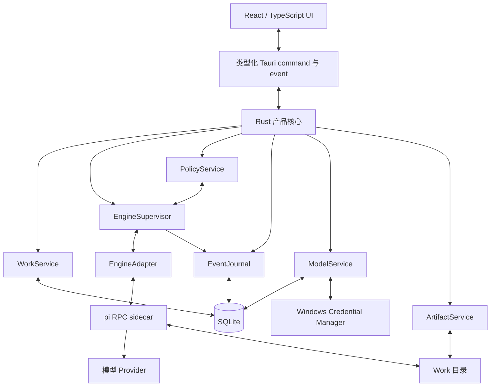

# PiWork 1.0 产品与架构设计

状态：设计已批准，中文版待书面审阅  
日期：2026-07-28  
目标平台：Windows 10/11 x64

## 1. 产品主张

PiWork 是一款本地优先的桌面 AI 工作产品。它把用户目标和一个本地目录转化为持久、可协作的 Work；Work 可以检查文件、修改文件、执行命令、验证结果并交付产物。

PiWork 是产品本身。pi coding agent 是被封装在 PiWork 自有引擎接口之后、可替换的内置执行引擎。用户无需安装 pi、Node.js 或 Bun，正常产品界面也不会暴露 pi 的实现术语。

长期方向是一款类似 Genspark 的能力产品：未来可以继续加入更丰富的工具、Apps、自动化和执行引擎。PiWork 1.0 刻意只验证一条垂直主线：在 Windows 上可靠地执行本地项目任务。

## 2. 设计原则

1. **以 Work 为中心，而非聊天。** 聊天是持久任务空间的控制界面。
2. **持续协作，而非一次性交付。** 一个 Work 支持人持续介入，并可随时间产生多个执行 Run。
3. **产品拥有事实源。** PiWork 产品数据以 SQLite 为准，而不是以 pi session 文件为准。
4. **通过 Adapter 隔离引擎。** 升级或替换 pi 不会改变 Work 的产品语义。
5. **行动可见，管线隐藏。** 用户能看到计划、工具操作、变更、授权和结果，但不会看到 RPC 或 sidecar 内部细节。
6. **默认本地优先。** 不要求 PiWork 账号和云后端，不采集提示词，默认不开启遥测。
7. **诚实的安全边界。** PiWork 明确区分“授权控制”和“沙箱隔离”，绝不承诺无法保证的完整回滚。

## 3. 术语与领域模型

### Work

一个持久的人机协作空间，包含：

- 一个目标和持续演进的指令；
- 一个规范化后的本地工作目录；
- 一种权限模式；
- 消息与事件时间线；
- 零个或多个 Run；
- 当前计划；
- 授权历史；
- 已索引的文件变更与产物；
- 产品状态。

Work 大致可以理解为“产品化的持久任务会话”，而不是普通聊天线程。多个 Work 可以指向同一个目录，但默认同一时刻只允许其中一个执行。

### Run

Work 内的一段主动执行周期。继续一个已完成、已停止、失败或空闲的 Work，会在同一个 Work 中创建新 Run。已有历史和产物谱系保持关联。

### Engine session

与某个 Run 关联、引擎专用且对产品不透明的续接引用。对 pi Adapter 而言，它指向一个 pi JSONL session。它永远不会被当作 PiWork 的产品记录。

### Artifact

由 PiWork 呈现为 Work 结果的文件或交付物。文件仍保存在用户的工作目录；PiWork 只保存元数据、来源、验证状态和可选的预览引用。

### Completion

完成是一条结构化产品事件，包含结果摘要、产物、验证证据和已知限制。执行引擎进入空闲并不代表完成。已完成 Work 仍然可以重新打开并继续打磨。

## 4. 范围

### 4.1 PiWork 1.0 包含

- 使用 Tauri 2 和 Rust 构建的 Windows 10/11 x64 桌面应用。
- React、TypeScript 和 Vite 前端。
- 简体中文与英文；默认跟随系统语言。
- 首次启动模型配置。
- OpenAI、Anthropic、Google、OpenRouter 和 DeepSeek 的精选 API Key 配置。
- 基于 `openai-completions` API 形态的自定义 OpenAI-compatible Provider。
- 将现有 pi 配置一次性导入 PiWork 自有存储。
- 与本地目录绑定的持久 Work。
- 持续的人机交互，以及每个 Work 下的多个 Run。
- 流式消息、计划、工具活动、授权、文件变更、日志与产物。
- 三档权限模式，默认使用平衡模式。
- 直接操作用户选择的原目录。
- Git diff 展示和有限的非 Git 文件备份。
- 默认最多同时执行 5 个 Work，并允许用户配置。
- 指向同一规范目录的 Work 默认串行执行。
- Windows 通知和系统托盘行为。
- 显式的中断恢复流程。
- NSIS 按用户安装器和卸载器。
- 诊断和脱敏支持包导出。

### 4.2 明确不属于 PiWork 1.0

- PiWork 账号、云同步或 PiWork 后端。
- 新增 OAuth/订阅登录流程。
- 自动导入或执行用户安装的任意 pi extension 与 skill。
- 将历史 pi session 批量转换为 PiWork Work。
- 网页研究和通用浏览器自动化。
- 将 Word 文档、电子表格或幻灯片生成做成一等产品界面。
- Apps/连接器、定时任务和自动化。
- 多 Agent 编排。
- 位于 Work 之上的 Project/Space 分组。
- 隔离的 Git worktree 或目录副本执行模式。
- PiWork 退出后仍继续执行的守护进程。
- ARM64、Microsoft Store 和便携版。
- 已启用的自动更新。
- 对任意命令提供完整撤销的承诺。

以上都是未来产品方向，而不是尚未完成的 1.0 需求。

## 5. 品牌与视觉语言

### 5.1 品牌

- 产品名：**PiWork**。
- 品牌方向：**Violet Loop**。
- Logo：**Continuous Loop**，使用连续的 π 形曲线，同时表达 pi 和 agent loop。
- 界面主要由中性色表面构成；紫色只用于焦点、状态、选择和主要动作。
- 正常界面中的 Onyx Logo、产品名、说明、URL 和品牌资产全部替换为 PiWork。

### 5.2 与 Onyx 的关系及归属说明

PiWork 可以选择性移植或改造 Onyx 仓库中非 `ee` 部分、采用 MIT 许可的组件、交互模式和设计 token。PiWork 不会 fork 完整 Onyx Web 应用，也不会引入 Onyx 的服务端领域功能。

正常 PiWork UI 不显示 Onyx 归属说明。法律要求的版权与许可证文本以独立 `NOTICE` 和第三方许可证文件随安装包发布。任何 Onyx `ee` 目录下的文件均不得使用。

### 5.3 主窗口

主 Work 界面采用响应式三栏布局：

1. **左栏——Work 导航**
   - PiWork 标识与“新建 Work”动作。
   - 按运行中、等待、已完成、失败或已停止状态分组或筛选的 Work 列表。
   - 每个 Work 的实时状态。
   - 产物、模型、设置和诊断等产品入口。

2. **中栏——协作时间线**
   - Work 目标和当前目录。
   - 用户与助手消息。
   - 简明的进度与推理摘要。
   - 计划变更和工具活动。
   - 默认折叠的原始命令输出。
   - 带文件附件、模型和权限控制的输入区。

3. **右栏——Work 检查器**
   - 计划与步骤进度。
   - 授权请求。
   - 文件变更与 Git diff。
   - 产物和验证证据。
   - 可展开的日志与诊断。

窗口较窄时右栏变为抽屉。即使不打开右栏，当前 Work 仍然可用。

### 5.4 引擎可见度

正常 UI 统一使用 PiWork 术语。界面可以显示所选模型与 Provider，因为它们直接影响用户控制、质量和成本；但不会显示 pi、sidecar、RPC 或 JSONL 等术语。

原始引擎版本和 sidecar 日志只出现在“高级诊断”中。

## 6. 首次模型配置

当 PiWork 没有可用模型配置时，必须先进入模型设置流程，之后才能运行 Work。

流程提供三个入口：

1. 使用 API Key 配置精选 Provider。
2. 配置自定义 OpenAI-compatible 端点，包括显示名称、Base URL、API Key、模型 ID 和连接测试。
3. 从现有 pi 配置进行一次性导入。

只有连接测试成功并选定默认模型后，配置才算完成。用户之后可以继续添加 Provider，并为不同 Work 或 Run 选择其他模型。

高级 pi 兼容字段在可行时应被保留，但不在主设置流程中展开。如果能提供校验和错误恢复，高级设置中可以增加原始配置编辑器。

### 6.1 导入语义

导入是转换，不是同步：

- PiWork 只读取一次现有 pi 的模型/Provider 设置和凭据。
- 导入值会被规范化到 PiWork 存储，并生成运行时引擎配置。
- 此后 PiWork 不会继续监控或写入 `~/.pi/agent`。
- PiWork 使用自己的应用数据目录与引擎数据目录。
- 再次导入必须由用户显式发起，并在修改当前配置前展示冲突摘要。
- PiWork 1.0 不把现有 pi session 历史转换为 Work。
- 用户已有的 pi extension 和 skill 不会被自动复制或执行；PiWork 只加载产品内置 extension 集合。

### 6.2 凭据处理

- API Key 存入 Windows Credential Manager。
- SQLite 只保存 Provider 与模型元数据。
- 生成的 `models.json` 引用 PiWork 创建的环境变量名，不包含明文 Key。
- Rust supervisor 只向某个 sidecar 注入它实际需要的凭据。
- 导入时发现的明文 API Key 会被迁移到 Credential Manager，并从生成配置中删除。
- 导入的 OAuth 凭据可以保留在 PiWork 私有、使用当前用户 ACL 保护的 pi 兼容 `auth.json` 中。PiWork 1.0 不创建新的 OAuth 登录；这些 token 不得进入 SQLite、诊断或导出文件。

## 7. 系统架构

PiWork 是模块化 Tauri 应用，不运行 localhost HTTP API。

### 7.1 Rust 模块

#### WorkService

- 拥有 Work 和 Run 状态机。
- 创建、继续、停止、完成、归档和恢复 Work。
- 执行全局并发上限。
- 除非用户显式解除，否则按规范工作目录串行调度活动 Run。

#### EngineSupervisor

- 启动、监控和终止引擎进程。
- 每个正在执行的 Work 维护一个引擎实例。
- 为 pi RPC 实现严格的 LF 分隔 JSONL framing。
- 关联 command 与 response，规范化 event，并执行超时策略。
- 检测进程退出并把 Run 标记为“已中断”。
- 默认支持内置 pi 二进制，也支持高级用户指定外部可执行文件。

#### EngineAdapter

面向产品的引擎契约应提供以下等价能力：

- 为 Work 与 Run 启动或恢复 session；
- 发送 prompt；
- steering 活动 Run；
- 排入 follow-up 输入；
- 回答授权/UI request；
- 切换模型或 thinking level；
- 中止执行；
- 读取引擎状态；
- 订阅规范化 event；
- 释放引擎实例。

任何 UI 或产品模块都不能直接导入 pi 专用协议类型。

#### PolicyService

- 管理全局和每个 Work 的权限设置。
- 对路径和请求操作进行分级。
- 记录授权请求与决定。
- 把审批请求路由到活动 UI 或 Windows 通知。
- 当权限桥无法获得有效决定时默认拒绝。

#### EventJournal

- 把引擎专用 event 转换为带版本号的 PiWork event。
- 先在 SQLite 事务中持久化关键状态，再向 UI 发布 event。
- 为 replay 和去重分配每个 Run 单调递增的序号。
- 不把原始隐藏推理写入 PiWork 产品存储。

#### ModelService

- 保存非敏感 Provider 与模型配置。
- 校验精选 Provider 和自定义 Provider。
- 生成 pi 兼容的运行时配置。
- 从 Windows Credential Manager 读取凭据并注入进程。

#### ArtifactService

- 跟踪被修改或被声明为交付物的文件。
- 读取 Git 状态和 diff，但不改变 Git 状态。
- 对通过可观察 edit/write 工具修改的非 Git 文件保留有限 before-image。
- 绝不声称能够撤销任意 shell 命令产生的副作用。

#### NotificationService

- 对完成、失败和需要授权发送通知。
- 激活通知时打开对应 Work。
- 让托盘状态与运行中、等待中的 Work 数保持同步。

#### Diagnostics

- 保存有界且脱敏的日志。
- 报告 PiWork、操作系统、WebView、数据库 schema、内置引擎和进程状态。
- 导出支持包时默认排除 prompt、文件内容、API Key、OAuth token 和环境变量 secret。

## 8. pi Adapter

### 8.1 分发与启动

- PiWork 把固定版本的 Windows pi 可执行文件作为 Tauri sidecar 打包。
- sidecar 使用 `--mode rpc` 启动。
- `PI_CODING_AGENT_DIR` 指向 PiWork 私有引擎配置目录。
- `PI_CODING_AGENT_SESSION_DIR` 指向 PiWork 私有的持久引擎 session 目录。
- PiWork 为每个 Work 控制工作目录。
- 每个引擎实例都强制加载 PiWork 内置权限 extension。
- 高级设置允许用户在通过版本和能力检查后，选择兼容的外部 pi 可执行文件。

用户运行 PiWork 时不需要安装 Node.js 或 Bun。

### 8.2 RPC 规则

- 仅使用 LF（`\n`）分隔记录。
- 对 CRLF 输入允许移除末尾 CR。
- 每条 PiWork command 都使用 correlation ID。
- 未知 event 保留在有界诊断通道中，但不能导致其他 Work 崩溃。
- 畸形输出只隔离受影响的 Adapter 实例。
- stdout 只用于 RPC；stderr 被采集为有界脱敏诊断。

### 8.3 权限桥

pi 本身不提供沙箱。因此 PiWork 内置一个在执行前拦截 `tool_call` 的 extension。

该 extension：

1. 规范化工具名、路径、命令和声明的副作用。
2. 应用当前权限策略快照。
3. 自动允许符合策略的操作。
4. 阻止明确禁止的操作。
5. 对需要用户决定的请求使用 RPC UI request。
6. 在超时、断连、无效响应或策略错误时默认阻止。

Rust 是权限策略和决定的权威存储；运行在 sidecar 进程内的 extension 是 pi 工具真正执行前的强制执行点。

## 9. 持久化

SQLite 是 PiWork 产品事实源，并从第一个版本开始使用版本化迁移。

持久产品数据位于当前用户的 roaming application-data 目录，逻辑路径为 `%APPDATA%\PiWork`，其中包括 SQLite 数据库、产品配置和持久的私有引擎 session。机器本地且可丢弃的数据位于 `%LOCALAPPDATA%\PiWork`，包括有界日志、sidecar 临时运行目录、缓存和保留的文件备份。所有精确子目录名都由一个 Rust path service 统一管理，不能散落在各模块中。

逻辑 schema 包括：

- `works`：标识、标题、当前目标、规范目录、产品状态、权限模式和时间戳。
- `runs`：Work 引用、引擎类型、engine session 引用、模型、状态、开始/结束时间、完成摘要和错误摘要。
- `messages`：Work/Run 引用、角色、公开内容类型、结构化内容和时间戳。
- `events`：Run 引用、单调序号、带版本的 event 类型、规范化 payload 和时间戳。
- `plans` 与 `plan_steps`：当前及历史结构化计划。
- `approval_requests` 与 `approval_decisions`：请求详情、风险、范围、响应和时间戳。
- `artifacts`：路径、类型、来源、验证状态和可选预览元数据。
- `file_backups`：可观察到的修改前文件快照及其保留元数据。
- `model_configs`：Provider/模型元数据和 vault 引用，绝不包含 secret。
- `settings`：语言、并发数、托盘行为、外部引擎路径等类型化产品设置。
- `schema_migrations`：已应用的迁移版本。

大量命令输出需要被限制大小，并可以存入由 SQLite 引用的压缩追加日志，而不是直接塞入主数据库。保留时间允许用户配置。

## 10. Work 生命周期与协作

### 10.1 产品状态

Work 可以处于：草稿、排队中、运行中、等待用户、空闲、已完成、失败、已停止、已中断或已归档。

- **草稿：** 目标或目录尚未满足运行条件。
- **排队中：** 等待并发容量或同目录串行锁。
- **运行中：** 引擎正在处理或执行工具。
- **等待用户：** 有尚未处理的授权或必要用户输入。
- **空闲：** 引擎已停止，但没有结构化完成；Work 仍可继续。
- **已完成：** agent 已提交结构化结果、产物、验证和限制。
- **失败：** Run 出现不可恢复错误；保留历史并允许重试。
- **已停止：** 用户停止当前 Run；Work 稍后仍可继续。
- **已中断：** PiWork 或 sidecar 异常结束；必须显式恢复。
- **已归档：** 从普通列表隐藏，但仍保存在本机。

### 10.2 持续协作

在 Run 进行中，用户可以：

- 发送 steering 指令，改变下一次模型 turn；
- 排入 follow-up，在当前 loop settled 后执行；
- 暂停或停止执行；
- 批准或拒绝请求的操作；
- 修改目标或计划。

完成后，用户仍可在同一个 Work 继续。PiWork 创建新 Run，保留已有历史和产物，并把 Work 恢复为活动状态。完成是阶段检查点，不是终止锁。

### 10.3 计划

- 简单请求可以不生成正式计划就直接执行。
- 非简单请求应生成可见的结构化计划。
- 默认情况下，可见计划不会阻塞正常执行。
- 高风险步骤在授权边界暂停。
- “仅规划”选项会阻止执行，直到用户显式继续。

## 11. 权限模型

### 11.1 三档模式

#### 每步询问

- 读取和搜索可以继续。
- 写入和命令需要确认。

#### 平衡模式——默认

- 允许在 Work 目录内读取、搜索和普通编辑。
- 允许并记录低风险测试、构建、格式化和只读 Git 命令。
- 目录外访问和高风险操作需要确认。
- 提权和关键系统变更默认阻止。

#### 自动执行

- 目录内的大多数操作自动继续。
- 系统级、改变权限和明显不可逆的操作仍需要确认，或者继续保持阻止。
- 用户始终可以看到活动并立即停止。

### 11.2 必须授权的示例

- 删除或破坏性批量变更；
- 写入规范 Work 目录之外；
- 安装依赖或软件；
- 有外部副作用的命令；
- `git push` 或等价发布动作；
- 修改注册表或系统配置。

### 11.3 默认阻止的示例

- 提升为管理员权限；
- 对 Windows 根目录或用户配置根目录进行破坏性访问；
- 关闭安全控制；
- 无法安全解析目标的操作。

授权控制不是沙箱。PiWork 必须在引导和设置界面清楚说明这一点。

## 12. 并发与后台行为

- 已保存 Work 数量不设上限。
- 默认最多同时执行 5 个 Work。
- 用户可以调整全局并发上限。
- 默认同一个规范目录最多只有一个 Work 执行。
- 用户可以在看到警告后显式解除同目录串行限制。
- 每个执行中的 Work 拥有独立 sidecar 进程。
- 切换 Work 不会停止 Run。
- 默认关闭主窗口会把 PiWork 最小化到托盘。
- 第一次关闭时解释托盘行为，并提供“关闭即退出”选项。
- 有活动 Run 时真正退出必须显式确认。
- PiWork 1.0 在应用完全退出后不再继续执行。

## 13. 失败处理与恢复

### Provider 或网络错误

展示用户可理解的错误和退避状态。只有明确尚未产生工具副作用的模型请求，才允许由引擎自动重试；出现不确定失败后绝不自动重放工具调用。

### sidecar 崩溃

把 Run 标记为“已中断”，保留脱敏诊断尾部和完整 Work 历史。只有用户点击“继续”后才重建并恢复。

### RPC 损坏或超时

隔离受影响的 Adapter，不得影响其他 Work；保留 correlation 信息供诊断使用。

### 数据库写入失败

当 PiWork 无法持久记录关键状态时，停止向引擎发送新指令。进入只读恢复界面，不能允许产品无法记住的执行继续发生。

### Work 目录不存在或不可访问

要求用户修复路径。绝不静默回退到进程目录、用户目录或其他文件夹。

### 凭据失效

暂停相关 Work 并跳转到模型设置。只有重新验证成功且用户显式操作后才恢复。

### 应用重启

关闭时仍活跃的 Run 转为“已中断”。UI 恢复消息、计划、授权、产物和 engine session 引用，但绝不自动续跑。

## 14. 隐私与本地数据

- 不要求账号或 PiWork 云服务。
- Work 数据保存在本机。
- Provider 请求由内置引擎直接发往已配置 Provider。
- PiWork 不采集 prompt、文件内容或会话。
- 崩溃报告和匿名产品分析要么不存在，要么默认关闭；未来增加时必须显式 opt-in。
- 内置 sidecar 禁用 pi 自己的版本检查和安装遥测；更新行为由 PiWork 负责。
- 日志、错误、支持包和 UI event payload 必须对 secret 脱敏。

## 15. Windows 打包与进程行为

- Tauri 2 应用，使用 NSIS 按用户安装器。
- 仅支持 Windows 10/11 x64。
- 按所选 Tauri 分发方式检查或引导安装 WebView2。
- 安装包包括固定版本 pi sidecar、PiWork 权限 extension、NOTICE 和第三方许可证。
- 卸载时询问保留还是删除 PiWork 用户数据。
- 内部可以预留自动更新接口，但在具备稳定发布渠道和代码签名证书前不启用更新。
- 所有 sidecar 都必须加入 Windows Job Object，避免 PiWork 异常退出后遗留孤儿引擎进程。

## 16. 测试策略

### Rust 单元测试

- Work 与 Run 状态转换。
- 并发和同目录调度。
- 路径规范化与边界检查。
- 权限分级与默认拒绝行为。
- JSONL framing、请求关联、超时和 event 规范化。
- 模型导入转换与 secret 剥离。
- SQLite 迁移、事务和重启恢复。
- 脱敏和诊断保留。

### 引擎契约测试

使用 fake `EngineAdapter` 生成确定性的 streaming、工具请求、授权、完成、损坏、超时和崩溃事件；无需 pi 或真实 Provider 即可测试产品行为。

### pi 集成测试

- 以 RPC mode 启动内置 pi sidecar。
- 使用本地模拟 OpenAI-compatible HTTP 服务，不依赖真实 API Key 或外部网络。
- 验证 prompt streaming、工具 event、steering、follow-up、abort、completion 和 session 恢复。
- 验证权限 extension 在工具执行前完成阻止。
- 验证畸形 JSON 和 sidecar 进程退出只影响当前 Work。

### 前端测试

- 模型引导与校验状态。
- Work 列表与状态徽标。
- 时间线 event 渲染与 replay。
- 授权卡片和超时状态。
- 响应式 inspector/drawer。
- 完成后继续协作并创建新 Run。
- 简体中文和英文覆盖。

### Windows 端到端测试

在干净的 Windows 11 x64 环境中：

1. 在未安装 Node.js 或 pi 的情况下安装 PiWork。
2. 配置模拟或测试用 OpenAI-compatible Provider。
3. 选择本地文件夹并创建 Work。
4. 流式接收响应、修改文件、请求授权、运行验证并完成。
5. 检查 diff、产物和通知行为。
6. 重启 PiWork，在新 Run 中继续同一个 Work。
7. 卸载并验证所选用户数据保留策略。

## 17. 交付里程碑

### 里程碑 1——桌面基础

Tauri/React 壳、Continuous Loop 品牌、i18n、SQLite 迁移、类型化 IPC、设置与基本 Windows 打包。

### 里程碑 2——核心纵向闭环

模型引导、Credential Manager 集成、pi Adapter、一个持久 Work、流式时间线与结构化完成。

### 里程碑 3——产品安全与协作

权限桥、可见计划、steering/follow-up、多 Run、diff/产物、中断恢复与诊断。

### 里程碑 4——Windows 1.0 完成度

并发调度、同目录串行、托盘与通知、安装/卸载行为、本地 Provider 集成测试和干净机器验收。

每个里程碑都必须保持一条可运行的纵向切片；仅仅完成孤立模块的实现，不算完成里程碑。

## 18. 验收标准

当下面流程能在一台干净的 Windows 11 x64 机器上成功完成时，PiWork 1.0 才算验收通过：

> 用户无需预装 Node.js 或 pi 即可安装 PiWork；配置模型后选择本地文件夹，创建 Work 并描述目标。PiWork 流式展示进度，在需要时请求授权，修改文件、运行验证、展示 diff 和产物，提交结构化完成结果，并发送 Windows 通知。重启应用后，用户仍可查看完整 Work，并在新 Run 中继续协作。

任何与这条路径无关的功能，都不能挤占让该路径稳定可用所需要的工作。

## 19. 外部参考

2026-07-28 查阅的主要来源：

- pi coding agent 仓库与包文档：<https://github.com/earendil-works/pi>
- pi RPC mode：<https://github.com/earendil-works/pi/blob/main/packages/coding-agent/docs/rpc.md>
- pi SDK：<https://github.com/earendil-works/pi/blob/main/packages/coding-agent/docs/sdk.md>
- pi 自定义模型：<https://github.com/earendil-works/pi/blob/main/packages/coding-agent/docs/models.md>
- pi 环境变量：<https://github.com/earendil-works/pi/blob/main/packages/coding-agent/docs/environment-variables.md>
- pi 安全模型：<https://github.com/earendil-works/pi/blob/main/packages/coding-agent/docs/security.md>
- Onyx 仓库：<https://github.com/onyx-dot-app/onyx>
- Onyx Tauri 桌面壳：<https://github.com/onyx-dot-app/onyx/tree/main/desktop>
- Onyx 仓库许可证：<https://github.com/onyx-dot-app/onyx/blob/main/LICENSE>

## 20. 已解决决定

本规格不存在尚未确定的 PiWork 1.0 产品决定。所有列为“明确不属于 1.0”的项目都经过有意延期，不会阻塞实施规划。
