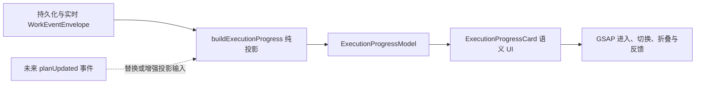

# PiWork GSAP 执行状态动效设计

- 日期：2026-08-02
- 状态：已完成交互评审，等待书面规格复核
- 目标：为 PiWork 的加载、Agent 执行进度、完成和错误状态增加克制、可恢复、无障碍的 GSAP 动效
- 技术基线：React 19、TypeScript、Zustand、Tauri 2、现有 Work/Run 事件流

## 1. 背景与约束

PiWork 已经持久化并实时发布 `runStarted`、`toolStarted`、`toolFinished`、`runCompleted` 和 `runFailed` 事件，但当前界面主要以静态活动行呈现这些信息。启动加载、Work hydration、运行过程与错误反馈之间缺少统一的动效语言，用户不容易快速判断 Agent 正处于哪个阶段。

当前 Pi RPC 只启用 `read`、`grep`、`find`、`ls`、`edit`、`write` 和 `bash` 工具，没有结构化计划工具或 `planUpdated` 事件。因此第一版不能声称展示 Agent 尚未产生的具体计划。设计采用渐进式混合方案：先从真实事件推导稳定的高层执行阶段，并让展示组件兼容未来的一等计划事件。

本设计必须遵守以下约束：

- SQLite、Work、Run、Message 和 Work Event 继续作为事实源；动画状态不能写回业务数据。
- 刷新、重启或重新选择 Work 后，执行进度必须能从持久事件重新投影。
- GSAP 只控制视觉过渡，不判断 Work 或 Run 的业务状态。
- 动效不能延迟提交、重试、切换 Work 或打开诊断等操作。
- 工作区当前存在未提交的 UI 重设计；实现应顺应现有组件和视觉令牌，不进行无关重构。

## 2. 已批准的产品方向

### 2.1 动效气质

采用克制、沉静的 Linear 风格：短距离位移、自然淡入、轻微呼吸和快速状态过渡。无限循环只用于真正进行中的状态。错误不持续抖动，完成不使用庆祝性粒子或大幅缩放。

### 2.2 计划交互

第一版为只读执行进度：显示阶段、当前进度、完成或失败状态，可展开查看已有工具活动，不提供暂停、继续、跳过步骤或逐步审批。

计划卡放在本次用户指令之后、Agent 正文之前。运行中默认展开；成功后短暂确认并折叠为摘要；失败后保持展开。历史回看时计划卡仍归属于原始对话轮次。

## 3. 状态架构

### 3.1 数据流

投影函数只接收当前 Run 的规范化事件，返回稳定的视图模型。相同事件序列必须产生相同结果，不读取 DOM、时间计时器或组件本地状态。

### 3.2 第一版阶段

| 阶段 | 进入依据 | 完成依据 | 可见含义 |
| --- | --- | --- | --- |
| 准备 | 用户指令已提交，或收到 `runStarted` | 收到第一个工具事件 | PiWork 正在接受并启动 Run |
| 分析 | `read`、`grep`、`find`、`ls` 工具开始 | 后续进入执行、验证或终态 | Agent 正在理解项目与上下文 |
| 执行 | `edit`、`write` 或非验证型 `bash` 开始 | 后续进入验证或终态 | Agent 正在修改或执行任务 |
| 验证 | `bash` 命令摘要包含 test、check、lint 或 build | 命令结束或进入终态 | Agent 正在检查结果 |
| 交付 | 收到 `runCompleted` 或 `runFailed` | 终态事件本身 | Agent 已完成或无法继续 |

阶段是高层执行进度，不是对未来具体工具调用的预测。尚未发生的具体操作不得显示成已承诺计划。

### 3.3 投影模型

`ExecutionProgressModel` 应至少包含：

- Run 标识；
- 整体状态：`preparing`、`running`、`completed` 或 `failed`；
- 当前阶段；
- 各阶段状态：`pending`、`active`、`completed`、`skipped` 或 `failed`；
- 已观察到的工具数量和失败工具数量；
- 最终失败消息；
- 是否存在可展开的活动详情。

当某类工具没有发生但 Run 已终止时，对应阶段标记为 `skipped`，不能伪装成已完成。乱序或重复事件先沿用 WorkStore 已有的序列去重和排序语义，投影层仍需对缺失的开始事件保持容错。

## 4. 组件边界

### 4.1 纯投影模块

新增独立的执行进度投影模块，职责仅为：

- 识别工具所属阶段；
- 从事件序列计算当前与最终状态；
- 为组件生成稳定、可测试的语义模型。

它不依赖 React、GSAP、i18n 或 DOM。

### 4.2 ExecutionProgressCard

新增时间线内联卡片，职责为：

- 呈现阶段列表、当前状态、进度摘要和失败信息；
- 复用现有工具活动详情，不复制另一套日志；
- 运行中展开、成功后折叠、失败后保持展开；
- 暴露正确的 `role="status"`、`aria-live` 和可操作的展开控件；
- 把动画目标限制在组件根节点内部。

### 4.3 WorkTimeline 集成

`WorkTimeline` 继续负责按 Run 聚合消息与事件。在每个对话轮次中，执行进度卡位于用户消息和 Agent 输出之间。现有 Assistant Markdown、附件、完成交付、失败卡和诊断入口保持原有语义。

时间线自动滚动调整为：用户位于底部附近时继续跟随；用户阅读历史并离开底部后不强制拉回，只显示“有新进度”提示。

### 4.4 统一动效封装

React 组件通过局部 ref 和 GSAP context 管理动画，卸载、切换 Work 或状态被替换时必须清理 tween/timeline。实现优先动画 `x`、`y`、`scale` 与 `autoAlpha`，不通过 `width`、`height`、`top` 或 `left` 制造移动。

## 5. 动效规范

### 5.1 加载

- 应用模型配置加载：保留品牌 Logo，增加低频、低振幅的呼吸或环形进度，不改变布局。
- 初次 Work hydration：现有骨架线以短 stagger 淡入，柔和高光循环移动。
- 创建 Work、继续 Work 和附件导入：在现有局部按钮或控件内反馈，不用全屏遮罩。
- 加载结束：内容使用一次 `autoAlpha` 与 `y` 过渡进入，不延迟可交互时间。

### 5.2 执行进度

- 卡片首次出现：`y: 8`、`autoAlpha: 0` 到静止状态，约 280ms，使用 `power2.out`。
- 阶段行首次出现：约 40ms stagger，仅播放一次。
- 当前阶段：状态点进行低频呼吸；文字和背景保持稳定。
- 阶段切换：旧状态与新状态在约 220ms 内交叉淡化并轻移，不重播整张卡片。
- 新工具活动：只对新增行播放一次入场，历史行不重新播放。

### 5.3 完成

- 收到 `runCompleted` 后，成功图标以约 320ms 的小幅缩放和淡入确认。
- 确认后以约 240ms 折叠为单行摘要；折叠完成后仍可手动展开。
- 不使用粒子、弹跳或大面积颜色闪烁。

### 5.4 错误

- 单个 `toolFinished(success: false)` 只标记当前阶段异常，Run 保持进行中，因为 Agent 可能恢复。
- 只有 `runFailed` 进入最终失败态并保持卡片展开。
- 错误卡入场使用淡入、轻微上移与一次最多 2px 的水平提示，约 180ms；不循环抖动。
- 若中途工具失败但最终收到 `runCompleted`，最终状态显示成功，同时保留可展开的失败工具活动。
- 全局 hydration 错误、Run 错误和附件错误继续使用各自现有文案与恢复路径，不合并成一个错误状态。

### 5.5 推荐时长

| 动作 | 时长 | Ease |
| --- | ---: | --- |
| 卡片进入 | 280ms | `power2.out` |
| 阶段切换 | 220ms | `power1.out` |
| 完成确认 | 320ms | `back.out(1.2)`，仅小幅缩放 |
| 成功折叠 | 240ms | `power2.inOut` |
| 错误强调 | 180ms | `power1.out` |

## 6. 无障碍与性能

- 所有状态都有文字和图标，动画不能成为唯一信息来源。
- 使用 GSAP matchMedia 响应 `prefers-reduced-motion: reduce`。减少动态效果时，进入与切换时长归零，关闭 shimmer、旋转和呼吸。
- 运行状态使用适度的 `aria-live="polite"`；最终失败使用现有 alert 语义，避免每个流式事件重复朗读。
- 只为实际动画元素设置 `will-change`，动画结束后清理；不在整个时间线永久开启图层提升。
- 使用单个 timeline 或 stagger 处理同组阶段，避免为每个渲染周期创建重叠 tween。
- Work 切换、组件卸载和媒体查询变化时清理全部局部动画。

## 7. 明确不做的内容

- 不为 Agent 增加结构化计划工具或修改 Pi sidecar 协议。
- 不从自然语言流中解析伪结构化计划。
- 不增加暂停、继续、跳过、逐步审批或计划编辑。
- 不为 Inspector、所有页面导航或滚动场景增加装饰性动画。
- 不使用 ScrollTrigger；本次动效由应用状态驱动，不由滚动位置驱动。
- 不增强 `queuedInstructions` 的视觉承诺。当前队列仅存在内存且不会自动消费，必须先修复运行时契约才能设计排队执行动效。

## 8. 测试与验证

### 8.1 单元测试

执行进度投影覆盖：

- 只有 `runStarted`；
- 分析、执行和验证工具的阶段映射；
- 缺少某些阶段时的 `skipped`；
- 重复或缺失开始事件；
- 工具失败后继续运行并最终成功；
- 最终 `runFailed`；
- 持久事件重新投影得到相同结果。

### 8.2 组件测试

- 运行中计划卡默认展开；
- 成功后显示摘要并可重新展开；
- 失败后保持展开并展示恢复操作；
- 工具失败不提前终止 Run；
- 状态文本、按钮名称与 live-region 语义正确；
- Work 切换和卸载执行动画清理；
- 减少动态效果不会隐藏信息或阻塞交互。

测试关注语义终态、清理行为和用户可见结果，不断言逐帧像素或具体中间 transform 值。

### 8.3 回归与视觉验证

- 运行现有 WorkTimeline、WorkSurface、WorkStore 与 i18n 测试；
- 运行 `pnpm typecheck`、`pnpm test` 和 `pnpm build`；
- 在实际 Tauri 窗口检查 900×640、1280×800 和 1440×900；
- 检查默认动态效果与 Windows 减少动态效果设置；
- 检查快速切换 Work、连续工具事件、失败后重试和长时间线阅读；
- 确认时间线没有强制抢回用户滚动位置，也没有残留动画继续运行。

## 9. 未来升级路径

当 Pi 引擎具备结构化计划能力后，可新增 `planUpdated` Work Event，包含稳定步骤 ID、标题、状态与顺序。`buildExecutionProgress` 届时优先使用结构化步骤，并用现有工具事件补充实时活动；`ExecutionProgressCard`、动效规范、折叠规则和无障碍语义保持不变。

该升级必须先明确 sidecar 生成计划的可信来源、事件持久化与恢复语义，不能通过解析自由文本完成。
