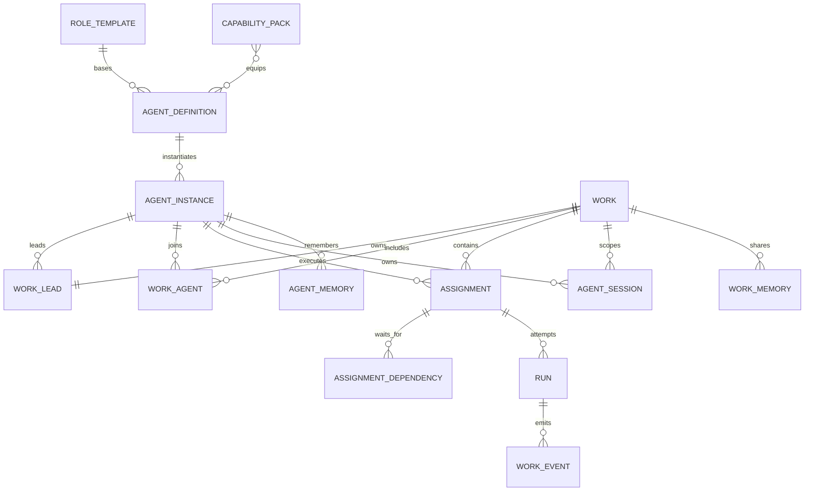
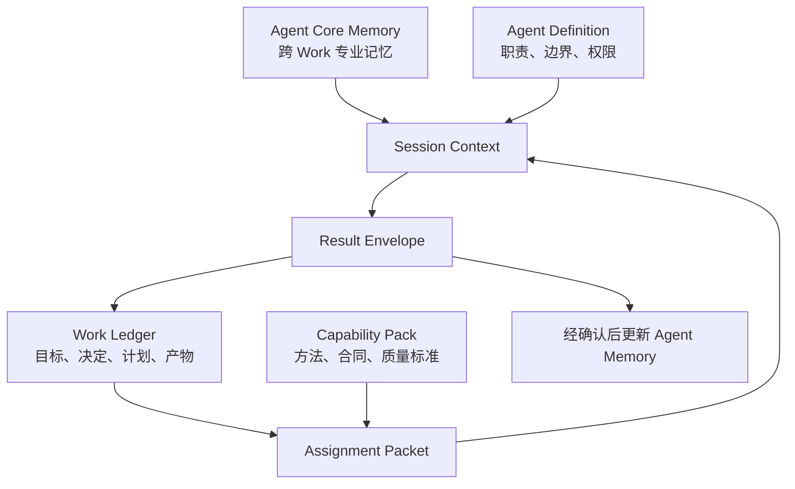
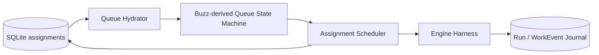
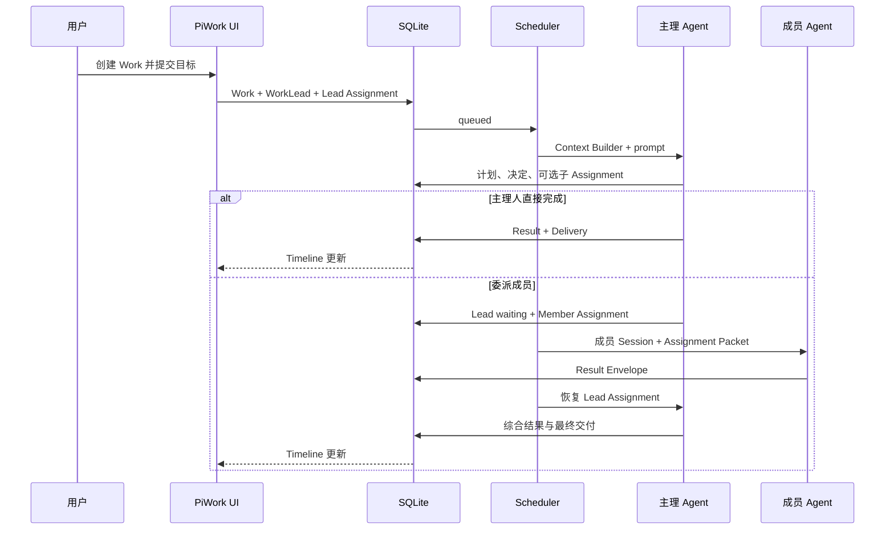

# PiWork 智能体装配与 Buzz 协作内核设计

- 状态：待用户审阅
- 日期：2026-08-09
- Buzz 上游基线：`block/buzz@5bf78671f45178f8de02ba18d3d321cbbf19cd1f`
- 相关调研：`research_buzz_piwork_20260809.md`
- 产品术语：主理人、成员、角色模板、能力包

## 1．背景

PiWork 当前已经具备本地优先 Work、Run、SQLite Event Journal、`EngineAdapter`、`EngineSupervisor`、资源管理和 React Activity UI。现有运行主线是：用户在 Work 中输入指令，Pi 引擎在项目目录中执行，并把结构化工具事件写回 Work 时间线。

现有智能体中心展示 9 个领域和 96 项能力，但这些条目目前只生成一段可编辑 Prompt；它们不是拥有身份、权限、Session、记忆和运行状态的真实 Agent。当前产品因此仍可概括为“Pi 驱动的一个持久对话与执行空间”。

Buzz 证明了另一种可靠边界：Agent 是长期身份，Channel 是协作上下文，ACP Session 是可替换运行态，Relay Event 是共同事实，Harness 负责队列、Session affinity、steer、interrupt、rotate 和活动监督。PiWork 不复制 Buzz 的 Community、Nostr 和 Relay 产品，而是把其已经实现并有测试覆盖的协作内核选择性移植到本地 Work 架构。

本设计将 PiWork 演进为：

> **以 Work 为中心、每个 Work 有一个主理人、按需调用少量长期成员，并由统一事件日志协调与监督的本地智能体协作工作台。**

多 Agent 的目标不是增加数量，而是用最少的专业角色形成清晰责任链、控制上下文规模并提高交付质量。

## 2．已确认决策

1. 每个 Work 恰好有一个主理人，对目标理解、任务分解、成员选择、冲突裁决和最终交付负责。
2. 用户默认只与 Work/主理 Agent 对话，不需要管理 Agent 群聊。
3. Agent 采用“角色模板 + 少量长期成员 + 可装载能力包”，不把 96 项能力变成 96 个 Agent。
4. 成员身份和装配定义长期存在；Assignment、Run、Session 按 Work 和任务临时创建。
5. 第一版预置一个主理人，以及研究员、工程师、审阅者三个成员；新成员可以后续由用户组装。
6. 主理 Agent 不是纯 dispatcher，必须完成综合、决策和最终答复。
7. Agent 之间不自由群聊，通过持久、结构化的 Assignment 与 Result Event 通信。
8. 第一版只有主理 Agent 可以委派成员；成员只能返回结果、请求澄清或请求主理 Agent 继续委派。
9. 第一版同一 Work 最多一个 in-flight Assignment；跨 Work 可有界并行。先保证正确性，再评估同 Work 只读并行。
10. Agent 的长期身份不绑定 Pi。Pi、Codex、Claude、Goose 或 ACP Agent 都是可替换 Engine/Runtime。
11. 能直接借用的 Buzz 状态机、协议投影、验证逻辑和测试必须选择性移植，不重新凭印象实现。
12. 所有移植代码固定来源 commit、保留 Apache-2.0 归属、记录修改并建立上游差异映射。

## 3．目标

- 把 Work 从“单 Agent 对话”升级为有负责人、成员、Assignment、Session 和共享记忆的协作空间。
- 把智能体中心从能力展示页升级为“我的团队 + 能力库”，复用现有页面、搜索、筛选、卡片和抽屉。
- 让主理 Agent 能用宿主工具可靠地创建、等待、恢复和综合成员 Assignment。
- 让成员由角色模板、能力包、工具、权限、Engine 和记忆策略组合装配。
- 用 SQLite 持久化 Assignment、Agent membership、Session reference、工作记忆和结果，应用重启后不丢已接受工作。
- 移植 Buzz 的按 Channel 队列、Session affinity、turn control、Observer Activity 和 Managed Agent 模型中的适用部分。
- 延续 PiWork“先 journal，后 publish”的事实源原则。
- 为多执行引擎和未来远程 Runner 保留接口，但不让它们阻塞第一版。

## 4．非目标

- 不引入 Buzz Relay、Nostr keypair、Community、Channel、Postgres、Redis 或 S3。
- 不复制 Buzz Desktop、Git forge、Workflow、Mobile、Relay Mesh 或 Kubernetes 产品。
- 不把 96 个展示条目自动声明为 96 个可运行 Agent 或完整能力包。
- 不在第一版允许成员自由生成任意层级子 Agent。
- 不在第一版允许同一 Work 多个 Agent 并行修改同一 working tree。
- 不把完整聊天历史复制给每个成员。
- 不将 Engine Session 当作产品事实或长期记忆。
- 不在本设计中实现代码；每个实施阶段需要独立计划、测试和验收。
- 不承诺 Buzz 0.x 当前所有接口永久稳定；PiWork 固定并维护自己的上游基线。

## 5．产品心智

### 5.1 用户看到的是一个 Work，不是一组聊天窗口

```text
用户
  ↓
Work：目标、计划、决定、进度、成员活动和交付物
  ↓
主理 Agent：唯一负责人
  ↓
少量按需成员：研究员、工程师、审阅者
  ↓
Pi / Codex / Claude / ACP：可替换执行身体
```

Work 仍是产品一级对象。Agent 不取代 Work；Agent 加入 Work，执行 Assignment，并把结果写回 Work 的共同事实源。

### 5.2 成员数量是一项成本

PiWork 不把“同时运行多少 Agent”作为能力指标。主理 Agent 选择成员时遵守：

1. 默认自己完成。
2. 只有出现明确专业边界、独立取证或独立审核需求时才委派。
3. 一个 Assignment 只能有一个责任成员。
4. 同一问题不重复委派，除非显式要求独立验证。
5. 一般 Work 同时加入的成员不超过三个。
6. 成员产出必须被主理 Agent 综合，不能直接冒充最终结论。

### 5.3 积木装配模型

一个长期成员不是一段固定 Prompt，而是一套可验证的装配结果：

```text
角色模板
＋ 能力包
＋ 工具组
＋ 权限策略
＋ 模型与 Engine
＋ 记忆策略
＝ 长期成员
```

- **角色模板**定义基础职责、边界、协作方式和默认结果合同，是装配底板。
- **能力包**是可以安装、卸载和组合的专业方法积木。
- **成员**是保存后的长期 Agent 身份，可以反复加入不同 Work。
- **Assignment/Session**是成员在某个 Work 中临时执行任务的运行态。

能力包必须声明适配角色、所需工具、权限、Engine capability 和冲突规则。成员保存前运行装配校验，不能把不兼容能力无条件拼接成 Prompt。

### 5.4 初始预置成员

| 成员 | 长期职责 | 默认输出 | 默认权限 |
|---|---|---|---|
| PiWork 主理人 | 目标理解、分解、派遣、决策、综合、最终交付 | 计划、Assignment、决定、最终答复 | 由 Work 权限决定 |
| 研究员 | 源码取证、事实核验、资料比较、风险与置信度 | 结论、证据、来源、未确认项 | 默认只读 |
| 工程师 | 实现、调试、重构、测试和产物生成 | 代码、变更摘要、验证、限制 | 可写，受 Work 权限约束 |
| 审阅者 | 独立审查声明、diff、测试、权限和遗漏 | 阻塞问题、风险、通过/不通过依据 | 默认只读 |

四个预置成员是官方搭好的角色与能力组合，都是版本化的 `AgentDefinition`/`AgentInstance`。它们不会始终运行；加入 Work 或接受 Assignment 时才建立运行 Session。用户修改预置成员时创建本地副本，不直接改变内置定义。

## 6．领域模型

### 6.1 概念关系



### 6.2 RoleTemplate

角色模板是成员装配的稳定底板。第一版内置 `lead / researcher / engineer / reviewer`，用户创建成员时从模板开始，不从空白 system prompt 开始。

建议字段：

```text
id
slug
name
description
base_instructions
responsibilities[]
non_responsibilities[]
base_result_contract
compatible_capability_kinds[]
builtin
version
created_at
updated_at
```

### 6.3 AgentDefinition

可复用、版本化的装配定义，描述“这个成员是谁、安装了什么、如何工作”。

建议字段：

```text
id
role_template_id
slug
name
description
instructions
responsibilities[]
non_responsibilities[]
input_contract
result_contract
quality_rubric
default_engine_kind
default_model_configuration_id
default_permission_policy
default_parallelism
memory_policy
builtin
active
version
created_at
updated_at
```

Definition 不持有当前进程、Work、Session 或 in-flight 状态。

### 6.4 AgentInstance

用户实际拥有的长期成员身份。第一版每个内置 Definition 自动提供一个内置 Instance；未来允许从角色模板和能力包组合创建定制实例。

建议字段：

```text
id
definition_id
display_name
engine_override
model_configuration_override
permission_policy_override
parallelism_override
status
created_at
updated_at
```

Instance 不等于进程。进程退出或 Engine 切换不改变 Instance ID。

### 6.5 CapabilityPack

能力包描述一套可装载的专业方法，而不是一个人格。

建议字段：

```text
id
catalog_capability_id
name
description
instructions
input_schema
output_schema
procedure
validation_rubric
required_tools[]
default_permission_scope
compatible_role_template_ids[]
required_engine_capabilities[]
conflicts_with_capability_pack_ids[]
version
status: catalog_only | executable | deprecated
```

现有 96 项能力初始都保留为 `catalog_only`。只有补齐指令、合同、工具和验证规则后，才能标为 `executable`。UI 必须清楚区分“目录能力”和“可装载能力包”，避免能力虚标。

### 6.6 装配校验

成员创建、复制或修改时，PiWork 必须验证：

- 所有能力包都兼容所选角色模板。
- 所需工具和 Engine capability 可用。
- 能力包要求的权限不超过成员策略和用户允许范围。
- 能力包之间不存在显式冲突。
- 装配后的指令与能力上下文未超过产品上限。

校验失败时不能静默忽略能力包；UI 显示具体冲突和修复方式。

### 6.7 WorkAgent 与 WorkLead

- 每个 Work 恰好一个 `WorkLead`。
- 主理 Agent 自动成为 Work member。
- 成员首次接受该 Work 的 Assignment 时自动加入，也可以由用户提前加入。
- membership 保存角色、加入时间、当前状态和 Work 范围权限。
- 成员离开 Work 不删除其历史 Assignment、事件和产物。

### 6.8 Assignment

一次可持久、可重试、可审计的委派。Assignment 是产品事实；Run 是一次执行尝试。

建议字段：

```text
id
work_id
parent_assignment_id
created_by_agent_id
assigned_agent_id
capability_pack_id
title
instruction
context_manifest
expected_result_schema
acceptance_criteria
permission_scope
priority
status
attempt_count
max_attempts
not_before
created_at
claimed_at
started_at
completed_at
```

状态集合：

```text
queued
claimed
running
waiting
completed
failed
cancelled
interrupted
dead_letter
```

状态转换必须通过 Rust domain state machine，不能由 UI 直接改字符串。

### 6.9 AgentSession

Session key：

```text
(agent_instance_id, work_id, engine_kind, generation)
```

它保存 Engine 专用 opaque reference、最近成功 turn、状态和 rotate 原因。一个 Agent 在两个 Work 中有两个独立 Session；同一 Work 的主理人和工程师也有不同 Session。

Session 可因 Engine crash、上下文上限、权限变化、模型切换或用户操作而 rotate。Session 丢失不会删除 Assignment、Run、Work Memory 或 Agent Memory。

### 6.10 AgentMemory 与 WorkMemory

`AgentMemory` 保存跨 Work 的、被确认有长期价值的成员知识和工作偏好。`WorkMemory` 保存当前 Work 的目标、决定、约束、计划、产物索引和未解决问题。

Memory 更新必须有来源、版本和作者；模型不能静默覆写长期记忆。

## 7．主理 Agent 与成员协作协议

### 7.1 主理 Agent 的宿主工具

PiWork 为主理 Agent 暴露产品级工具，而不是要求它通过自然语言模拟协调：

```text
list_work_members
inspect_capability_packs
delegate_assignment
get_assignment_status
cancel_assignment
request_assignment_retry
record_work_decision
update_work_plan
complete_work_delivery
```

`delegate_assignment` 只创建持久 Assignment。它不直接持有成员进程，也不在工具调用内等待成员执行完毕。

### 7.2 单层委派

第一版只有主理 Agent 可以调用 `delegate_assignment`。

成员需要其他能力时返回 `delegation_requested`，包含建议成员或能力、原因、所需上下文和期望输出。主理 Agent 在恢复 turn 时决定是否批准并创建新 Assignment。

这条规则防止：

- 无界 Agent 树。
- 权限在多层委派中扩大。
- 用户失去责任链。
- 成员之间形成不可见私聊。

### 7.3 Lead Assignment 的等待与恢复

用户消息首先创建一个分配给主理 Agent 的 Lead Assignment。

当主理 Agent 委派一个或多个成员时：

1. 子 Assignment 先写 SQLite。
2. 当前 Lead Run 以 `waiting_on_assignments` 结束。
3. Lead Assignment 进入 `waiting`。
4. Scheduler 依次执行子 Assignment。
5. 所有必需依赖终止后，Lead Assignment 重新进入 `queued`。
6. 主理 Session 收到结构化结果摘要，启动新的综合 Run。
7. 主理 Agent 可以继续委派、请求用户澄清或完成交付。

一次 Assignment 因此可以产生多个 Run；Run 不再与用户一条消息强制一一对应。

### 7.4 Result Envelope

成员必须通过统一结果合同提交：

```text
status
summary
findings[]
evidence[]
artifacts[]
validation[]
decisions_recommended[]
uncertainties[]
delegation_requests[]
limitations[]
```

不同能力包可以扩展领域字段，但基础字段和 provenance 不能缺失。主理 Agent 默认只接收 Result Envelope、相关 Work 决定和显式引用；原始工具日志按需展开。

### 7.5 用户介入

用户默认消息始终发给主理 Agent。Work 正在运行时，Composer 提供明确语义：

- **排在下一步**：创建新的 Lead Assignment。
- **纠偏当前任务**：对当前 in-flight Assignment 发 steer；Engine 不支持时降级为 cancel + merge + 新 Run。
- **中断并替换**：取消当前 Assignment，把新指令设为高优先级 Lead Assignment。

用户可以从成员 Activity 打开详情并“针对该任务纠偏”，但不会进入独立、长期的成员私聊页面。

## 8．上下文管理

### 8.1 四层上下文



### 8.2 Context Builder 顺序

移植 Buzz `base_prompt.md` 和 `pool.rs` 的分层装配思想，固定顺序：

1. PiWork Base Protocol。
2. Agent Definition。
3. Capability Pack。
4. Agent Core Memory。
5. Work Brief。
6. 当前 Assignment Packet。
7. 依赖 Assignment 的 Result Envelope。
8. 必要的文件、附件和最近相关消息。

每一段使用独立标题和明确来源，不能由 Adapter 任意重排。

### 8.3 Work Ledger

Work Ledger 是从 append-only WorkEvent 投影出的共享状态，不是另一份手工同步文档。至少包含：

- 当前目标。
- 当前计划和步骤状态。
- 已确认决定。
- 约束和权限。
- 活跃/等待/完成 Assignment。
- 产物与验证索引。
- 未解决问题。
- 最近一次交付摘要。

原始消息和工具输出仍保存在 Event Journal，但只有被当前任务引用的内容进入 Assignment Packet。

### 8.4 长期记忆写入

成员可以提出 `memory_candidate`，但不能直接改写 AgentMemory。第一版由主理 Agent 或用户确认后写入，并保存：

```text
source_work_id
source_event_id
author_agent_id
content
reason
version
created_at
```

敏感信息、临时路径、未经确认推测和大段工具输出不得写入长期记忆。

## 9．调度与并发

### 9.1 采用 Buzz Queue 状态机

从 `crates/buzz-acp/src/queue.rs` 移植：

- per-channel queue → per-Work queue。
- 单 Channel in-flight → 单 Work in-flight。
- 跨 Work oldest-head fairness。
- queue depth cap。
- batch cap。
- retry count。
- exponential backoff 与 jitter。
- dead-letter。
- in-flight deadline。
- steer/interrupt cancelled batch merge。
- pool exhausted 时保留原始时间戳重新入队。

核心算法和适用测试尽量保持上游结构，仅替换领域类型。

### 9.2 PiWork 持久化扩展

Buzz queue 是 Harness 运行态；PiWork 增加 Repository adapter：



规则：

1. Assignment 被接受时先写数据库。
2. Queue State Machine 只决定哪个 Work/Assignment 可运行。
3. Claim、start、retry、complete 和 dead-letter 都写数据库事务。
4. 应用启动时，`claimed/running` 且没有有效 runtime owner 的 Assignment 标为 `interrupted`。
5. 可重试的 interrupted Assignment 按策略重新进入 queue；写操作不确定时默认等待用户确认，避免重复副作用。

### 9.3 第一版并发边界

- 同 Work 最多一个 in-flight Assignment，不区分读写。
- 不同 Work 按全局上限并行。
- 每个 AgentInstance 有独立 parallelism 上限；内置成员默认 1。
- Work fairness 优先于同一 Work 的子任务吞吐。
- 后续只有在权限和 workspace snapshot 能可靠证明只读时，才开放同 Work 多个只读 Assignment。

## 10．Engine Harness 与 Session

### 10.1 第一期 Engine 决策

第一期所有预置成员都由现有 Pi Adapter 驱动：

```text
成员（角色 + 能力包 + 权限 + 记忆）
  ↓ Assignment
Engine Harness
  ↓ EngineAdapter
PiEngineAdapter
  ↓
独立 Pi Session / Process
```

成员的差异来自装配定义和上下文，不来自各自维护一套 Agent Runtime。`AgentDefinition` 只保存 `default_engine_kind = "pi"` 和可选模型配置；主理人、研究员、工程师、审阅者都经过同一个 `EngineAdapter` contract。第一期唯一 production adapter 是 Pi，Fake Adapter 继续只用于测试。

当前 `EngineSupervisor` 持有 `Arc<dyn EngineAdapter>`，Pi Adapter 是实际实现，这个边界继续保留。Agent、Assignment、UI 和 Scheduler 都不能直接依赖 Pi RPC 类型。

### 10.2 保留 EngineAdapter，补充能力协商

当前 `EngineAdapter` 是 PiWork 正确边界，不被 Buzz ACP 直接替换。新增 `EngineCapabilities`：

```text
session_resume
session_rotate
native_steer
cancel
thought_stream
plan_updates
permission_requests
tool_progress
usage_reporting
parallel_tool_calls
```

Harness 根据能力选择原生路径或诚实降级：

- 无 native steer：cancel + merge + new Run。
- 无 thought/plan：Feed 不伪造。
- 无 permission request：宿主按工具集合和 Work policy 预先限制。
- 无 session resume：创建新 Session，并注入 Work/Assignment Context。

### 10.3 Session affinity

从 Buzz `AgentPool.try_claim(Some(channel_id))` 和 Session map 移植：

- 优先选择已持有 `(agent, work)` Session 的进程。
- 无可用进程时 Assignment 留在队列。
- Process crash 使其所有 Session invalidated。
- Session rotate 不改变 Agent、Work、Assignment 或 Run 历史。
- Engine-specific session reference 只存于 `agent_sessions`，不进入 UI 产品语义。

### 10.4 Session 隔离迁移

当前 Pi Adapter 使用 `sessions_root/<work_id>`，并把 `work_id` 作为 Engine Session ID。多成员后这个键会让主理人、研究员、工程师和审阅者共享同一上下文，必须在 Assignment 调度上线前迁移。

`EngineRunContext` 增加：

```text
agent_instance_id
agent_session_id
resolved_model_configuration_id
```

新的 Pi session directory 使用稳定产品 ID：

```text
engine-sessions/pi/<agent_instance_id>/<work_id>/<generation>
```

Pi 的 `--session-id` 使用 `agent_session_id`，不再直接使用 `work_id`。同一成员在同一 Work 中可以 resume；不同成员、不同 Work 或新的 generation 绝不共享 Session。旧 Work 原有目录只允许作为 legacy 主理人 Session 读取，rotate 后进入新目录。

### 10.5 运行“身体”

第一阶段：

- 主理人、研究员、工程师和审阅者都由现有 Pi Adapter 运行。
- 每个 Agent × Work 使用独立 session directory，替代当前只按 Work ID 共用 Session 的方式。
- Agent 定义和能力包通过 Context Builder 注入。

后续增加：

- Codex Adapter。
- Generic ACP Adapter。
- Claude/Goose presets。
- Local/Remote Runner provider。

Engine 切换只替换身体，不创建新的成员身份。

## 11．权限模型

### 11.1 有效权限取交集

Assignment 的有效权限：

```text
Work Owner Policy
∩ Agent Policy
∩ Capability Pack Requirements
∩ Assignment Override
∩ Engine Capability
```

任何委派都不能扩大主理 Agent 或 Work 的权限。成员提出需要额外权限时进入 `permission_requested`，由用户决定。

### 11.2 初始策略

- 研究员：默认只读文件和研究工具。
- 审阅者：默认只读 diff、测试结果和日志；可执行无写入验证命令时仍受命令策略约束。
- 工程师：允许 edit/write/bash，但必须继承 Work permission mode。
- 主理 Agent：可以创建 Assignment 和记录 Work 决定；文件权限不因“主理”身份自动提高。

现有 `balanced` 与 `auto_execute` 在 Pi Adapter 中实际使用相同工具集合并统一 `--approve`。多 Agent 上线前必须把权限语义做实：审批请求、决策来源、适用范围和结果都写入 WorkEvent。

## 12．Activity Feed 与监督

### 12.1 复用 Buzz Observer 与 Transcript Projector

选择性移植：

```text
crates/buzz-acp/src/observer.rs
desktop/src/features/agents/ui/agentSessionTypes.ts
desktop/src/features/agents/ui/agentSessionTranscript.ts
desktop/src/features/agents/ui/agentSessionTranscriptGrouping.ts
```

保留：

- turn/session/liveness envelope。
- message/thought/plan/tool/permission/usage 映射。
- tool start/update/end 原地聚合。
- render class 和 salience。
- raw rail。
- session/turn grouping。
- permission request/response correlation。
- suppressed noise。

移除或适配 Buzz Relay/CLI 特定分类，增加 PiWork Assignment、Agent、Artifact 和 Validation 类型。

### 12.2 Work Timeline 形态

主时间线按“动词—对象—结果”展示：

```text
主理人　拆分了 2 项工作
研究员　核验 Buzz Queue 状态机 → 发现 8 个可移植不变量
工程师　修改 4 个文件 → 测试通过
审阅者　审查交付 → 发现 1 个阻塞问题
工程师　修复问题 → 重新验证通过
主理人　完成交付
```

Agent 之间的内部事件、工具原始参数和完整输出默认不占主时间线；Inspector Raw Rail 始终可追溯。

### 12.3 Inspector

在现有 Inspector 中增加：

- Team：主理人、已加入成员、当前状态和能力包。
- Assignments：依赖、状态、重试、dead-letter 和结果摘要。
- Plan/Decisions：Work Ledger 投影。
- Activity Raw Rail：原始 WorkEvent/EngineEvent。
- Memory Candidates：待确认长期记忆。

## 13．智能体中心复用设计

### 13.1 页面结构

复用现有 `AgentCenterPage`、筛选、卡片网格、详情抽屉和视觉样式，一级视图改为：

1. **我的团队**：四个预置长期成员及用户后续组装的成员。
2. **能力库**：现有 96 项能力，继续支持搜索、领域和优先级筛选。

角色模板不作为第三个一级页面；创建或自定义成员时，在成员装配器中选择角色模板。

### 13.2 成员详情与装配器

显示：

- 职责和明确边界。
- 已装载能力包。
- 默认 Engine/Model。
- 工具与权限。
- 记忆策略。
- 最近参与的 Work。
- 版本和启用状态。

操作：自定义副本、加入当前 Work、查看活动。内置 Definition 本身只读；用户点击自定义时创建可升级的本地副本，并进入装配器：

```text
选择角色模板
→ 安装或卸载能力包
→ 校验工具与权限
→ 选择模型与 Engine
→ 设置记忆策略
→ 保存长期成员
```

### 13.3 能力详情

保留现有能力正文，但根据状态显示：

- `目录能力`：仅信息展示，可继续用现有 Prompt 草稿方式启动 Work。
- `可装载能力包`：可以安装到兼容角色的已有成员，或用于组装新成员。

“开始使用”不再暗示启动一个独立机器人。对于 executable pack：

1. 选择已有成员或接受推荐角色。
2. 创建 Work/Lead Assignment 草稿。
3. 主理 Agent 决定是否调用装载该能力的成员。

## 14．数据流

### 14.1 新 Work



### 14.2 重启恢复

1. 启动时恢复现有 interrupted Run 的逻辑继续执行。
2. Assignment Repository 扫描非终态 Assignment。
3. 没有 runtime owner 的 `claimed/running` 标为 `interrupted`。
4. 只读、幂等或尚未启动的任务可自动重排。
5. 可能产生写入副作用的任务进入“需要恢复确认”。
6. Work Timeline 显示恢复原因和用户选择，不静默重跑。

## 15．SQLite 演进

新增表：

```text
role_templates
agent_definitions
agent_instances
capability_packs
agent_capability_bindings
work_agents
work_leads
agent_sessions
assignments
assignment_dependencies
agent_memory
work_memory
```

现有表变更：

- `runs` 增加 nullable `assignment_id` 和 `agent_instance_id`。
- `events` envelope 增加或在 payload 中稳定承载 `turn_id`、`assignment_id`、`agent_id`、`session_id`、`causation_id`、`correlation_id`。
- `messages` 保持用户/助手产品消息；Agent 内部通信不伪装成普通 message，而是 Assignment/Result Event。

迁移原则：

- 现有 Work 无损保留。
- Migration 先创建内置 Definition/Instance，再为每个现有 Work 写入唯一的内置主理 Agent 绑定；不允许迁移后存在无 Lead 的 Work。
- 旧 Run 的 `assignment_id/agent_instance_id` 保持 NULL，投影时视为 legacy lead activity。
- 当前 `engine-sessions/<work-id>` 可作为旧 Work 主理 Session 继续读取；首次 rotate 后迁移到新的 Agent × Work session path。
- 迁移不自动把旧消息总结为长期记忆。

## 16．Buzz 源码移植边界

### 16.1 推荐移植映射

| Buzz 上游 | PiWork 目标 | 策略 |
|---|---|---|
| `crates/buzz-acp/src/queue.rs` | `src-tauri/src/assignment/queue.rs` | 移植状态机与测试，替换领域类型 |
| `crates/buzz-acp/src/lib.rs:3239-3331` | Scheduler dispatch | 移植公平 dispatch、claim/requeue 语义 |
| `crates/buzz-acp/src/pool.rs` Session/turn control | Engine Harness/Agent Pool | 提取 affinity、timeout、cancel、steer、rotate 与测试 |
| `crates/buzz-acp/src/observer.rs` | Engine Activity Bus | 移植 envelope、buffer 和 event context |
| `crates/buzz-acp/src/base_prompt.md` | Context Builder base protocol | 移植分层 framing，替换 Buzz 术语 |
| `desktop/src-tauri/src/managed_agents/types.rs` | Agent domain types | 移植 Definition/Instance/default/validation 思路与适用代码 |
| `desktop/src-tauri/src/managed_agents/access_policy.rs` | AgentAccessPolicy | 移植 fail-closed policy 与测试 |
| `desktop/src-tauri/src/managed_agents/parallelism.rs` | Agent parallelism | 移植边界验证 |
| `desktop/src/features/agents/ui/agentSession*` | Work Activity Projector | 移植类型、聚合、分类和测试 |

### 16.2 不直接移植

```text
buzz-relay
buzz-db / buzz-pubsub / buzz-search
Nostr event signing and community membership
Buzz Channel/Community UI
Buzz Git forge and Projects
buzz-workflow
mobile
relay mesh
Kubernetes backend
buzz-agent LLM loop
```

### 16.3 移植流程

每个模块按以下顺序：

1. 固定上游文件与 commit。
2. 复制适用测试、fixture 和不变量说明。
3. 建立 PiWork 领域 adapter，使测试能表达 Work/Assignment 类型。
4. 移植原实现，先保持行为，不提前重构。
5. 运行上游派生测试。
6. 增加 PiWork 的 SQLite、重启恢复、权限和 UI 测试。
7. 记录与上游的所有差异。
8. 行为稳定后才进行 PiWork 风格重构。

### 16.4 归属与上游维护

增加：

```text
THIRD_PARTY_NOTICES.md
docs/architecture/buzz-upstream-map.md
```

每个实质移植文件保留说明：

```text
Adapted from block/buzz at <commit>, Apache-2.0.
Original file: <path>.
PiWork modifications: <summary>.
```

`buzz-upstream-map.md` 记录：上游文件、固定 commit、本地文件、测试映射、已知差异、最近同步日期。升级不自动追随 `main`；只针对安全修复、状态机 bug 和明确需要的能力进行人工 review。

## 17．错误与恢复语义

| 场景 | 产品行为 |
|---|---|
| 成员 Engine 启动失败 | Run failed；Assignment 按策略 backoff 重试 |
| 重试超过上限 | Assignment `dead_letter`，通知主理 Agent 和用户 |
| Session 丢失 | rotate Session，用持久 Context 重建，不丢 Assignment |
| Work 正在执行时收到新消息 | 默认排给主理 Agent；用户可显式 steer/interrupt |
| 主理 Agent crash | 当前 Run interrupted；Lead Assignment 恢复或等待确认 |
| 成员返回不符合 Result Contract | 一次结构化修复重试；仍失败则 `failed` 并交主理 Agent 处理 |
| 成员请求超出权限 | `permission_requested`；未经用户批准不执行 |
| 成员发现需要另一种能力 | 返回 `delegation_requested`；主理 Agent 决定选择哪个成员 |
| UI 实时事件丢失 | 从 SQLite 重新 hydrate；UI 不拥有事实源 |
| 上下文超限 | Session rotate；Work Ledger + Result Envelope 重建必要上下文 |

## 18．测试策略

### 18.1 上游派生测试

- Buzz Queue push/drop/queue 行为。
- 单 Work in-flight。
- 跨 Work oldest-head fairness。
- batch cap 和 queue depth cap。
- retry/backoff/dead-letter。
- cancelled batch steer/interrupt framing。
- deadline 释放和 withheld event 恢复。
- Session affinity claim/return。
- timeout/cancel/rotate race。
- Activity tool/permission/session grouping。

### 18.2 PiWork 领域测试

- 每个 Work 恰好一个 Lead。
- Definition 与 Instance override 规则。
- Capability `catalog_only/executable` 边界。
- 只有主理 Agent 可以创建子 Assignment。
- 成员权限不能超过 Work/Owner policy。
- Lead Assignment waiting → children terminal → queued 的依赖状态机。
- Result Envelope schema validation。
- Memory candidate 不会直接写长期记忆。

### 18.3 持久化与恢复

- Assignment 先 journal 后 dispatch。
- 应用重启后 queued Assignment 不丢失。
- orphaned claimed/running 被正确标记 interrupted。
- 非幂等写任务不会静默重复执行。
- Session 丢失不删除 Agent/Work/Assignment。
- legacy Work/Run 迁移和主理 Agent 回填。

### 18.4 Engine conformance

为所有 Adapter 建立统一 conformance suite：

- start/resume/abort。
- event ordering。
- terminal event 恰好一次。
- steer 原生或降级语义。
- Session rotate。
- permission request。
- liveness 和 timeout。
- capability negotiation。

### 18.5 前端与产品

- 智能体中心“我的团队/能力库”。
- 目录能力与 executable pack 清楚区分。
- 成员加入 Work。
- Team/Assignments/Memory Inspector。
- 主 Timeline 语义聚合与 Raw Rail。
- 活跃 Run 时 queue/steer/interrupt。
- dead-letter、permission、waiting 和恢复状态可见。
- 用户默认只与主理 Agent 对话。

## 19．实施分解

本设计覆盖多个相互依赖的子系统，实施必须分为独立计划和可验证切片。

### 子项目 A：Activity Protocol 与 Buzz Projector

- 扩展 EngineEvent/WorkEvent envelope。
- 移植 Observer、Transcript Projector 和测试。
- 单 Agent 先使用新 Activity Feed。
- 不引入多 Agent。

价值：先建立监督协议，后续所有成员运行都有统一可见性。

### 子项目 B：Agent Domain 与智能体中心

- RoleTemplate、AgentDefinition、AgentInstance、CapabilityPack、WorkLead/WorkAgent。
- 成员装配校验：角色兼容性、工具可用性、权限上限、Engine capability 和能力包冲突。
- 内置主理人、研究员、工程师、审阅者四个预置成员。
- 复用智能体中心页面。
- 现有 96 项标为 catalog-only，逐步升级能力包。

价值：用户真正拥有长期成员，但仍可沿用当前单 Agent Run。

### 子项目 C：Assignment Queue 与 Session Harness

- 移植 Buzz Queue、dispatch、Session affinity 和 turn control。
- SQLite Assignment Repository 和恢复。
- EngineCapabilities 与 Agent × Work Session。
- UI queue/steer/interrupt。

价值：已接受工作不丢失，调度和控制具备明确语义。

### 子项目 D：主理委派、Result Envelope 与 Context Builder

- 主理 Agent 宿主工具。
- 单层成员委派。
- Lead waiting/resume。
- Result Contract。
- Work Ledger、Assignment Packet、Memory Candidate。

价值：形成第一个完整“主理 Agent + 成员”闭环。

### 子项目 E：多 Engine 与高级协作

- Codex/Generic ACP Adapter。
- 更完整权限请求。
- 用户组装成员和 executable capability authoring。
- 经验证的同 Work 只读并行。
- 可选 RemoteRunner。

价值：扩大执行身体和专业生态，不改变前四个子项目的产品语义。

实施顺序固定为 A → B → C → D；E 独立评估。每个子项目完成后都必须保持 PiWork 可运行和旧 Work 可打开。

## 20．验收标准

完成 A～D 后，必须满足：

- 用户创建 Work 时自动绑定一个主理 Agent。
- 主理 Agent 可以自己完成，也可以通过宿主工具委派预置成员。
- 角色模板、成员装配、能力、权限和 Result Contract 是长期、版本化产品数据。
- 同一 Work 不出现两个 in-flight Assignment。
- 跨 Work 公平、有界并行。
- Assignment 在执行前持久化，重启后不会丢失。
- 主理 Agent 等待成员时不会占用一个持续运行的 Engine turn。
- 成员结果通过 Result Envelope 回到 Work Ledger，主理 Agent 收到压缩上下文。
- 用户主时间线能看懂谁做了什么以及结果，原始事件可追溯。
- 用户可以 queue、steer、interrupt，并看到降级语义。
- Session/Engine 丢失不会丢 Agent 身份、Assignment、Run 历史、决定或产物。
- 现有 96 项页面被复用，但不会把目录条目虚假描述成可运行 Agent。
- Buzz 派生代码和测试有固定 commit、归属和差异记录。
- 旧 Work 与 legacy Run 无损打开。

## 21．成功指标

产品成功不以 Agent 数量衡量，第一阶段关注：

- 用户是否能明确知道当前负责人和成员职责。
- 主理 Agent 是否只在有必要时委派。
- 成员输出是否稳定符合 Result Contract。
- 主理 Agent 综合时所需上下文是否显著小于全部原始历史。
- 用户是否能在一分钟内判断 Work 正在做什么、是否顺利、是否需要介入。
- 应用重启和 Engine crash 后，Assignment 是否可解释地恢复。
- 成员参与是否提高一次交付通过审核的比例，而不是增加 Activity 噪声。

## 22．设计结论

PiWork 不建设一个 Agent 数量市场，而是建设一个可以组合装配、责任清晰的本地团队：

```text
一个 Work
一个主理 Agent
少量长期成员
按需装载能力包
临时 Assignment 和 Session
统一 WorkEvent 事实源
可替换 Engine
```

Buzz 提供经过大量实现和测试验证的队列、Session、Agent 管理和活动监督基础。PiWork 通过选择性源码移植，把 Channel/Relay 语义翻译成 Work/SQLite 语义，并在其上增加本地持久 Assignment 和角色/能力积木装配模型。

这条路线既避免从零重写协作内核，也避免把 PiWork 变成 Buzz 的缩小版。最终产品仍然是 PiWork：一个人可以在本地拥有、调度和监督少量专业 Agent，并由一个明确负责人完成交付。
