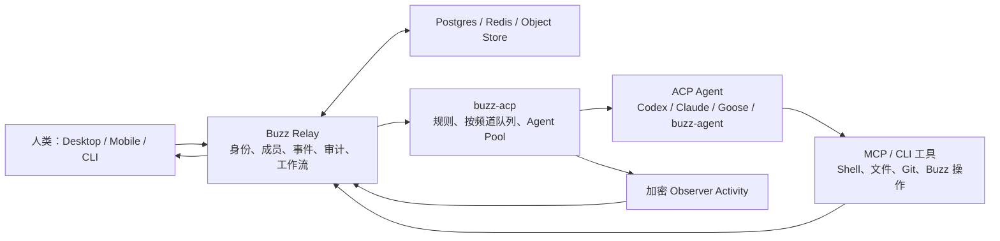
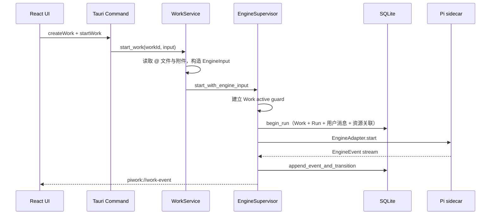
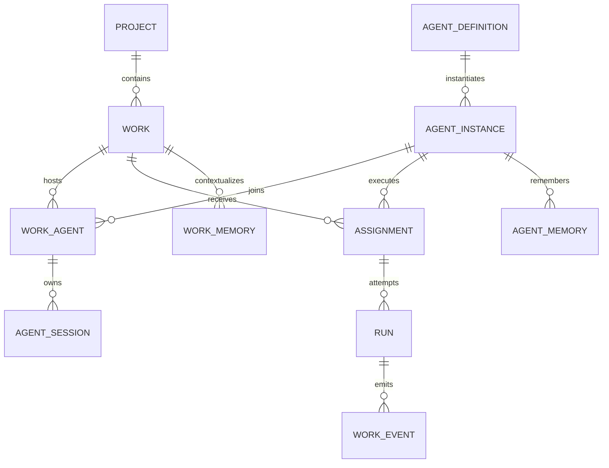
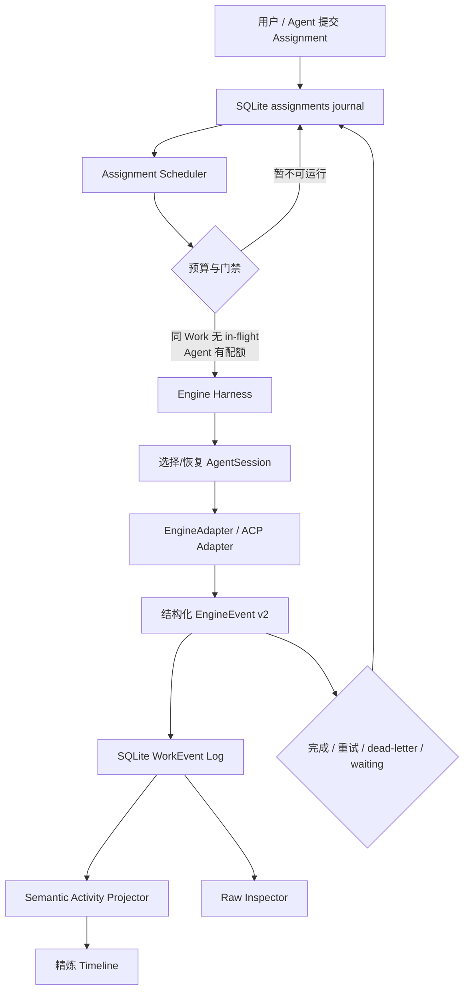

# Buzz × PiWork 深度调研：从“本地执行器”走向“个人 Agent 协作工作台”

> 调研日期：2026-08-09  
> Buzz 基线：`block/buzz@5bf78671f45178f8de02ba18d3d321cbbf19cd1f`  
> PiWork 基线：当前本地 `master`；调研开始时工作树干净，交付时仅新增本报告  
> 结论置信度：产品定位高；核心运行链高；远程 Agent 的长期产品形态中等；具体迁移工期未评估

## 0．先给结论

Buzz 值得 PiWork 深度借鉴，但不值得现在整仓 1:1 复刻。

Buzz 的本质不是“多 Agent 聊天桌面端”，而是：

> **以签名事件日志为共同事实源，让人、Agent、Git、审批、工作流和执行器在同一个协作协议中对等工作的操作系统。**

PiWork 的本质则是：

> **本地单用户、项目绑定、Work/Run 持久化、执行引擎可替换的桌面 Agent 工作台。**

两者最有价值的结合方式，是保留 PiWork 的本地优先产品外壳，复刻 Buzz 的“Agent 协作内核”：

1. 把 Agent Center 的“能力模板”升级成真实、可配置、可运行、可记忆的 Agent。
2. 把 Work 升级成 Agent 协作频道，并为每个 `Agent × Work` 保留独立 Session。
3. 把当前一次性 `startWork` 升级成持久 Assignment Queue：同一 Work 串行，跨 Work/Agent 有界并行。
4. 把 6 类 `EngineEvent` 扩展成可监督协议，并建立 Buzz 式“动词—对象—结果”Activity Feed。
5. 保留 `EngineAdapter`，让 Pi、Codex、Claude、Goose 或通用 ACP 都能成为可替换的“身体”。

最合适的新定位是：

> **PiWork = 个人本地 Agent 协作工作台。**  
> 先解决“一个人如何拥有、调度和监督一支本地 Agent 团队”，以后再选择是否增加多人 Relay。

如果只做三个最先产生产品价值的切片，顺序应是：

1. **Activity Protocol + 可监督 Feed**：先让用户看得懂、信得过、能介入。
2. **真实 Agent Center**：把 96 个能力目录变成 AgentDefinition 的创建入口。
3. **持久 Assignment Queue + Session 隔离**：让多个 Agent/Work 真正可以连续协作。

---

## 1．调研范围与方法

本报告没有只读 README，而是沿两套系统各追踪了一次真实执行链：

- Buzz：Relay 入站事件 → 权限/规则 → 按频道队列 → Agent pool → ACP Session → LLM/tool loop → 结果回写 Relay。
- PiWork：新建 Work → Tauri command → WorkService → EngineSupervisor → SQLite Run/Event → Pi sidecar → React timeline。

证据来源包括：

- Buzz 完整 Git 历史：2,215 commits、106 authors、3,799 tracked files。
- Buzz 当前 HEAD 的 Rust、TypeScript、协议文档、E2E 测试和 Vision 文档。
- PiWork 当前本地源码、SQLite migration、Store 和测试。
- Block 官方发布文章与自托管 Relay 文章。

GitHub 首次 API 取样时，Buzz 有 25,360 stars、2,982 forks、2,317 个 open issues/PRs，创建于 2026-03-06，许可证为 Apache-2.0。GitHub 的 `open_issues_count` 同时包含 issue 和 PR，不能解读为纯 bug 数。[citation:GitHub Repository API](https://api.github.com/repos/block/buzz)

Buzz 从首次提交到本次基线只有约五个月，最新历史已经到 Desktop `0.5.8`、Relay `0.2.1`。这意味着它的架构方向很有参考价值，但接口和产品形态仍在高频演进；应借原则和边界，不应把当前目录结构视作成熟标准。

---

## 2．Buzz 到底是什么

### 2.1 产品层：一个自托管的人机共同工作空间

Buzz 官方的主张是“humans and agents build together, on a relay you own”。它把 Community、Channel、Agent、Project、Git、Workflow、消息和活动监督放进一个产品，而不是把 Agent 关在独立聊天窗口里。[citation:Buzz README](https://github.com/block/buzz/blob/main/README.md) [citation:Introducing Buzz](https://engineering.block.xyz/blog/buzz)

一个 Agent 在 Buzz 中不是一段 prompt，也不是临时子进程。它至少拥有：

- 独立 Nostr keypair 和公钥身份。
- Profile、owner、成员关系与响应策略。
- Persona/definition 与运行实例的分离。
- 每个 Channel 独立的 ACP Session。
- Core Engram（长期记忆）、频道历史和 Channel Canvas（工作上下文）。
- 可审计的工具、权限、思考、计划、运行状态和结果轨迹。
- 可更换的本地或远程运行“身体”。

这就是 Buzz 比“Agent 并发器”深一层的地方：**Agent 是组织成员，执行进程只是它暂时使用的计算资源。**

### 2.2 协议层：签名事件是统一语言

Buzz 在线上使用 Nostr NIP-01。每个事件都有 `id / pubkey / kind / tags / content / sig`；`kind` 是唯一协议分派键。新增消息、reaction、workflow、Git、Agent memory 或 turn metric，本质上都是新增或扩展一种事件类型，而不是让各子系统私下交换不可追踪的状态。

源码证据：[Buzz `ARCHITECTURE.md` 协议段](https://github.com/block/buzz/blob/5bf78671f45178f8de02ba18d3d321cbbf19cd1f/ARCHITECTURE.md#L101-L142)。

这带来三个产品级效果：

1. **共同事实源**：人说了什么、Agent 做了什么、谁批准了什么，可以重建在同一条时间线上。
2. **跨客户端一致**：桌面、移动端、CLI、Agent harness 都读写同一协议。
3. **执行器可替换**：Codex、Claude、Goose、Buzz 自身 Agent 不必知道 UI 内部状态，只需要通过 ACP/MCP 和 Relay 协议工作。

### 2.3 控制面：Relay 才是 Buzz 的中心

Buzz 架构文档明确写道：Relay 是 single source of truth。一个持久 EVENT 进入 Relay 后依次经过认证、pubkey 匹配、验签、频道成员检查、Postgres 写入、Redis 发布、订阅 fan-out、搜索、审计和 workflow trigger。[Buzz `ARCHITECTURE.md` Event Pipeline](https://github.com/block/buzz/blob/5bf78671f45178f8de02ba18d3d321cbbf19cd1f/ARCHITECTURE.md#L221-L244)

自托管 Relay 不是口号：官方部署形态包含一个 Rust Relay 二进制以及 Postgres、Redis、S3-compatible object store；Relay 和 owner 都使用 Nostr keypair，社区由 Relay host/URL 确定。[citation:Run your own Buzz relay](https://engineering.block.xyz/blog/run-your-own-buzz-relay)

因此，Buzz 的系统形态是：



### 2.4 执行面：ACP Harness 把 Relay 和 Agent 解耦

`buzz-acp` 是独立进程：

```text
Relay WebSocket → buzz-acp → ACP/JSON-RPC stdio → Agent → MCP tools
```

它负责接收频道事件、判断 Agent 是否应该响应、按频道排队、从 Agent pool 领取进程、创建或复用 Session、处理超时/取消/steer/rotate，并把活动观察帧发回 Relay。它不负责长期持久化；架构文档明确写着 `Does NOT: persist state`。[Buzz `ARCHITECTURE.md` ACP Harness](https://github.com/block/buzz/blob/5bf78671f45178f8de02ba18d3d321cbbf19cd1f/ARCHITECTURE.md#L644-L674)

长期状态和易失状态的边界是：

| 状态 | 所在位置 | 是否耐重启 |
|---|---|---:|
| Agent 身份、成员、Profile | Relay | 是 |
| Channel 消息与共同决策 | Relay | 是 |
| Core Engram | Relay | 是 |
| Turn metric / 审计 | Relay | 是 |
| ACP Session 上下文 | Agent 进程 | 通常否 |
| 当前 in-flight turn | `buzz-acp` 内存 | 否 |
| 本地 working tree / 临时文件 | 运行“身体” | 取决于 substrate |

远程 Agent 文档对此很诚实：远程 Agent 可以使用同一身份和共同历史“复活”，但工作目录、checkout 和 session-local state 默认属于身体，计算实例消失时也会消失，除非 substrate 额外提供持久盘。[Buzz `VISION_REMOTE_AGENTS.md`](https://github.com/block/buzz/blob/5bf78671f45178f8de02ba18d3d321cbbf19cd1f/VISION_REMOTE_AGENTS.md#L11-L25)

---

## 3．一次真实 Buzz Agent Turn

这条运行链比功能清单更能说明 Buzz 的工程思想。

### 3.1 入站与授权

`buzz-acp` 从 Relay 收到事件后，不会直接丢给模型。它先执行：

1. 自消息过滤。
2. owner 控制命令识别。
3. DM fail-closed 判断。
4. `respond_to = owner-only / allowlist / anyone` 作者门禁。
5. 订阅规则匹配，生成 `prompt_tag`。

只有通过门禁和规则的事件才进入队列；当前代码在 `crates/buzz-acp/src/lib.rs:2329-2483`。这说明“谁能驱动 Agent”是宿主协议责任，而不是靠 system prompt 请求模型自律。

### 3.2 按频道队列与反压

队列不是一个全局 FIFO，而是 `channel_id → VecDeque`：

- 每频道最多 500 个 pending event。
- 每批最多 50 个事件。
- 同一频道最多一个 in-flight prompt。
- 不同频道按最老 head event 公平调度。
- 失败采用指数退避，最多 10 次后 dead-letter。
- 可选择 in-flight 时 drop 或 queue。
- 新消息可走 steer，也可 cancel 后把前一批与新事件合并重提。

源码证据：[Buzz `queue.rs`](https://github.com/block/buzz/blob/5bf78671f45178f8de02ba18d3d321cbbf19cd1f/crates/buzz-acp/src/queue.rs#L1-L170)。事件真正入队后，Harness 立即异步添加 👀 reaction，形成“已看见”的可见反馈（`crates/buzz-acp/src/lib.rs:2500-2516`）。

这套设计的核心不是吞吐量，而是三个不变量：

- 同一协作上下文不出现相互踩踏的两个 turn。
- 一个慢频道不阻塞其他频道。
- 接受过的工作不会因为进程忙而静默消失。

### 3.3 Session affinity 与上下文装配

Dispatch 时，pool 优先选择已经持有该频道 Session 的 Agent 进程；没有可用进程就保留原始时间戳重新入队。源码在 `crates/buzz-acp/src/lib.rs:3239-3331`。

创建新 Session 前，Harness 会装配：

- Base prompt。
- Persona/System instruction。
- Agent core engram。
- Channel canvas。
- 最近对话历史。
- 频道成员资料。

Buzz 的 base prompt 明确写明：同一个 Agent 在不同频道中有独立 Session 和上下文，但共享身份、磁盘 workspace、Relay 和 core memory。[Buzz `base_prompt.md`](https://github.com/block/buzz/blob/5bf78671f45178f8de02ba18d3d321cbbf19cd1f/crates/buzz-acp/src/base_prompt.md#L1-L15)

这个设计很适合 PiWork：它避免把“Agent 的长期人格”和“某个 Work 的局部任务上下文”混成一段不断膨胀的聊天历史。

### 3.4 ACP Turn 控制

真正执行时，Harness 通过 `session/prompt` 发送请求，并处理：

- idle timeout。
- hard max-turn timeout。
- `session/cancel`。
- mid-turn steer。
- Session rotate/model switch。
- turn liveness。
- Agent crash/panic。

主要实现位于 `crates/buzz-acp/src/pool.rs:1390-2358`。`turn_started / session_resolved / turn_liveness / turn_completed / turn_error` 等事件让 UI 不会在长时间执行时“变黑”。

### 3.5 Agent 内部循环

`buzz-agent` 自己是一个可替换 ACP Agent；Shell/文件编辑在独立 `buzz-dev-mcp` 中。它执行经典循环：

```text
LLM completion → tool calls → 并行/有界执行工具 → tool results → LLM completion
```

它支持取消、工具并行、上下文 handoff、输出上限和强制发布最终回复。`VISION_AGENT.md` 说明单进程默认最多 8 个并发 Session，每个 Session 有独立 MCP server、history 和 context。[Buzz `VISION_AGENT.md`](https://github.com/block/buzz/blob/5bf78671f45178f8de02ba18d3d321cbbf19cd1f/VISION_AGENT.md#L53-L70)

这又体现一个重要原则：**Harness 管“谁、何时、在哪个上下文运行”，Agent 管“如何完成一个 turn”，MCP 管“如何触碰外部世界”。**

---

## 4．Buzz 最值得借鉴的十个设计

### 4.1 AgentDefinition 与 AgentInstance 分离

Buzz Desktop 已经把 definition/persona 与 managed instance 区分开。Definition 描述显示名、system prompt、runtime、model、provider、默认响应策略和并行度；Instance 拥有 key、运行配置、backend 和生命周期。源码见 `desktop/src-tauri/src/managed_agents/types.rs:6-90,212-354`。

这比“96 张能力卡分别是 96 个机器人”更合理：一个能力模板可以创建多个实例；一个实例可以在多个 Work 中工作；实例可以换引擎而不丢身份。

### 4.2 Work/Channel 是 Session 隔离单位

Session 不应只按 Agent，也不应只按项目；正确键通常是：

```text
(agent_instance_id, work_id, engine_kind)
```

这让同一个“研究员”在两个 Work 中互不污染，同时共享它自己的长期记忆和工具权限。

### 4.3 队列是产品事实，不是 UI 草稿

Buzz 的队列虽仍主要是 Harness 内存状态，但其状态机已经清楚定义公平性、反压、重试、dead-letter 和中断合并。PiWork 若实现多 Agent，Assignment Queue 必须持久化到 SQLite；否则桌面重启、引擎崩溃或应用升级都会让“已经委派的工作”消失。

### 4.4 Activity Feed 是监督面，不是日志窗

Buzz 的 Activity Vision 用一句话定义每条有意义的活动：

> Agent 对某个对象做了某个动作，得到某个结果。

例如“编辑 `runtime.rs`（+12/−3）”“运行测试 → 1248 passed”。完整原则见 [Buzz `VISION_ACTIVITY.md`](https://github.com/block/buzz/blob/5bf78671f45178f8de02ba18d3d321cbbf19cd1f/VISION_ACTIVITY.md#L19-L63)。

Vision 定义了十二类完整分类；当前 Desktop 代码已进一步细分出 message、relay-op、file-edit、file-read、skill-read、image、shell、status、thought、plan、permission、error、generic、raw-rail、suppressed 等 render class（`desktop/src/features/agents/ui/agentSessionTypes.ts:1-44`）。

关键不是卡片数量，而是：

- 一次 tool call 原地从 pending → running → completed/failed。
- chunk 合并成完整消息，而不是协议包瀑布。
- 失败和写操作突出，读取和心跳后退。
- 原始事件始终可展开，但默认不占据主时间线。
- silence、waiting、timeout 都有明确状态。

### 4.5 权限是宿主可审计控制，不是 Prompt 建议

Buzz 把 `respond_to`、allowlist、ACP permission request/response 和 permission mode 放进宿主层。即使 Agent 不支持 mode 配置，Harness 仍能在每个 tool permission request 上处理策略。

PiWork 当前的 `PermissionMode` 还只是工具集合开关：`ask_every_step` 只给 read 工具；`balanced` 与 `auto_execute` 都给 read/edit/write/bash，且统一传 `--approve`（`src-tauri/src/engine/pi/mod.rs:138-177`）。这三个名称目前没有形成三个真正不同、可审计的授权语义。

### 4.6 Core Memory 与 Work Memory 分层

Agent 的长期习惯、用户偏好和领域经验属于 `AgentMemory`；任务目标、决策、约束和局部上下文属于 `WorkMemory`。两者必须有独立来源、独立容量和独立更新策略，不能继续只依赖引擎 Session 历史。

### 4.7 Steer、Interrupt、Rotate 是第一等控制

长任务里最重要的不是 Stop，而是：

- **Steer**：不丢当前进度地补充方向。
- **Interrupt**：当前做法已经错了，停止并用新请求替代。
- **Rotate**：保留共同事实，但创建干净 Session，防止上下文污染或超限。

这三者应进入 `EngineAdapter` 或更高层 Harness 协议，而不是每个引擎各自在 UI 上发明按钮。

### 4.8 进程是可替换身体

Buzz 的 `BackendKind` 只有本地或 Provider；Desktop 发现 `buzz-backend-*` 二进制，通过 JSON/stdin 协议查询 info 和 deploy，Kubernetes 是已经存在的 provider 实现（`crates/buzz-backend-kubernetes`）。

PiWork 应借这个抽象，但无需立即上 Kubernetes。先让 Local Pi、Local Codex 和通用 ACP 都满足相同 Run/Activity/Control contract，未来 RemoteRunner 只是新增 execution substrate。

### 4.9 Project 是代码边界，Channel/Work 是协作边界

Buzz 已从单仓 Project 演进到 NIP-MP 多仓 Project；Project 分组不授予仓库 push 权限，Git 权限仍由每个 repository 自身声明决定。源码见 [Buzz NIP-MP](https://github.com/block/buzz/blob/5bf78671f45178f8de02ba18d3d321cbbf19cd1f/docs/nips/NIP-MP.md#L39-L90)。

PiWork 也不应把 `rootPath`、Work 和 Agent 混为一体：Project 管代码根；Work 管一个协作目标；Agent 是可在多个 Work/Project 上被委派的成员。

### 4.10 协议语义优先于某个 Agent SDK

Buzz Activity 的基础层只依赖 ACP 的消息、思考、计划、工具和 turn 语义；Buzz 特有的 relay-op、CLI 解析和 Git 卡片是 enrichment。PiWork 应采用同样的层次：先定义引擎无关事件，再为 Pi 特定 RPC 做增强映射。

---

## 5．哪些已经实现，哪些仍主要是愿景

| 能力 | 状态判断 | 证据与限制 |
|---|---|---|
| Relay 事件事实源 | 已实现 | Rust Relay、Postgres/Redis/object store、完整 ingest pipeline |
| Community/Channel/成员权限 | 已实现 | Desktop/Mobile/Relay 均有实现和测试 |
| ACP 多执行器接入 | 已实现 | Codex、Claude、Goose、buzz-agent presets；BYOH generic ACP seam 于 2026-07-26 合入 |
| 每频道 Session + 队列 | 已实现 | `buzz-acp` pool/queue；但队列和 in-flight 是进程内运行态 |
| Agent Definition/Team/Managed Instance | 已实现且持续演进 | Relay projection + Desktop local/private config；模型仍在快速变化 |
| Core Engram | 已实现 | NIP-AE kind `30174`，2026-05-19 合入 |
| Agent Activity Feed | 已实现 | 2026-06-30 十二类重构；当前代码已进一步细化 |
| Projects/Git/PR/Issue | 已实现 | repository-first、Git 工作流、多仓 Project 和 E2E 测试均存在 |
| Remote Provider 协议 | 已实现 | `BackendKind::Provider`、provider 发现/校验/deploy |
| Kubernetes backend | 已实现早期版本 | 独立 crate 与 wire fixture 存在；安全和生命周期仍在高频演进 |
| “Relay 是 Agent 永久的家” | 产品方向 | 身份/历史成立；工作区和半成品 working tree 默认不会随身体恢复 |
| 完全可靠的持久任务队列 | 未体现为 Relay 级统一能力 | `buzz-acp` 自身不持久化；Harness 崩溃后的精确恢复仍有限 |

这个表解释了为什么不能简单说“Buzz 已经解决了所有 Agent 编排问题”。它解决得最好的是共同协议、身份、监督和宿主边界；它自己也仍在补远程执行、恢复语义和规模化细节。

---

## 6．PiWork 当前真实架构

### 6.1 PiWork 已经拥有正确的骨架

PiWork 不是空白项目。当前已经有：

- `Work`：长期任务/协作容器。
- `Run`：一次引擎执行生命周期。
- SQLite：Works、Runs、Messages、Events 的持久事实源。
- `EngineAdapter`：执行器抽象。
- `EngineSupervisor`：一个 Work 的 active guard、启动/终止/异常恢复。
- `EngineEvent`：引擎无关事件。
- Pi Session：按 Work ID 续接的隐藏引擎上下文。
- Tauri → React 的 `piwork://work-event` 实时投影。
- 本地附件、文档派生物、凭据和 runtime 目录边界。

数据库契约见 `src-tauri/migrations/0001_foundation.sql:3-71`；引擎契约见 `src-tauri/src/engine/mod.rs:28-147`。

### 6.2 一次真实 PiWork Run



具体链路：

1. `NewWorkStart.submit` 创建 Work 后立即 `startWork`：`src/features/workspace/NewWorkStart.tsx:177-207`。
2. Store 调 Tauri client：`src/features/works/workStore.ts:568-610`。
3. IPC 调 `start_work`：`src/app/tauriClient.ts:124-132`。
4. Rust command 确认模型已配置：`src-tauri/src/work/commands.rs:49-57`。
5. WorkService 装配项目文件与附件：`src-tauri/src/work/service.rs:87-138`。
6. Supervisor 以 Work ID 建 active guard，拒绝同 Work 第二个 Run：`src-tauri/src/engine/supervisor.rs:204-269`。
7. `begin_run` 在一个事务中写 Work 状态、Run、用户消息和资源关联：`src-tauri/src/work/repository.rs:325-460`。
8. Pi Adapter 为每个 Run 建 runtime 目录、为每个 Work 建 session 目录，并以 Work ID 作为 `session_id`：`src-tauri/src/engine/pi/mod.rs:491-598`。
9. Pi RPC 被翻译成 6 类统一事件：`src-tauri/src/engine/pi/mod.rs:190-259`。
10. Supervisor 先写 SQLite，再发布 UI 事件：`src-tauri/src/engine/supervisor.rs:545-629`。
11. React listener 合并投影：`src/features/works/useWorkEvents.ts:6-39`。

这个“先 journal，后 publish”的顺序非常好，应继续保留。它意味着 UI 事件丢失时可以重新从 SQLite 水合，而不是把前端内存当真相。

### 6.3 当前真正的缺口

#### Agent Center 还是能力目录，不是真实 Agent

当前选中能力后，`buildCapabilityPrompt` 只生成一个可编辑 prompt，再跳回新建 Work 页面：`src/features/workspace/WorkSurface.tsx:129-135`、`src/features/agent-center/agentCapabilities.ts:237-252`。

所以 96 个条目现在是：

```text
能力元数据 → Prompt 模板 → 普通 Pi Run
```

而不是：

```text
Agent Definition → Agent Instance → Work Assignment → 独立 Session/Memory/Policy
```

#### 有队列 API 雏形，但没有产品闭环

`queueInstruction` 只存在于 Zustand Store 和测试；产品 UI 没有调用者。Composer 在 `runActive` 时直接 return：`src/features/workspace/WorkComposer.tsx:66-74`。

这表示当前用户不能在执行过程中追加工作，也没有 durable queue、steer 或 interrupt 语义。

#### EngineEvent 过窄

当前只有：

- `RunStarted`
- `AssistantDelta`
- `ToolStarted`
- `ToolFinished`
- `RunCompleted`
- `RunFailed`

它无法完整表达 thought、plan、permission、waiting、liveness、session lifecycle、steer、usage/cost、artifact 和 validation 的独立生命周期。UI 因此只能从工具名和参数摘要中猜测活动语义。

#### 并发边界只有“同 Work 一个 Run”

`EngineSupervisor.active` 正确地阻止一个 Work 同时跑两个 Run，但没有：

- 全局并行度预算。
- Agent 实例并行度预算。
- 跨 Work 公平性。
- Assignment retry/dead-letter。
- Session affinity scheduler。

#### 权限名称大于实际语义

`balanced` 与 `auto_execute` 使用完全相同的工具集合，并且都传 `--approve`。这会让 UI 给用户一种比实现更精细的控制感。权限系统在引入多个 Agent 前必须先做实，否则自动协作只会放大风险。

---

## 7．三种结合路线

### 路线 A：把 Buzz 整仓嵌入 PiWork

做法：直接运行 Buzz Relay/Desktop/ACP，将 PiWork 变成一个 Buzz 客户端或外壳。

优点：最快获得 Community、Channel、Nostr 身份、团队 Agent、Relay、Git 和移动端生态。

问题：

- PiWork 的 SQLite Work/Run 与 Buzz Relay event 会形成两套事实源。
- 用户必须理解 Community/Relay/keypair，破坏当前本地项目工作流。
- 引入 Postgres、Redis、S3、WebSocket、Nostr key 管理和服务运维。
- PiWork UI 和 Buzz Desktop 功能高度重叠，后续很难决定谁主导产品。

判断：**不推荐，除非战略目标已经改成“做 Buzz 的定制发行版”。**

### 路线 B：1:1 复刻 Buzz 功能

做法：保留 PiWork 品牌和 UI，但逐项复制 Community、Channel、Identity、Relay、Agent、Git、Workflow、Mobile。

问题：这是成本最高、收益最晚的路线。Buzz 五个月已有 2,215 个提交和大量协议/安全测试；1:1 功能对齐意味着 PiWork 实际上重新建设一个协作平台，而不是增强个人工作台。

判断：**法律上可行，产品和工程上不合理。**

Buzz 使用 Apache-2.0，允许使用、修改和分发，但复制代码时仍需保留许可证/NOTICE、标注修改，并检查第三方依赖和商标；专利条款也应由正式法务确认。本报告不是法律意见。[citation:Buzz Apache-2.0 License](https://github.com/block/buzz/blob/main/LICENSE)

### 路线 C：复刻协作内核，保留 PiWork 本地外壳

做法：不引入 Nostr/Relay，先用 SQLite 实现 Buzz 的领域语义、调度和监督体验。

优点：

- 复用 PiWork 已有 Work/Run/Event/Engine 边界。
- 不改变本地优先和单用户心智。
- 每个增量都能直接改善当前产品。
- 未来需要多人协作时，可以在稳定的本地事件协议上增加 Sync/Relay。

判断：**强烈推荐。**

| 评估项 | A：嵌入 Buzz | B：1:1 复刻 | C：复刻内核 |
|---|---:|---:|---:|
| 与 PiWork 当前定位一致 | 低 | 低 | 高 |
| 短期用户价值 | 中 | 低 | 高 |
| 基础设施复杂度 | 极高 | 极高 | 中 |
| 可渐进交付 | 低 | 低 | 高 |
| 保留本地优先 | 低 | 中 | 高 |
| 未来多人扩展 | 高 | 高 | 中高 |
| 推荐度 | 低 | 低 | **高** |

---

## 8．推荐的 PiWork 目标架构

### 8.1 概念映射

| Buzz | PiWork 推荐映射 |
|---|---|
| Community | 本机 PiWork Profile；未来可选 Workspace/Team |
| Project | Local Project / `rootPath`；未来支持 multi-root |
| Channel | Work |
| Mention/Event | Assignment / WorkCommand |
| Agent Persona | AgentDefinition |
| Managed Agent | AgentInstance |
| Agent npub | Local AgentInstance ID；未来可附签名公钥 |
| Relay event log | SQLite WorkEvent Log |
| `buzz-acp` | Engine Harness + Assignment Scheduler |
| ACP channel session | `AgentSession(agent, work, engine)` |
| Core Engram | AgentMemory |
| Channel Canvas | WorkMemory / Work Context |
| Observer Feed | Work Activity Timeline + Raw Inspector |
| Project/branch room | Work + branch/worktree binding |
| Remote body | Local sidecar；未来 RemoteRunner provider |

### 8.2 新的领域模型

建议新增六个核心实体，而不是先堆 UI：



建议职责：

| 实体 | 关键字段 | 说明 |
|---|---|---|
| `agent_definitions` | name、instructions、default_engine、model、tool/permission policy、memory policy | 可复用模板 |
| `agent_instances` | definition_id、display_name、status、engine override、parallelism | 可运行成员 |
| `work_agents` | work_id、agent_id、role、joined_at | Work 成员关系 |
| `agent_sessions` | agent_id、work_id、engine_kind、external_session_id、generation、status | 上下文隔离与 rotate |
| `assignments` | work_id、agent_id、parent_id、instruction、priority、status、attempt、not_before | 持久任务队列 |
| `agent_memory` | agent_id、scope、content、source、version、updated_at | 长期记忆 |
| `work_memory` | work_id、kind、content、source_event_id、version | 目标、决定、约束、handoff |

`Run` 不需要被 Assignment 替代：一个 Assignment 可以因为 retry、rotate 或换引擎产生多个 Run；Run 仍然是一次执行尝试。

### 8.3 目标运行链



关键不变量：

1. 接受 Assignment 后先持久化，再尝试运行。
2. 每个 Work 至多一个会修改 workspace 的 in-flight Assignment；只读任务可在以后单独开放并行。
3. Scheduler 对跨 Work 公平，对全局/每 Agent 并行度有界。
4. 每个事件先 journal，再发布到 UI。
5. UI 可以丢事件并从 DB 重建，不拥有运行真相。
6. Session 可以丢失，但 Assignment、Run、共同决定和产物不能丢失。

---

## 9．推荐实施路线

### Phase 0：先冻结 Activity Protocol v2

不要先做多 Agent UI。先扩展 `EngineEvent`，建议至少覆盖：

```text
turn_started / turn_completed / turn_failed
assistant_delta / thought_delta
plan_changed
tool_pending / tool_started / tool_progress / tool_finished
permission_requested / permission_resolved
waiting / liveness
session_created / session_resumed / session_rotated
artifact_produced / validation_produced
usage_updated
```

设计要求：

- Event 是领域事实，不带 React 展示文案。
- `tool_call_id`、`turn_id`、`session_id`、`agent_id`、`assignment_id` 可关联。
- 进行中的事件可以由 projector 原地更新，但 journal 仍保留追加式事实。
- 未识别的引擎事件进入 raw payload，不静默丢弃。
- version 从一开始进入 envelope 和 migration 策略。

### Phase 1：单 Agent Activity Feed

在不增加多 Agent 的情况下先改善现有 Work：

- Timeline 采用“动词—对象—结果”。
- Tool start/update/end 合并成一条卡片。
- file edit、shell、read、error、permission 分级。
- thought/plan 默认折叠。
- Inspector 提供 raw event rail。
- waiting、liveness、timeout 有可见状态。

验收标准：用户只看主时间线就能回答“Agent 正在做什么、是否顺利、是否需要我”；需要调试时仍能找到原始协议。

### Phase 2：真实 Agent Center

把当前 96 个 capability 保留为“模板目录”，但“开始使用”改成：

1. 从 capability 创建或选择 `AgentDefinition`。
2. 配置默认引擎、模型、工具、权限、记忆策略。
3. Mint 一个 `AgentInstance`，或复用已有实例。
4. 将它加入 Work，创建 Assignment。

不要为 96 个能力预先创建 96 个常驻进程。多数 capability 应只是 definition preset；用户真正拥有的是少量长期 Agent，如研究员、产品经理、工程师、审阅者。

### Phase 3：Assignment Queue 与协作控制

实现：

- SQLite durable queue。
- 每 Work 串行、跨 Work 有界并行。
- 优先级、`not_before`、attempt、backoff、dead-letter。
- `steer / interrupt / rotate / stop`。
- parent assignment，用于 Agent 委派子任务。
- Crash recovery：启动时把不确定的 running attempt 标成 interrupted，再按策略重试或等待用户。

第一版不必允许多个 Agent 同时编辑同一 working tree。更安全的模型是：

- 一个 Work 同时只有一个 writer。
- Reviewer/Researcher 可使用只读副本或独立 worktree。
- 要并行改代码时，每 Assignment 绑定独立 Git worktree/branch，最后显式 merge。

### Phase 4：多执行引擎 Harness

保留当前 `EngineAdapter`，但补全：

- capability negotiation。
- structured activity。
- permission request/response。
- session resume/rotate。
- steer/interrupt。
- usage/cost。

推荐 adapter 顺序：

1. 深化 Pi Adapter，证明协议。
2. Codex Adapter。
3. 通用 ACP Adapter。
4. Claude/Goose presets。

不要一开始复制 `buzz-agent`。PiWork 的竞争力更可能来自优秀的宿主、监督和本地工作流，而不是再维护一个通用 coding agent loop。

### Phase 5：可选 Team/Remote/Relay

只有确认 PiWork 要进入多人产品后，再增加：

- PiWork Sync/Relay。
- 签名身份与成员关系。
- RemoteRunner provider。
- 共享 Work 和组织审计。

Nostr 可以成为一种同步协议候选，但不应成为本地内核的前置依赖。先让 SQLite event schema 具备明确 author、kind、causation、correlation、version 和 payload，再评估它是否需要映射为签名网络事件。

---

## 10．第一个可执行产品包

为了避免“架构很宏大、用户没有新价值”，建议把首个产品包限定为：

### Slice 1：可监督的单 Agent Run

改动中心：

- `src-tauri/src/engine/mod.rs`
- `src-tauri/src/engine/pi/mod.rs`
- `src-tauri/src/engine/supervisor.rs`
- Work event payload/domain types
- Timeline/Inspector projector 与 UI

完成条件：thought、plan、tool lifecycle、permission、waiting、usage 至少能被协议表达；主 Timeline 和 raw rail 从同一 journal 重建。

### Slice 2：一个真实 Agent

先只支持创建一个自定义 Agent：名字、职责、instructions、默认模型、权限、工具、memory。它可以加入一个 Work，并拥有独立于 Work 的 definition/instance ID。

完成条件：删除/重建执行进程后，Agent 身份、配置和 Work 成员关系仍在；更换 Engine 不需要创建新 Agent。

### Slice 3：执行中追加 Assignment

把 Composer 的 `runActive` 拒绝改成三种明确动作：

- Queue next。
- Steer current。
- Interrupt and replace。

第一版如果 Pi RPC 不支持原生 steer，可以将 steer 降级为“请求 cancel → 保留原任务摘要 → 合并新指令 → 新 Run”，但 UI 必须诚实显示发生了什么。

完成条件：应用重启后 queued assignment 仍存在；同 Work 不并发踩写；失败达到阈值后进入可见 dead-letter，而不是无限重试。

---

## 11．明确不做什么

当前阶段建议拒绝以下范围：

- 不复制 Buzz Community/Channel UI。
- 不引入 Postgres、Redis、S3 作为本地运行前提。
- 不让 SQLite 和 Nostr Relay 同时成为权威事实源。
- 不预先启动 96 个 Agent。
- 不允许多个 Agent 无隔离地同时修改同一 working tree。
- 不把 Agent memory 等同于原始聊天历史。
- 不用 system prompt 代替宿主权限检查。
- 不因为 Buzz 使用 ACP 就立刻废弃 PiWork 的 `EngineAdapter`；两者可以通过 adapter 层兼容。
- 不先做远程 Kubernetes，再补本地恢复和监督。

---

## 12．风险与待验证问题

### 产品风险

- 多 Agent 很容易制造“看起来忙碌”的噪声；Activity Feed 必须先于并发扩张。
- Agent Center 若继续按 96 个机器人宣传，会让用户面对选择过载；应强调少量长期角色 + 能力模板。
- Work 是频道还是任务容器，需要在 UI 语言上统一，否则 Assignment、Run、Message 会互相混淆。

### 工程风险

- Pi 引擎当前 RPC 能否稳定暴露 thought、plan、usage、permission 和 steer，需要逐项能力探测，不能假设。
- SQLite scheduler 需要处理进程崩溃、应用重启、时钟、幂等和重复启动。
- 多 worktree 的磁盘生命周期、分支命名、merge 冲突和清理规则必须成为产品协议。
- Memory 写入需要 provenance 和可撤销版本，不能允许模型无审计地改写长期事实。

### 安全风险

- 当前 `balanced` 与 `auto_execute` 的实现差异不足，必须先定义“可自动执行的工具/路径/命令”和审批持久性。
- Agent 间委派不能自动扩大权限；子 Assignment 的有效权限应是委派者权限与目标 Agent 策略的交集。
- 远程 Runner 若以后获得凭据或代码访问，应按可撤销租约和最小权限设计。

### 本报告局限

- 没有实际部署 Buzz Relay、Kubernetes backend 或运行其完整 E2E 套件；运行行为判断来自源码、测试和历史。
- GitHub 数量指标是一次时间点取样，会迅速变化。
- Buzz 的 Vision 文档描述目标状态，不等同于所有路径都已达到生产成熟度；报告已尽量用“实现/愿景”表分开。
- 未进行 PiWork 新架构的工期估算、交互原型和 schema migration 设计；这些应作为下一阶段独立 PRD/ADR。

---

## 13．最终判断

Buzz 对 PiWork 最大的启发不是“做一个更多 Agent 的界面”，而是改变三个基本假设：

1. **Agent 不是 prompt，是有身份、权限、记忆和成员关系的长期实体。**
2. **运行不是聊天流，是可排队、可恢复、可中断、可监督的 Assignment/Turn 协议。**
3. **Activity 不是调试日志，是人类愿意继续委派工作的信任界面。**

PiWork 已经具备正确的本地事实源和 Run 生命周期，因此不需要推倒重来。最有价值的演进，是在现有 SQLite + Supervisor + EngineAdapter 上补齐 Agent、Assignment、Session、Memory 和 Activity 五个领域概念。

一句话收束：

> **不要把 Buzz 搬进 PiWork；把 Buzz 证明有效的协作内核，翻译成 PiWork 的本地优先语言。**

这样得到的不是 Buzz 的缩小版，而是一个定位更清楚的产品：个人拥有、调度和监督本地 Agent 团队的工作台。

---

## 附录 A：Buzz 演进时间线

| 日期 | 关键变化 |
|---|---|
| 2026-03-06 | Initial commit |
| 2026-03-09 | Relay 与 Desktop 首次发布 |
| 2026-03-10 | ACP harness 进入历史 |
| 2026-03-13 | Managed Agents View |
| 2026-03-17 | Agent 启动恢复 |
| 2026-05-12 | Projects 成为顶级视图 |
| 2026-05-19 | NIP-AE Agent Engram/Core Memory |
| 2026-06-10～11 | Sprout 重命名为 Buzz |
| 2026-06-24 | Persona/Team/Managed Agent 发布为 Relay events |
| 2026-06-30 | Activity Feed 十二类重构 |
| 2026-07-03 | Repository-first Projects |
| 2026-07-06 | 加密 Agent Turn Metrics |
| 2026-07-14 | Relay Mesh |
| 2026-07-26 | BYOH Generic ACP Runtime |
| 2026-08-02 | Kubernetes Remote Agent backend |
| 2026-08-04 | Multi-repo Projects |
| 2026-08-08 | Desktop 0.5.8、Relay 0.2.1 |

## 附录 B：核心证据索引

### Buzz

- 产品定位：[README](https://github.com/block/buzz/blob/main/README.md)
- 总体架构：[ARCHITECTURE.md](https://github.com/block/buzz/blob/5bf78671f45178f8de02ba18d3d321cbbf19cd1f/ARCHITECTURE.md)
- Relay 入站：`crates/buzz-relay/src/connection.rs`、`handlers/event.rs`、`handlers/ingest.rs`
- Harness 入站/调度：`crates/buzz-acp/src/lib.rs:2207-2578,3239-3331`
- 按频道队列：[queue.rs](https://github.com/block/buzz/blob/5bf78671f45178f8de02ba18d3d321cbbf19cd1f/crates/buzz-acp/src/queue.rs)
- Session/上下文/控制：`crates/buzz-acp/src/pool.rs:1390-2358`
- ACP wire：`crates/buzz-acp/src/acp.rs:738-824,1060-1217`
- Agent loop：`crates/buzz-agent/src/agent.rs:233-632`
- Activity：[VISION_ACTIVITY.md](https://github.com/block/buzz/blob/5bf78671f45178f8de02ba18d3d321cbbf19cd1f/VISION_ACTIVITY.md)
- Remote Agents：[VISION_REMOTE_AGENTS.md](https://github.com/block/buzz/blob/5bf78671f45178f8de02ba18d3d321cbbf19cd1f/VISION_REMOTE_AGENTS.md)
- Managed Agent types：`desktop/src-tauri/src/managed_agents/types.rs`

### PiWork

- 数据库：`src-tauri/migrations/0001_foundation.sql`
- 引擎协议：`src-tauri/src/engine/mod.rs`
- Supervisor：`src-tauri/src/engine/supervisor.rs`
- Pi Adapter：`src-tauri/src/engine/pi/mod.rs`
- Work 事务：`src-tauri/src/work/repository.rs`
- WorkService：`src-tauri/src/work/service.rs`
- 前端事件订阅：`src/features/works/useWorkEvents.ts`
- 当前 Composer 门禁：`src/features/workspace/WorkComposer.tsx`
- Agent Center prompt handoff：`src/features/workspace/WorkSurface.tsx`、`src/features/agent-center/agentCapabilities.ts`
